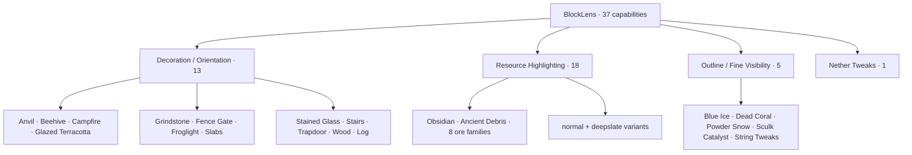
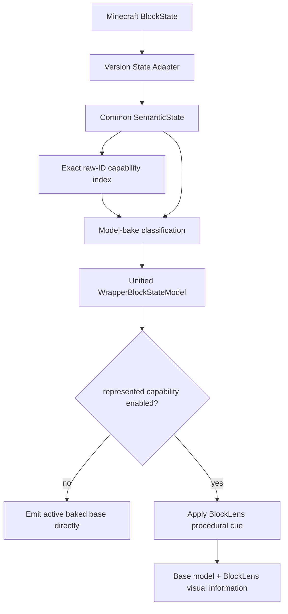
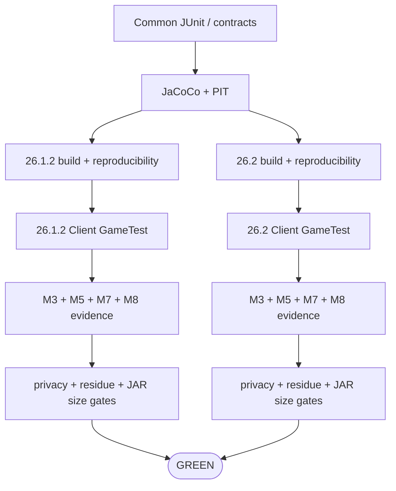

# BlockLens

**English** | [日本語](README_ja.md)

BlockLens is a **client-side visual inspection mod for Minecraft Java Edition**. It reconstructs the useful visual behavior of the pinned AMATERAS resource-pack baseline as compact, testable code instead of redistributing thousands of state-specific JSON/PNG files.

The product contract contains **37 independently configurable capabilities**. Minecraft-version differences stay behind thin adapters while configuration, state interpretation, target policy, and render semantics are shared across Minecraft **26.1.2** and **26.2**.

> **Current state:** M0-M8 are complete. The full 37-capability product remains verified on both supported Minecraft versions. The final M8 runtime JAR is **88,973 bytes** on both lines, with strict no-growth, 100 KiB release-budget, real-client performance, frame-percentile, reload-retention, and visual-regression gates.

## Supported environment

| Item | Current contract |
| --- | --- |
| Minecraft | **26.1.2** and **26.2** |
| Loader | Fabric |
| Java | **25** |
| Side | **Client only** |
| Server-side BlockLens | Not required |
| Product policy | Shared across both Minecraft versions |
| Version-specific code | Thin Minecraft/Fabric adapters |
| Verified renderer path | Default / shader-OFF OpenGL CI path |
| Vulkan | Experimental track |

## 37-capability map



The supplied RPO enables only five capabilities by default—Blue Ice, Dead Coral, Powder Snow, Sculk Catalyst, and String Tweaks. That preset is not the complete product scope.

## Runtime architecture



Runtime principles:

- **323 capability-to-target bindings** / **320 unique Minecraft block targets**
- no whole-world target scan
- no per-frame registry scan
- semantic interpretation at model bake
- primitive enabled-capability mask on the render hot path
- direct active-base emission when no represented capability is enabled
- bounded immutable cue/instruction reuse
- bounded retained-capability structure verified across repeated resource reloads

## Visual families

### M3 — Decoration / Orientation · 13 ✅

State-aware procedural cues cover axis, stairs, slabs, trapdoors, gates, beehives, campfires, grindstones, stained glass, wood/log orientation, and related targets.

### M4 — Outline / Fine Visibility · 5 ✅ core parity

Blue Ice, Dead Coral, Powder Snow, Sculk Catalyst, and String Tweaks are implemented. Sculk bloom state is preserved and all **64 Tripwire semantic states** are regression-tested.

M8 stores one immutable emissive quad instruction per visibility cue and consumes it directly from both version adapters.

### M5 — Resource Highlighting · 18 ✅ core/rendered parity

All 18 resource controls preserve the active baked base model and add a full-bright procedural accent. A dedicated dark-area real-client oracle verifies resource-only ON against all-OFF.

M8 also stores one immutable instruction per resource cue and removed duplicate retained color state. This is a deterministic allocation-site simplification; BlockLens does **not** claim a measured FPS percentage from noisy whole-client CI timing.

### M6 — Nether Tweaks · 27 exact targets ✅ core parity

The source-derived visual grammar is recreated with procedural palette logic and two tiny BlockLens-owned models (`interior_fill` and `upper_band`). No AMATERAS PNG is redistributed.

## M7 automated core integration gate

The same Fabric Client GameTest runs on Minecraft **26.1.2** and **26.2** and verifies all 37 capabilities, native config save/reload, resource reload, deterministic framebuffer evidence, dimension round-trip, Nether-only behavior, the five-feature reference preset, M5 dark-area rendering, all-OFF restoration, bounded lookup, and owned model resolution.

Representative shader-ON, broader third-party resource-pack coverage, and experimental Vulkan verification remain separate compatibility/release tracks and are not implied by the core gate.

## M8 performance / load / size hardening ✅

M8 is complete. Final verification: **GitHub Actions `34738345474` (run #223)**.

### Artifact size

The pinned source resource pack is **2,366,865 B**.

| Artifact / rule | Size | Relative to source pack |
| --- | ---: | ---: |
| Pinned AMATERAS resource pack | **2,366,865 B** | 100% |
| Absolute requirement | **< 1,183,433 B** | < 50% |
| BlockLens release budget | **<= 102,400 B (100 KiB)** | <= 4.33% |
| PR #17 pre-optimization baseline | **93,068 B** | 3.93% |
| **Final M8 runtime JAR** | **88,973 B** | **3.76%** |

The final artifact is **4,095 B (4.4%) smaller** than the PR #17 baseline and **96.24% smaller** than the pinned source ZIP while retaining all 37 capabilities. **88,973 B is now the frozen no-growth baseline** for each supported Minecraft line.

CI/Gradle also produces a deterministic JAR report with exact bytes, entry count, compressed category totals, and the 20 largest entries. Retired runtime-policy bytecode is explicitly rejected.

### Real-client regression evidence

Repeated runs established a coarse, median-based regression envelope. M8 freezes gross-regression guards rather than claiming a benchmark win:

- resource reload median: **<= 6.0 s**
- rebuild median: **<= 2.5 s**
- total/render-relevant allocation median: **<= 32 MiB**

Final run #223:

| Metric | 26.1.2 | 26.2 |
| --- | ---: | ---: |
| reload median | **3.842 s** | **4.069 s** |
| OFF / Resource-ON rebuild median | **1.493 / 1.510 s** | **1.532 / 1.512 s** |
| OFF frame-main median | **5.026 ms** | **5.054 ms** |
| Resource-ON frame-main median | **5.078 ms** | **5.092 ms** |
| Resource-ON frame-main P95 | **7.969 ms** | **11.441 ms** |
| Resource-ON frame-main P99 | **12.009 ms** | **12.538 ms** |

The frame metric is **main render-pass duration**, not complete present-to-present frame time. Tail values remain observation evidence, not an FPS claim.

### Reload retention / cache evidence

For all three measured reloads on both versions:

```text
wrapped models:             7820, 7820, 7820
retained capability slots:  7827, 7827, 7827
max capabilities/model:        2,    2,    2
Nether wrapped models:         33,   33,   33
reloadRetentionStable=true
```

Nether overlay references remain lazy per-wrapper caches with one-attempt guards. No measurement counter was added to quad emission.

Authoritative details: [`knowledge/current/m8-performance.md`](knowledge/current/m8-performance.md).

## Development status

| Milestone | Status | Result |
| --- | --- | --- |
| M0 | ✅ Complete | pinned source baseline / 37-capability contract |
| M1 | ✅ Complete | Java 25, dual-version build, CI, Client GameTest, artifact gates |
| M2 | ✅ Complete | shared semantic state + thin adapters |
| M3 | ✅ Complete | 13 decoration/orientation capabilities |
| M4 | ✅ Core parity | 5 outline/fine-visibility capabilities |
| M5 | ✅ Core/rendered parity | 18 resource highlights + dedicated dark-area evidence |
| M6 | ✅ Core parity | 27 exact Nether targets |
| M7 | ✅ Automated core gate | all-37 / config / reload / dimension / preset / OFF restoration |
| M8 | ✅ Complete | performance/load/retention evidence + final **88,973 B** no-growth baseline |
| M9 | Planned | release readiness / public artifact audit |

## Automated quality



A runtime/compatibility change is not complete until both supported Minecraft lines are green on the current head.

## Engineering Graph Loop


Implementation alone is not completion. Failures return through **DIAGNOSE → FIX → VERIFY**.

## Build and verify

Java 25 is required.

```bash
./gradlew qualityGate
./gradlew ciGate
```

Per-version builds enforce the runtime artifact budget and write `build/reports/blocklens/runtime-jar-size.txt`.

## Project documentation

- [`AGENTS.md`](AGENTS.md) — engineering rules
- [`knowledge/index.md`](knowledge/index.md) — knowledge index
- [`knowledge/current/product-spec.md`](knowledge/current/product-spec.md) — product contract
- [`knowledge/current/architecture.md`](knowledge/current/architecture.md) — architecture
- [`knowledge/current/quality-strategy.md`](knowledge/current/quality-strategy.md) — quality strategy
- [`knowledge/current/performance-strategy.md`](knowledge/current/performance-strategy.md) — performance strategy
- [`knowledge/current/m8-performance.md`](knowledge/current/m8-performance.md) — authoritative M8 evidence
- [`knowledge/current/roadmap.md`](knowledge/current/roadmap.md) — roadmap
- [`knowledge/current/engineering-loop.md`](knowledge/current/engineering-loop.md) — Graph Loop

`knowledge/current/` is the source of truth. README files are user-facing summaries and should never claim more compatibility or performance than the evidence supports.
