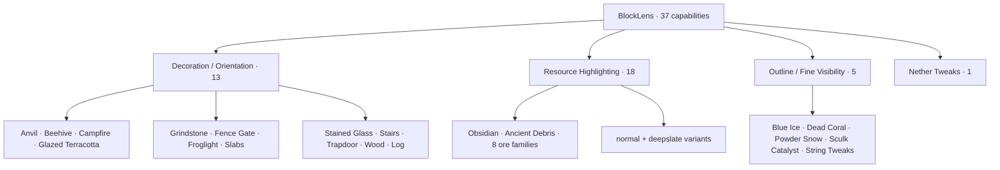
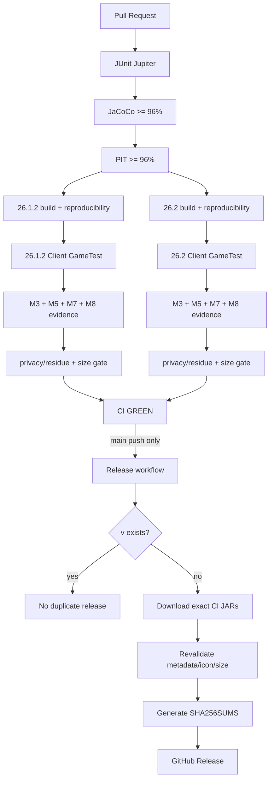
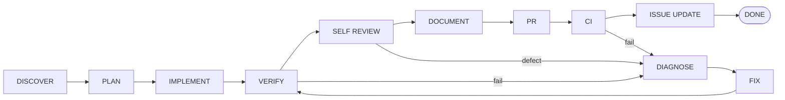

# BlockLens

<p align="center">
  
</p>

**English** | [日本語](README_ja.md)

BlockLens is a **client-side visual inspection mod for Minecraft Java Edition**. It reconstructs the useful visual behavior of the pinned AMATERAS resource-pack baseline as compact, testable code instead of redistributing thousands of state-specific JSON/PNG files.

The product contract contains **37 independently configurable capabilities**. Minecraft-version differences stay behind thin adapters while configuration, semantic state, target policy, rendering behavior, quality gates, and release automation are shared across Minecraft **26.1.2** and **26.2**.

> **Current state:** M0-M9 release-readiness work is implemented. The verified release line is **v0.1.0**, produced only from a successful `main` CI run. The icon-inclusive runtime JAR baseline is **95,333 B** per supported Minecraft line, with a strict **100 KiB** release budget.

## Supported environment

| Item | Current contract |
| --- | --- |
| Minecraft | **26.1.2** and **26.2** |
| Loader | Fabric Loader **0.19.3+** |
| Fabric API | **0.155.2+26.1.2** / **0.160.0+26.2** |
| Java | **25+** |
| Side | **Client only** |
| Server-side BlockLens | Not required |
| Verified renderer path | Default / shader-OFF OpenGL |
| Shader-ON | Not yet claimed as supported |
| Minecraft 26.2 Vulkan | Experimental |

## 37-capability product map



The supplied RPO enables five capabilities by default—Blue Ice, Dead Coral, Powder Snow, Sculk Catalyst, and String Tweaks. That preset is not the complete product scope.

## Runtime architecture


Runtime principles:

- **323 capability-to-target bindings** / **320 unique Minecraft block targets**
- no whole-world target scan
- no per-frame registry scan
- semantic interpretation at model bake
- primitive enabled-capability mask on the render hot path
- direct active-base emission when no represented capability is enabled
- immutable/bounded cue and instruction reuse
- bounded retained-capability structure verified across repeated resource reloads
- client-only packaging with no nested runtime dependency JARs

## Technology foundation

BlockLens is intentionally small at runtime but uses a strict engineering toolchain around it.

| Layer | Technology | Role in BlockLens |
| --- | --- | --- |
| Language | **Java 25** | Production code, shared semantic engine, Fabric adapters, tests |
| Build | **Gradle 9.5.1** | Multi-project build, verification entry points, deterministic artifact tasks |
| Minecraft tooling | **Fabric Loom 1.17.19** | Minecraft mappings/dev runtime/build integration |
| Loader | **Fabric Loader 0.19.3** | Client-side mod loading |
| Runtime API | **Fabric API** | Version-specific Minecraft/Fabric hooks and client GameTest integration |
| Unit / contract tests | **JUnit Jupiter 5.14.4** | Semantic, config, target-policy, repository and regression contracts |
| Test platform | **JUnit Platform** | JUnit 5 execution through Gradle |
| Coverage | **JaCoCo 0.8.15** | Line coverage reporting and hard coverage gate |
| Mutation testing | **PIT 1.19.0** | Mutation score and test-strength verification of product-policy logic |
| PIT JUnit 5 adapter | **pitest-junit5-plugin 1.2.3** | JUnit 5 mutation-test execution |
| Real-client integration | **Fabric Client GameTest** | Actual Minecraft client startup, reload, dimension and render-path verification |
| Headless graphics CI | **Xvfb** on Ubuntu 24.04 | Runs real client GameTests and framebuffer evidence in GitHub Actions |
| CI/CD | **GitHub Actions** | Shared quality gate, dual-version builds, visual/performance evidence, release automation |
| Artifact integrity | **SHA-256** | Release checksums and reproducibility evidence |
| Release publishing | **GitHub CLI (`gh`)** | Publishes the exact successful-CI JARs; no rebuild in release job |

### Quality thresholds

The common product-policy surface is guarded by explicit thresholds:

- JaCoCo line coverage: **>= 96%**
- PIT mutation coverage: **>= 96%**
- PIT mutation score: **>= 96%**
- PIT test strength: **>= 96%**
- Java compilation uses `-Xlint:deprecation`, `-Xlint:unchecked`, and **`-Werror`**

The purpose is not merely “tests exist”; the suite must demonstrate that critical semantic/config/render-policy logic is exercised strongly enough to detect mutations.

## Automated quality pipeline



### Release safety properties

`.github/workflows/release.yml` intentionally separates build verification from publishing:

- release runs only after the named **CI** workflow completes successfully;
- only successful **pushes to `main`** are eligible;
- the release job checks out the **exact verified commit SHA**;
- it downloads the **exact runtime JAR artifacts from that CI run** instead of rebuilding them;
- it verifies Minecraft version, mod version, client-only metadata, packaged icon and size budgets again;
- `mod_version` in `gradle.properties` is the release version source;
- if `v<mod_version>` already exists, the workflow exits successfully without creating a duplicate release;
- SHA-256 checksums are generated before publication.

This means a README-only `main` change does not create another `v0.1.0`; a new release requires a reviewed version bump.

## Visual capability families

### M3 — Decoration / Orientation · 13 ✅

State-aware procedural cues cover axis, stairs, slabs, trapdoors, gates, beehives, campfires, grindstones, stained glass, wood/log orientation, and related targets.

### M4 — Outline / Fine Visibility · 5 ✅ core parity

Blue Ice, Dead Coral, Powder Snow, Sculk Catalyst, and String Tweaks are implemented. Sculk bloom state is preserved and all **64 Tripwire semantic states** are regression-tested.

### M5 — Resource Highlighting · 18 ✅ core/rendered parity

All 18 resource controls preserve the active baked base model and add a full-bright procedural accent. Dedicated dark-area and deterministic active-resource-pack client evidence protect the verified path.

### M6 — Nether Tweaks · 27 exact targets ✅ core parity

The source-derived visual grammar is recreated with procedural palette logic and two tiny BlockLens-owned models (`interior_fill` and `upper_band`). No AMATERAS PNG is redistributed.

### M7 — Automated full-product gate ✅

The same client integration oracle runs on both supported Minecraft lines and verifies all 37 capabilities, config round-trip, resource reload, dimension round-trip, Nether behavior, the five-feature preset, M5 dark-area behavior, all-OFF restoration, bounded lookup and owned model resolution.

### M8 — Performance / load / retention / size hardening ✅

M8 froze evidence-based gross-regression guards rather than claiming an FPS improvement:

- resource reload median: **<= 6.0 s**
- terrain rebuild median: **<= 2.5 s**
- allocation median: **<= 32 MiB**

The M8 pre-icon runtime baseline was **88,973 B**. M9 deliberately rebaselines only the packaged release icon growth to the measured **95,333 B** value while preserving the **100 KiB** release ceiling and the source-pack **<50%** hard maximum.

### M9 — Release readiness ✅

M9 adds the repository-owned icon, release metadata, release-time validation, SHA-256 generation, and automatic GitHub Release publication from successful `main` CI artifacts.

## Installation

1. Install Fabric Loader for the target Minecraft version.
2. Install the matching Fabric API.
3. Use Java 25 or later.
4. Download the matching JAR from GitHub Releases.
5. Put the JAR in the Minecraft `mods` directory.
6. Launch the client.

BlockLens is client-only; a server-side BlockLens installation is not required.

## Build and verify

Java 25 is required.

```bash
./gradlew qualityGate
./gradlew ciGate
```

Useful per-version gates include:

```bash
./gradlew :versions:mc26_1_2:build :versions:mc26_1_2:versionSmokeContract :versions:mc26_1_2:verifyRuntimeJarBudget
./gradlew :versions:mc26_2:build :versions:mc26_2:versionSmokeContract :versions:mc26_2:verifyRuntimeJarBudget
```

Per-version builds also write deterministic runtime-size evidence to `build/reports/blocklens/runtime-jar-size.txt`.

## Compatibility scope

Verified support is intentionally narrower than “anything Fabric can run”:

- default / shader-OFF OpenGL: **verified**
- representative non-vanilla active resource-pack preservation: **verified fixture**
- arbitrary third-party resource packs: **not universally claimed**
- representative shader-ON configurations: **not yet claimed**
- Minecraft 26.2 Vulkan: **experimental**

Issue #5 remains the authority for shader-ON compatibility work. This is not a core 37-capability or release-automation blocker; unsupported combinations are simply not advertised as supported.

## Release / redistribution audit

The runtime JAR contains BlockLens code/resources and the BlockLens-owned icon/models. The CI rejects nested dependency JARs, local paths, logs, saves, crash dumps, secrets/private-key markers, source RPO residue, and retired runtime-policy bytecode. AMATERAS PNG assets are not redistributed.

No explicit open-source license is granted by the repository unless a `LICENSE` file is added. GitHub Release publication by the repository owner does not imply third-party redistribution rights.

## Engineering Graph Loop



Implementation alone is not completion. Failures return through **DIAGNOSE → FIX → VERIFY**.

## Project documentation

- [`AGENTS.md`](AGENTS.md) — engineering rules
- [`knowledge/index.md`](knowledge/index.md) — knowledge index
- [`knowledge/current/product-spec.md`](knowledge/current/product-spec.md) — product contract
- [`knowledge/current/architecture.md`](knowledge/current/architecture.md) — architecture
- [`knowledge/current/quality-strategy.md`](knowledge/current/quality-strategy.md) — quality strategy
- [`knowledge/current/performance-strategy.md`](knowledge/current/performance-strategy.md) — performance strategy
- [`knowledge/current/m8-performance.md`](knowledge/current/m8-performance.md) — M8 evidence
- [`knowledge/current/release-readiness.md`](knowledge/current/release-readiness.md) — M9/release contract
- [`knowledge/current/roadmap.md`](knowledge/current/roadmap.md) — roadmap
- [`knowledge/current/engineering-loop.md`](knowledge/current/engineering-loop.md) — Graph Loop

`knowledge/current/` is the source of truth. README files deliberately do not claim compatibility or performance beyond verified evidence.
