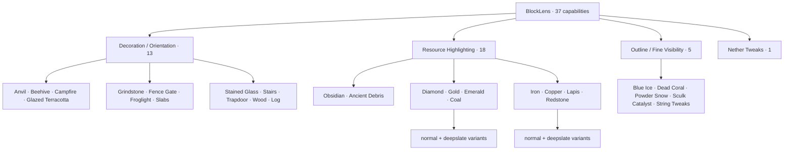
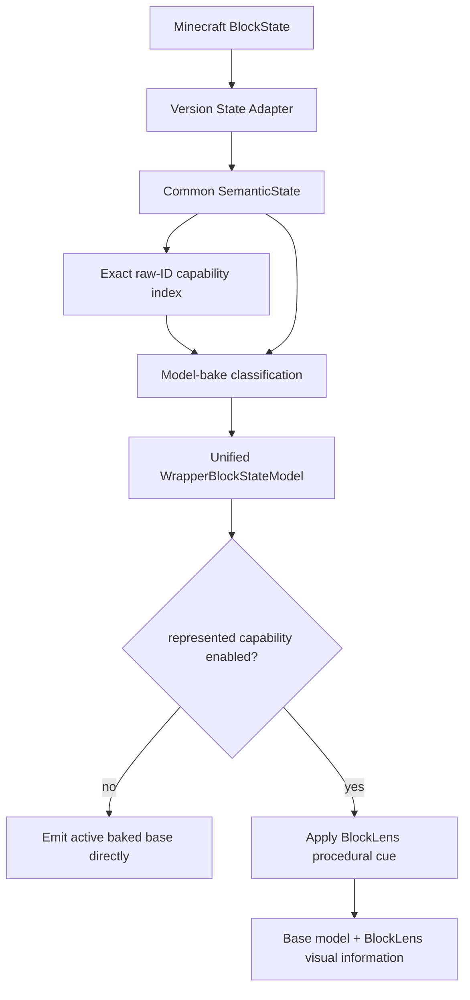

# BlockLens

**English** | [日本語](README_ja.md)

BlockLens is a **client-side visual inspection mod for Minecraft Java Edition**. It reconstructs the useful visual behavior of the pinned AMATERAS resource-pack baseline as compact, testable code instead of redistributing thousands of state-specific JSON/PNG files.

The product contract contains **37 independently configurable capabilities**. Minecraft-version differences stay behind thin adapters while configuration, state interpretation, target policy, and render semantics are shared across Minecraft **26.1.2** and **26.2**.

> **Current state:** M0-M7 core behavior is implemented and continuously verified. M8 performance/load/size hardening is now active. The verified runtime JAR baseline is **93,068 bytes on both supported Minecraft versions** while keeping the full 37-capability contract.

## Supported environment

| Item | Current contract |
| --- | --- |
| Minecraft | **26.1.2** and **26.2** |
| Loader | Fabric |
| Java | **25** |
| Side | **Client only** |
| Server-side BlockLens | Not required |
| Product policy | Shared across both Minecraft versions |
| Version-specific code | Thin Minecraft/Fabric adapters |
| Verified renderer path | Default / shader-OFF OpenGL CI path |
| Vulkan | Experimental track |

## Why BlockLens is much smaller than the source pack

The pinned source resource pack is **2,366,865 bytes** and contains **4,535 ZIP entries**. Its behavior is mostly represented through thousands of small JSON/PNG/RPO files, and roughly **45.9%** of the ZIP is container overhead.

BlockLens moves that behavior into shared semantic code and a very small set of owned resources.

| Artifact | Size | Relative to source pack |
| --- | ---: | ---: |
| Pinned AMATERAS resource pack | **2,366,865 B** | 100% |
| 50% absolute requirement | **< 1,183,433 B** | < 50% |
| BlockLens release budget | **<= 102,400 B (100 KiB)** | <= 4.33% |
| Verified M8 baseline | **93,068 B** | **3.93%** |

That is roughly a **96.1% size reduction** versus the pinned source ZIP while retaining the same 37-capability product scope.

### M8 size rules

1. The runtime JAR must remain below **1,183,433 B**.
2. The normal BlockLens release budget is **100 KiB**.
3. **93,068 B** is the current verified no-growth baseline.
4. Growth above the frozen baseline is treated as a regression unless the baseline is deliberately revised with review evidence.
5. CI generates a deterministic runtime-JAR size report with compressed category totals and the largest entries.

The goal is not code golf. A smaller artifact is only accepted when maintainability, testability, and runtime behavior remain intact.

## 37-capability map



The supplied RPO enables only five capabilities by default—Blue Ice, Dead Coral, Powder Snow, Sculk Catalyst, and String Tweaks. That preset is not the complete product scope.

## Runtime architecture



Current runtime principles:

- **323 capability-to-target bindings**
- **320 unique Minecraft block targets**
- no whole-world target scan
- no per-frame registry scan
- semantic interpretation at model bake
- primitive enabled-capability mask on the render hot path
- direct active-base emission when no represented capability is enabled
- bounded immutable cue/instruction reuse where repeated allocation is unnecessary

## Implemented visual families

### M3 — Decoration / Orientation · 13 ✅

Procedural state-aware cues cover axis, stairs, slabs, trapdoors, gates, beehives, campfires, grindstones, stained glass, wood/log orientation, and related targets.

### M4 — Outline / Fine Visibility · 5 ✅ core parity

Blue Ice, Dead Coral, Powder Snow, Sculk Catalyst, and String Tweaks are implemented. Sculk bloom state is preserved and all **64 Tripwire semantic states** are regression-tested.

M8 hardening reuses **one immutable emissive quad instruction per M4 visual cue** instead of constructing an equivalent record for each emitted quad.

### M5 — Resource Highlighting · 18 ✅ core/rendered parity

All 18 resource controls preserve the active baked base model and add a full-bright procedural accent. A dedicated dark-area real-client oracle verifies resource-only ON against all-OFF.

M8 hardening also reuses one immutable instruction per resource cue. This is a deterministic allocation-site removal; it is **not presented as a measured FPS/rebuild-speed win** because whole-client CI timing remains noisy.

### M6 — Nether Tweaks · 27 exact targets ✅ core parity

The source-derived visual grammar is recreated with procedural palette logic and two tiny BlockLens-owned models (`interior_fill` and `upper_band`). No AMATERAS PNG is redistributed.

## M7 automated core integration gate

The same Fabric Client GameTest runs on Minecraft **26.1.2** and **26.2** and verifies:

- all 37 capabilities ON simultaneously
- config codec/mask round-trip
- real `config/blocklens.properties` save → reload → exact restoration
- resource reload with all 37 enabled
- deterministic framebuffer evidence
- Overworld → Nether → Overworld round-trip
- Nether Tweaks alone
- frozen five-feature reference preset
- M5 resource-only dark-area evidence
- all 37 OFF / active base restoration
- bounded zero-world-scan target lookup
- BlockLens-owned model resolution

## M8 performance and size hardening

M8 follows a strict order: **measure → remove structurally unnecessary work → re-run behavior gates → report the result**.

The first real-client baseline records:

- resource reload warmup + raw samples
- reload median and nearest-rank P95
- OFF vs Resource Highlight ON rebuild timing
- JVM thread-allocation deltas
- BlockLens initialization timing
- wrapped model count

The whole-client rebuild/allocation window showed runner noise and large outliers. Therefore BlockLens currently makes **no measured speedup claim** from those samples.

What is verified instead:

- M5 repeated immutable instruction construction removed
- M4 repeated immutable instruction construction removed in the current M8 hardening slice
- retained instruction sets are tiny and bounded by enum values
- no world scan or registry scan was introduced
- M3/M5/M7 behavior remains the regression authority
- JAR size is now treated as a first-class CI contract

Authoritative M8 evidence: [`knowledge/current/m8-performance.md`](knowledge/current/m8-performance.md).

## Development status

| Milestone | Status | Result |
| --- | --- | --- |
| M0 | ✅ Complete | pinned source baseline / 37-capability contract |
| M1 | ✅ Complete | Java 25, dual-version build, CI, Client GameTest, artifact gates |
| M2 | ✅ Complete | shared semantic state + thin adapters |
| M3 | ✅ Complete | 13 decoration/orientation capabilities |
| M4 | ✅ Core parity | 5 outline/fine-visibility capabilities |
| M5 | ✅ Core/rendered parity | 18 resource highlights + dedicated dark-area evidence |
| M6 | ✅ Core parity | 27 exact Nether targets |
| M7 | ✅ Automated core gate | all-37 / config / reload / dimension / preset / OFF restoration |
| M8 | 🔧 In progress | performance, allocation, reload, retained-memory, and **100 KiB size** hardening |
| M9 | Planned | release readiness / public artifact audit |

## Current artifact evidence

Final PR #17 verification: **GitHub Actions `34736446316`**.

| Minecraft | Runtime JAR | Client GameTest / quality gates |
| --- | ---: | --- |
| 26.1.2 | **93,068 B** | PASS |
| 26.2 | **93,068 B** | PASS |

Both versions also produced M8 performance manifests, M3/M5/M7 visual evidence, and reproducible runtime JARs.

## Automated quality


A runtime/compatibility change is not complete until both supported Minecraft lines are green on the current head.

## Engineering Graph Loop


Implementation alone is not completion. Failures return through **DIAGNOSE → FIX → VERIFY**.

## Still pending

A green core gate does not imply every compatibility path is complete. Remaining tracks include:

- representative shader-ON verification
- broader third-party resource-pack compatibility evidence
- Minecraft 26.2 Vulkan experimental verification
- repeated M8 runs sufficient to freeze useful performance tolerances
- representative frame-time percentile evidence if reproducible
- retained cache/geometry and lazy-initialization evidence
- M9 licensing/attribution and public-release audit

## Build and verify

Java 25 is required.

```bash
./gradlew qualityGate
./gradlew ciGate
```

Per-version builds also enforce the runtime artifact budget and write `build/reports/blocklens/runtime-jar-size.txt` with category totals and largest compressed entries.

## Project documentation

- [`AGENTS.md`](AGENTS.md) — engineering rules
- [`knowledge/index.md`](knowledge/index.md) — knowledge index
- [`knowledge/current/product-spec.md`](knowledge/current/product-spec.md) — product contract
- [`knowledge/current/architecture.md`](knowledge/current/architecture.md) — architecture
- [`knowledge/current/quality-strategy.md`](knowledge/current/quality-strategy.md) — quality strategy
- [`knowledge/current/performance-strategy.md`](knowledge/current/performance-strategy.md) — performance strategy
- [`knowledge/current/m8-performance.md`](knowledge/current/m8-performance.md) — M8 evidence and limitations
- [`knowledge/current/roadmap.md`](knowledge/current/roadmap.md) — roadmap
- [`knowledge/current/engineering-loop.md`](knowledge/current/engineering-loop.md) — Graph Loop

`knowledge/current/` is the source of truth. README files are user-facing summaries and should never claim more compatibility or performance than the evidence supports.
