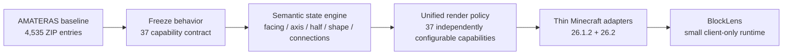
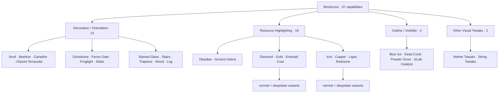
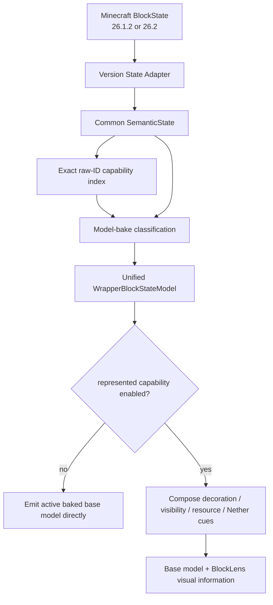
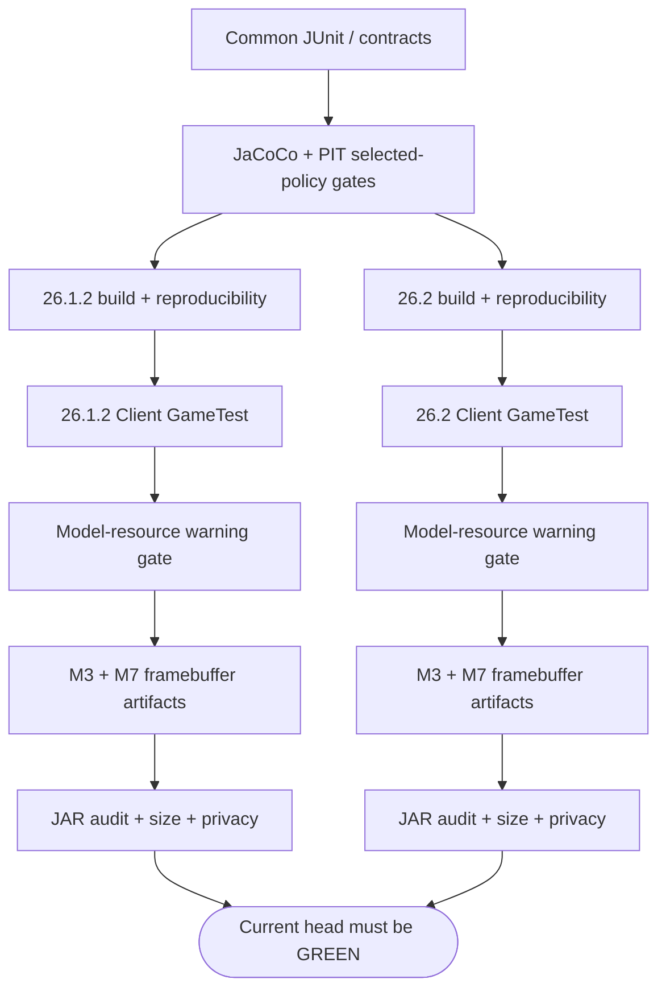

# BlockLens

**English** | [日本語](README_ja.md)

BlockLens is a **client-side visual inspection mod for Minecraft Java Edition**. It rebuilds the useful visual ideas of the AMATERAS resource-pack baseline as compact, testable code instead of shipping thousands of state-specific JSON/PNG files.

The goal is not "put a resource pack in a JAR." The goal is to preserve the **37-capability visual contract** while improving maintainability, cross-version behavior, configuration, testability, performance evidence, and artifact size.

> **Current state:** M0–M3 are complete. The M4–M6 core rendering tracks are implemented and automatically verified on Minecraft **26.1.2** and **26.2**. The M7 automated core integration gate is green for all 37 capabilities, including all-on, resource reload, dimension round-trip, Nether-Tweaks-only evidence, the frozen five-feature reference preset, and all-off restoration. Final compatibility work for representative third-party resource packs, shader-ON paths, Vulkan, real config-file reload acceptance, and M8/M9 performance/release readiness is still pending.

## Why BlockLens?

The source baseline is useful but structurally expensive: thousands of tiny blockstate/model files encode combinations that can often be represented once as semantics and rendered dynamically.



```text
many state-specific JSON / PNG variants
                ↓
shared state interpretation + shared render semantics + minimal BlockLens-owned geometry
```

## Supported platforms

| Item | Current contract |
| --- | --- |
| Minecraft | **26.1.2** and **26.2** |
| Loader | Fabric |
| Java | **25** |
| Side | **Client only** |
| Server mod required | No |
| Product policy | Shared across both Minecraft versions |
| Version-specific code | Thin Minecraft/Fabric adapters only |
| Required renderer track | OpenGL/default CI path |
| Vulkan | Experimental track; not implied by OpenGL success |

A feature is not considered complete when it works on only one supported Minecraft line unless a current specification explicitly records an exception.

## 37-capability map

The frozen source baseline contains **37 independently controllable capabilities**.



The supplied reference RPO preset enables five capabilities: Blue Ice, Dead Coral, Powder Snow, Sculk Catalyst, and String Tweaks. That is a preset, not the entire product contract.

## Unified runtime architecture

BlockLens keeps Minecraft mapping/API differences at the edge and product semantics in shared code.



Current unified target scope:

- **323 capability-to-target bindings**
- **320 unique Minecraft block targets**
- intentional overlap through capability bitmasks
- no whole-world target scan
- no per-frame registry scan
- semantic interpretation at model bake instead of every frame
- primitive enabled-capability mask on the hot path

Examples of intentional overlap include Obsidian (`gaming.obsidian` + `others.nethertweaks`) and Crimson/Warped Stem (`deco.log` + `others.nethertweaks`).

## Implemented visual families

### M3 — Decoration / orientation · 13 capabilities ✅

The 13 decoration/orientation capabilities use BlockLens-owned procedural cues over the active baked model.

Important properties:

- exact frozen target scope
- independent toggles
- X/Y/Z axis grammar
- state-aware stairs, slabs, trapdoors, gates, beehives, campfires, grindstones, and related targets
- Stained Glass uses opaque/solid-layer behavior
- all-13 framebuffer evidence on both supported Minecraft lines
- resource reload and OFF restoration regression coverage

Authoritative contract: [`knowledge/current/m3-visual-semantics.md`](knowledge/current/m3-visual-semantics.md).

### M4 — Outline / fine visibility · 5 capabilities ✅ core parity

Implemented:

- Blue Ice
- Dead Coral
- Powder Snow
- Sculk Catalyst
- String Tweaks

The shared state engine retains Sculk `bloom` and the Tripwire N/E/S/W + `powered` + `attached` semantics. All **64 tripwire semantic states** are covered by common regression tests.

### M5 — Resource highlighting · 18 capabilities 🔧 core implementation complete

All 18 frozen resource-highlight controls are integrated into the same wrapper. BlockLens preserves the active baked base model and applies a full-bright procedural accent using:

- emissive rendering
- diffuse shading disabled
- ambient occlusion disabled

The default/shader-OFF OpenGL CI path passes on both versions. Representative shader-ON and third-party resource-pack compatibility remain explicit verification work before those paths are claimed as supported.

### M6 — Nether Tweaks · 27 exact targets ✅ core parity

The pinned source ZIP was inspected directly instead of guessing the behavior. The dominant source grammar is:

```text
16×16 surface
├─ 14×14 flat interior = 196 pixels
└─ 1px frame          =  60 pixels
```

Nylium adds an upper color band.

BlockLens reconstructs this behavior procedurally with a source-derived palette plus two tiny BlockLens-owned reusable models:

- `interior_fill`
- `upper_band`

No AMATERAS PNG is copied into BlockLens. CI also fails if either BlockLens-owned Nether model is missing or has incomplete texture references.

## M7 automated core integration gate

The same shared Client GameTest runs against Minecraft **26.1.2** and **26.2**.

It verifies:

- all 37 capabilities enabled simultaneously
- config encode/decode mask round-trip
- resource reload with all 37 enabled
- deterministic framebuffer capture after reload
- Overworld → Nether → Overworld transition
- **Nether Tweaks enabled alone**
- frozen five-feature reference preset
- all 37 disabled / base rendering restoration
- bounded zero-world-scan target lookup
- BlockLens-owned model resolution

Each version archives five M7 screenshots plus a manifest and screenshot SHA-256 list:

1. `m7-all37-on.png`
2. `m7-all37-reloaded.png`
3. `m7-nether-only.png`
4. `m7-reference-preset.png`
5. `m7-all37-off-active-pack.png`

Latest verified implementation run before the documentation-only updates: **GitHub Actions `34729441969`**.

| Evidence | Minecraft 26.1.2 | Minecraft 26.2 |
| --- | ---: | ---: |
| all-37 ON vs OFF ROI delta | **3,917 px** | **3,932 px** |
| after resource reload vs OFF | **3,911 px** | **3,904 px** |
| Nether Tweaks only vs OFF | **834 px** | **765 px** |
| five-feature preset vs OFF | **1,067 px** | **1,063 px** |
| dimension round-trip | PASS | PASS |
| config codec round-trip | PASS | PASS |
| BlockLens model resolution | PASS | PASS |

Authoritative evidence and remaining boundaries: [`knowledge/current/m4-m7-parity.md`](knowledge/current/m4-m7-parity.md).

## What is still pending

A green M7 automated core gate is **not** a claim that every compatibility path is finished.

Still pending:

- representative third-party active resource-pack matrix
- representative supported shader path with shader **ON**
- real config-file save/reload acceptance beyond codec/persistence smoke coverage
- Vulkan experimental validation and documented separation from required OpenGL support
- dedicated dark-area resource-highlight framebuffer evidence
- M8 startup/reload/frame/allocation performance hardening
- M9 release-readiness, licensing, attribution, compatibility notes, and public artifact audit

## Development status

| Milestone | Status | Result |
| --- | --- | --- |
| M0 — source baseline freeze | ✅ Complete | 37/37 capability evidence and machine-readable contract |
| M1 — dual-version quality scaffold | ✅ Complete | Java 25, config, CI, GameTest, reproducible artifacts, size/load baseline |
| M2 — shared state engine | ✅ Complete | semantic model, both adapters, real-client oracle, composable bounded lookup |
| M3 — 13 decoration/orientation visuals | ✅ Complete | dual-version rendered parity, reload and OFF restoration evidence |
| M4 — outline/fine visibility | ✅ Core parity | five capabilities, state semantics, dual-version integration |
| M5 — 18 resource highlights | 🔧 Core implementation complete | unified full-bright rendering; broader compatibility verification remains |
| M6 — Nether Tweaks | ✅ Core parity | 27 exact targets, source-derived procedural grammar, isolated framebuffer evidence |
| M7 — full-product hardening | 🔧 Automated core gate green | all-37/reload/dimension/preset/OFF evidence; compatibility matrix remains |
| M8 | Planned | final performance/load/size hardening |
| M9 | Planned | release readiness and public artifact audit |

Authoritative implementation order: [`knowledge/current/roadmap.md`](knowledge/current/roadmap.md).

## Artifact size

### Current M4–M7 implementation evidence

GitHub Actions run `34729441969` produced:

| Minecraft | Runtime JAR | Client GameTest | Model resolution | M7 visual evidence |
| --- | ---: | --- | --- | --- |
| 26.1.2 | **92,790 B** | PASS | PASS | PASS |
| 26.2 | **92,790 B** | PASS | PASS | PASS |

This is far below both current release-size budgets:

- required: **< 1,183,433 bytes**
- stretch: **<= 716,800 bytes (700 KiB)**

### Historical M1 baseline

The M1 scaffold was intentionally tiny before rendering features expanded:

| Minecraft | M1 runtime JAR | BlockLens init | Client GameTest |
| --- | ---: | ---: | --- |
| 26.1.2 | 14,481 B | ~7.513 ms | PASS |
| 26.2 | 14,476 B | ~2.684 ms | PASS |

The M1 values are historical baselines, not current artifact sizes.

## Quality graph



Current automated quality includes JUnit 5, exact 37-capability contracts, cross-version state/config parity, selected JaCoCo and PIT gates, Client GameTest on both versions, config persistence smoke coverage, exact all-target model-pipeline oracles, M3 and M7 framebuffer artifacts, BlockLens-owned model-resource warning gates, runtime JAR privacy/residue audit, reproducible rebuild checks, and JAR byte budgets.

## Engineering Graph Loop

Code written is not equivalent to work completed.


The authoritative rules and `DONE / BLOCKED / PARTIAL` terminal states are defined in [`knowledge/current/engineering-loop.md`](knowledge/current/engineering-loop.md).

## Repository layout

```text
BlockLens/
├─ common/                  # shared product/config/state/render policy + BlockLens assets
├─ versions/
│  ├─ mc26_1_2/            # thin 26.1.2 Minecraft/Fabric adapter
│  └─ mc26_2/              # thin 26.2 Minecraft/Fabric adapter
├─ gametest/                # shared real-client visual/integration oracles
├─ gradle/                  # multi-version convention and artifact gates
├─ knowledge/
│  ├─ index.md
│  └─ current/              # authoritative current specification/evidence
├─ AGENTS.md
└─ README_ja.md
```

## Build and verify

Java 25 is required.

```bash
./gradlew qualityGate
./gradlew ciGate
```

A Minecraft/Fabric integration change is not complete until **both** supported versions are green for the current head SHA.

## Performance rules

BlockLens intentionally avoids work that does not belong on startup or the render hot path:

- no runtime classpath/reflection feature discovery
- no startup update/network check
- no telemetry initialization
- no normal-path legacy RPO parsing
- no whole-world or unbounded loaded-chunk scan each frame
- no per-frame registry scan or BlockState reinterpretation in model wrappers
- no per-frame rebuilding of unchanged retained geometry
- bounded raw-ID target lookup
- primitive config mask for frequent render enable checks
- explicit resource-reload/world-transition invalidation
- direct wrapped-model OFF fast path

Performance claims require evidence. M8 will measure startup/load, resource reload, frame behavior, allocations/memory, and artifact size separately.

## Resource-pack and shader compatibility

BlockLens prefers to preserve the model/texture already baked by Minecraft or the user's active resource pack, then adds only BlockLens visual information where technically safe.

The automated test pack proves base-model preservation and OFF restoration in controlled tests. It is **not** a substitute for the still-pending representative third-party resource-pack matrix.

Shader/backend compatibility is verified rather than assumed. Shader-OFF/default OpenGL CI rendering passes. Shader-ON support and Vulkan remain separate verification tracks.

## Non-goals

- embedding the original resource pack unchanged inside the JAR
- removing capabilities merely to meet a size target
- duplicating product policy between Minecraft version directories
- requiring a BlockLens server component for visual features
- adding unrelated gameplay automation
- treating the five enabled RPO options as the complete product
- claiming shader/backend/resource-pack compatibility without evidence

## Source and licensing note

The AMATERAS resource pack is used as a **behavioral/visual reference baseline**. Its internal structure is not the target architecture for BlockLens.

The baseline contains attribution to other creators, and redistribution permission must not be assumed. BlockLens therefore prefers original procedural code and tiny BlockLens-owned geometry instead of copying source binary assets. M9 still requires the final licensing/attribution audit before public release.

## Project documentation

- Engineering rules: [`AGENTS.md`](AGENTS.md)
- Knowledge index: [`knowledge/index.md`](knowledge/index.md)
- Product contract: [`knowledge/current/product-spec.md`](knowledge/current/product-spec.md)
- Architecture: [`knowledge/current/architecture.md`](knowledge/current/architecture.md)
- Quality strategy: [`knowledge/current/quality-strategy.md`](knowledge/current/quality-strategy.md)
- Performance strategy: [`knowledge/current/performance-strategy.md`](knowledge/current/performance-strategy.md)
- Roadmap: [`knowledge/current/roadmap.md`](knowledge/current/roadmap.md)
- M3 visual semantics: [`knowledge/current/m3-visual-semantics.md`](knowledge/current/m3-visual-semantics.md)
- M4–M7 core parity evidence: [`knowledge/current/m4-m7-parity.md`](knowledge/current/m4-m7-parity.md)
- Engineering Graph Loop: [`knowledge/current/engineering-loop.md`](knowledge/current/engineering-loop.md)

`knowledge/current/` is the source of truth. README files are user-facing summaries and must be updated whenever completed implementation changes their meaning.
