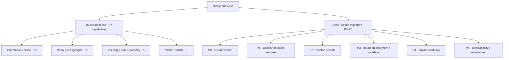
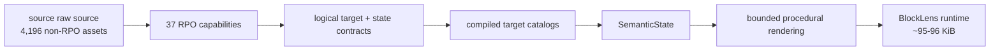
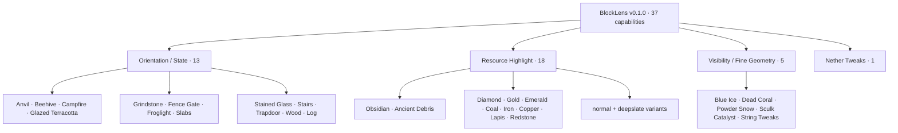
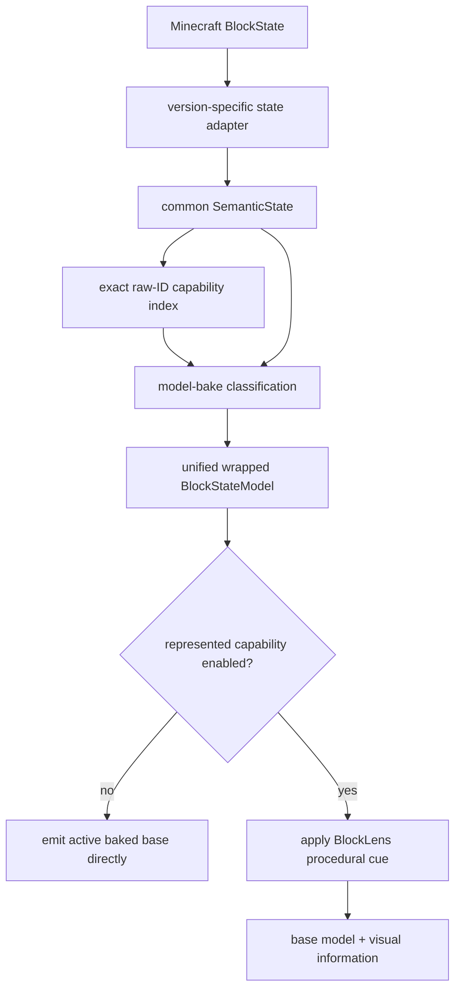
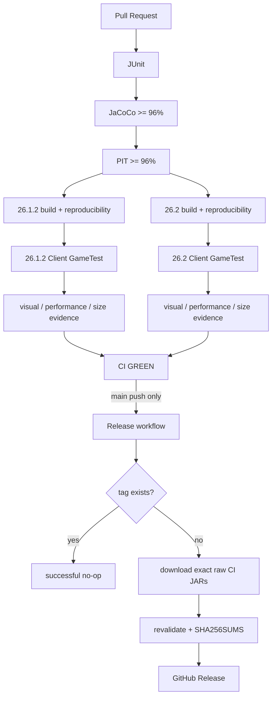

# BlockLens

<p align="center">
  
</p>

**English** | [日本語](README_ja.md)

BlockLens is a **client-side visual inspection mod for Minecraft Java Edition**. It makes block orientation and state, resources, fine geometry and Nether materials easier to distinguish through 40 independently configurable visual capabilities. See the [complete current feature list](knowledge/current/features.md).

The core design goal is **source/function parity, not byte-for-byte asset bundling**. If a set of raw blockstate/model/texture files describes one logical visual capability, BlockLens represents that behavior as compiled target catalogs, semantic state, and bounded procedural rendering.

> **Current stable release:** BlockLens **v0.2.0** provides **40 independently configurable capabilities** for Minecraft **26.1.2** and **26.2**, while preserving every identity and behavior contract in the original 37-capability source baseline.
>
> **Historical release:** BlockLens **v0.1.0** remains the immutable 37-capability source release baseline. P0 shipped in v0.2.0 with **328 capability-to-target bindings / 322 unique block targets**; the strict **100 KiB** release budget remains unchanged.

## Current development: three Minecraft versions

The development build targets **26.1.2 / 26.2 / 26.3**, preserving all 40 capabilities. Java 25, Fabric Loader **0.19.5+** and the matching Fabric API are required. PR #40's native settings redesign is merged. Current-head three-version validation is required; this does not add 26.3 to an already published release.

To watch real Minecraft UI automation on Windows, with Java 25 and Gradle 9.5.1 on PATH, run `./scripts/run-ui-tests.ps1` (all three) or `./scripts/run-ui-tests.ps1 -Version 26.3`. The runner opens actual clients sequentially, exits after testing and stops on failure. CI requires ten settings screenshots per target and separate rendering/JAR evidence. See [current version contract, exact dependencies and verification status](knowledge/current/minecraft-26-3.md).

## Product direction

BlockLens is the product base. ChiseTweaks is a source of selected capabilities and design ideas; it is **not** a runtime dependency.



The migration plan is tracked in **Issue #22** and [`knowledge/current/chisetweaks-migration.md`](knowledge/current/chisetweaks-migration.md).

## Source raw-source parity

The original intent is preserved: **all useful behavior represented by the effective source raw source must be represented by BlockLens**. That does not mean copying every source file into the runtime JAR.

The latest raw-source audit reproduced the established M0 evidence shape:

- **37 distinct RPO condition keys**
- **337 `.rpo` sidecars** in the supplied archive
- **336 effective gated roots**
- the 337th sidecar is an orphan duplicate `pale_oak_slab.rpo`, not a 38th capability
- **4,196 non-RPO Minecraft assets**
- **4,101 reachable assets** from effective RPO-gated roots
- **95 unreachable/source-residue candidates**
- BlockLens v0.1.0: **37 compiled capabilities / 323 capability-to-target bindings**

The raw source is therefore compressed into logical behavior rather than embedded literally:



### Source-to-runtime grouping

| Source group | RPO keys | Effective source shape | BlockLens v0.1.0 logical coverage |
| --- | ---: | --- | --- |
| Orientation / Decoration | 13 | blockstates + large model/texture dependency graph | **254 block targets** |
| Resource Highlight | 18 | 18 independently gated resource roots | **18 block targets** |
| Outline / Visibility | 4 | texture/blockstate gates | Blue Ice + **20 Dead Coral forms** + Powder Snow + Sculk Catalyst |
| String Tweaks | 1 | Tripwire blockstate + dependent geometry | **Tripwire** |
| Nether Tweaks | 1 | **33 textures + 1 model** | **27 Nether block targets** |

Two cases are worth calling out:

- **Dead Coral:** 15 gated textures represent 20 logical dead-coral block forms because wall-fan forms reuse fan textures. BlockLens targets all 20 logical forms.
- **Nether Tweaks:** 33 gated textures plus one Magma Block model represent 27 logical block targets. BlockLens targets those 27 blocks rather than shipping the original texture set.

The complete per-capability audit is in [`knowledge/current/source-raw-parity-audit.md`](knowledge/current/source-raw-parity-audit.md) and tracked by **Issue #24**.

## Stable v0.1.0 capability map



The supplied RPO preset historically enables five capabilities by default: Blue Ice, Dead Coral, Powder Snow, Sculk Catalyst, and String Tweaks. That preset is not the complete product scope.

## P0: ChiseTweaks visual-overlap absorption

P0 extends the existing BlockLens engine rather than importing the ChiseTweaks feature framework.

### Additive capabilities

- Crying Obsidian
- Nether Gold Ore
- Nether Quartz Ore

### Existing capabilities extended with ChiseTweaks parity

- String Tweaks → adds **Tripwire Hook** coverage
- Nether Tweaks → adds **Polished Basalt** coverage

The first 37 enum entries, bit positions, source/config keys, and defaults remain frozen. P0 appends new capability IDs only.

Published v0.2.0 contract:

- **40 capabilities**
- **328 capability-to-target bindings**
- **322 unique block targets**
- published JAR: **96,248 B** on both Minecraft lines
- release-era cross-platform no-growth baseline: **96,257 B**
- release ceiling: **102,400 B / 100 KiB**, unchanged

P0 was merged in PR #23 at `b440d43904e2a93236549efc571b7cc127622352`. Main CI **#270 / `34801429999`** and Release **#31 / `34802548055`** completed successfully before v0.2.0 was published.

## Runtime architecture



Runtime principles:

- compiled catalogs; no reflection/classpath feature discovery
- no whole-world target scan for ordinary visual features
- no per-frame registry scan
- semantic interpretation at model bake
- primitive enabled-capability mask on the render hot path
- direct active-base emission when represented capabilities are OFF
- immutable/bounded cue and instruction reuse
- bounded retained-capability structure across repeated resource reloads
- client-only packaging with no nested runtime dependency JARs

### Current source hardening

The current source tree provides a native **B-key settings screen** and an optional **Mod Menu** entrypoint without a required UI dependency. Its category-based redesign groups all 40 options into **Decoration, Resources, Visibility, and Other**, with explanations and separate Enabled/Disabled controls. **Save and apply** persists edits; **Discard changes** and **Esc** discard them. See [settings UI behavior and verification boundaries](knowledge/current/settings-ui.md). The redesign is under review; the supplied third-party pack combinations, source-screen pixel equivalence, shaders and Vulkan are not yet verified.

The same review also adds bounded config reads, synchronous temporary-file writes with atomic replacement where supported, immutable config publication, safe lazy-overlay publication, cached semantic enum tables/instructions, and two retained descriptor arrays per wrapped model instead of four. Current dual-version GameTest performance evidence covers OFF, default, and all-40 configurations. The reviewed local artifacts are **101,877 B (26.1.2) / 101,913 B (26.2)**; **101,913 B** is the new development no-growth baseline and the **102,400 B** hard release ceiling was not changed.

## Release

**v0.2.0** is the current verified stable release.

| Minecraft | Published JAR | Size | SHA-256 |
| --- | --- | ---: | --- |
| 26.1.2 | `BlockLens-26.1.2-v0.2.0.jar` | **96,248 B** | `c678c4c5955596db0a1e3064bc1301ad44bb88b6141243e88ca1cefe9973e98a` |
| 26.2 | `BlockLens-26.2-v0.2.0.jar` | **96,248 B** | `54b99d9b66a403195e28850dcfb165083007ee6cddb3521c36176d51af031105` |

The release targets `b440d43904e2a93236549efc571b7cc127622352`. Successful main CI **#270 / `34801429999`** supplied the exact artifacts published by Release **#31 / `34802548055`**, together with `SHA256SUMS.txt`.

**v0.1.0** remains the historical 37-capability baseline.

| Minecraft | Published JAR | Size | SHA-256 |
| --- | --- | ---: | --- |
| 26.1.2 | `BlockLens-26.1.2-v0.1.0.jar` | **95,332 B** | `191f579fe7d574c94614b611c01420fa6887684e2fabc597966515490f59d24b` |
| 26.2 | `BlockLens-26.2-v0.1.0.jar` | **95,333 B** | `3848de8a07836d829d12ab5ed09ee650d5e1bebd4e0249b254436dda9c5a54be` |

The release was produced from successful `main` CI **#245 / `34768792311`** at commit `a4b63087004d687c3c8223d0d95c6c95fb2c5156`. Release run **#3 / `34769093202`** published the exact CI-verified JAR bytes plus `SHA256SUMS.txt`.

## Supported environment

| Item | Current verified contract |
| --- | --- |
| Minecraft | **26.1.2** and **26.2** |
| Loader | Fabric Loader **0.19.3+** |
| Fabric API | **0.155.2+26.1.2** / **0.160.0+26.2** |
| Java | **25+** |
| Side | **Client only** |
| Server-side BlockLens | Not required |
| Verified renderer path | default / **shader-OFF OpenGL** |
| Shader-ON | not yet claimed as supported |
| Minecraft 26.2 Vulkan | experimental |

Issue #5 remains intentionally open for representative shader-ON / broader external compatibility evidence.

## Technology foundation

BlockLens is intentionally small at runtime, but its engineering and QA foundation is strict.

| Layer | Technology | Role |
| --- | --- | --- |
| Language | **Java 25** | production code, semantic engine, adapters, tests |
| Build | **Gradle 9.5.1** | multi-project build, deterministic artifacts, verification |
| Minecraft tooling | **Fabric Loom 1.17.19** | mappings, development runtime, build integration |
| Loader | **Fabric Loader 0.19.3** | client-side mod loading |
| Runtime API | **Fabric API** | Minecraft/Fabric hooks and Client GameTest integration |
| Unit / contract tests | **JUnit Jupiter 5.14.4** | semantic, config, target, repository and release contracts |
| Coverage | **JaCoCo 0.8.15** | line-coverage gate |
| Mutation testing | **PIT 1.19.0** | mutation coverage, score and test strength |
| PIT JUnit adapter | **pitest-junit5-plugin 1.2.3** | JUnit 5 mutation execution |
| Real-client integration | **Fabric Client GameTest** | real Minecraft startup/reload/render verification |
| Headless graphics | **Xvfb / Ubuntu 24.04** | framebuffer tests in GitHub Actions |
| CI/CD | **GitHub Actions** | dual-version quality/release pipeline |
| Artifact integrity | **SHA-256** | reproducibility and CI/release byte identity |

Java compilation uses `-Xlint:deprecation`, `-Xlint:unchecked`, and **`-Werror`**.

Quality gates remain:

- JaCoCo line coverage: **>= 96%**
- PIT mutation coverage: **>= 96%**
- PIT mutation score: **>= 96%**
- PIT test strength: **>= 96%**

## Real-client verification

Both supported Minecraft versions run **Fabric Client GameTest** under Xvfb. The gate covers configuration round-trips, resource reload, Overworld/Nether transitions, target/state mapping, full enable/OFF restoration, rendered visual evidence, resource-pack preservation fixtures, M8 performance/retention observations, model resolution, and reproducible artifact checks.

The original 37-capability source baseline remains a historical regression contract even as the development runtime grows beyond it.

## Automated quality and release pipeline



The Release job does not rebuild BlockLens. It promotes the exact verified raw CI JARs, rechecks metadata/icon/size, and publishes checksums.

## Artifact size history

- M8 pre-icon baseline: **88,973 B**
- v0.1.0 icon-inclusive stable baseline: **95,333 B**
- P0 measured development maximum: **96,257 B**
- P0 growth over v0.1.0 baseline: **924 B maximum**
- release budget: **100 KiB / 102,400 B**, unchanged
- source-pack `<50%` absolute hard maximum remains unchanged

Size reduction is never allowed to remove functional parity, tests, compatibility evidence, or safety gates.

## Installation

For the stable release:

1. Install Fabric Loader for the target Minecraft version.
2. Install the matching Fabric API.
3. Use Java 25 or later.
4. Download the matching JAR from the `v0.1.0` GitHub Release.
5. Put the JAR in the Minecraft `mods` directory.
6. Launch the client.

BlockLens is client-only; server-side installation is not required.

## Build and verify

```bash
./gradlew qualityGate
./gradlew ciGate
```

Per-version gates:

```bash
./gradlew :versions:mc26_1_2:build :versions:mc26_1_2:versionSmokeContract :versions:mc26_1_2:verifyRuntimeJarBudget
./gradlew :versions:mc26_2:build :versions:mc26_2:versionSmokeContract :versions:mc26_2:verifyRuntimeJarBudget
```

## Compatibility scope

Verified support is intentionally evidence-bounded:

- default / shader-OFF OpenGL: **verified**
- representative non-vanilla active resource-pack preservation: **verified fixture**
- arbitrary third-party resource packs: **not universally claimed**
- representative shader-ON configurations: **not yet claimed**
- Minecraft 26.2 Vulkan: **experimental**

## Release / redistribution audit

The runtime JAR contains BlockLens code/resources and BlockLens-owned assets. CI rejects nested dependency JARs, local paths, logs, saves, crash dumps, secret/private-key markers, source RPO residue, and retired runtime-policy bytecode. Source PNG/JSON assets are not redistributed.

## Engineering Graph Loop


## Project documentation

- [`AGENTS.md`](AGENTS.md) — engineering rules
- [`knowledge/index.md`](knowledge/index.md) — knowledge index
- [`knowledge/current/product-spec.md`](knowledge/current/product-spec.md) — product contract
- [`knowledge/current/architecture.md`](knowledge/current/architecture.md) — architecture
- [`knowledge/current/source-raw-parity-audit.md`](knowledge/current/source-raw-parity-audit.md) — raw-source/RPO parity audit
- [`knowledge/current/chisetweaks-migration.md`](knowledge/current/chisetweaks-migration.md) — ChiseTweaks → BlockLens migration
- [`knowledge/current/quality-strategy.md`](knowledge/current/quality-strategy.md) — quality strategy
- [`knowledge/current/performance-strategy.md`](knowledge/current/performance-strategy.md) — performance strategy
- [`knowledge/current/m8-performance.md`](knowledge/current/m8-performance.md) — M8 evidence
- [`knowledge/current/release-readiness.md`](knowledge/current/release-readiness.md) — M9/release evidence
- [`knowledge/current/roadmap.md`](knowledge/current/roadmap.md) — roadmap
- [`knowledge/current/engineering-loop.md`](knowledge/current/engineering-loop.md) — Graph Loop

`knowledge/current/` is the source of truth. README claims remain bounded by verified evidence.
