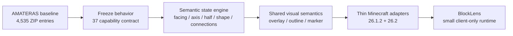
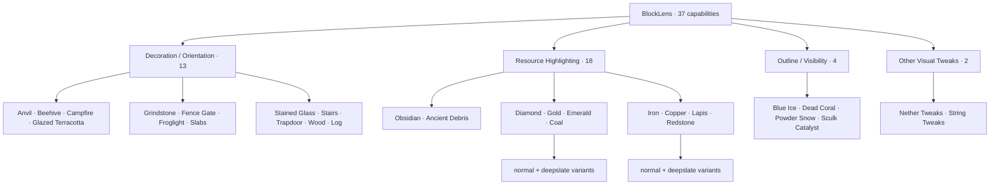
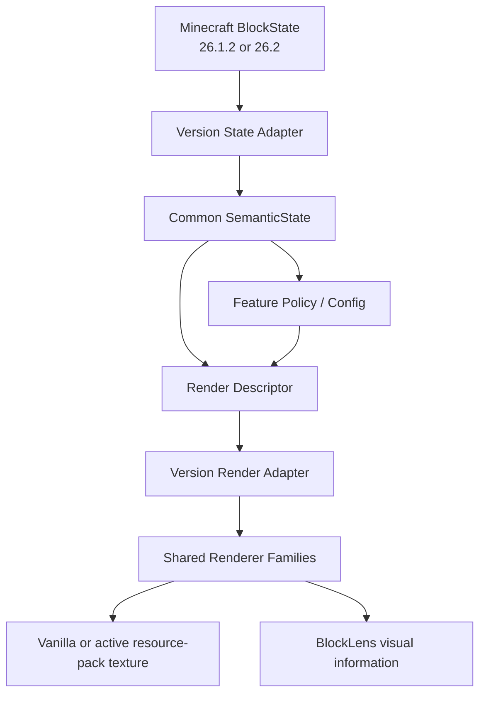
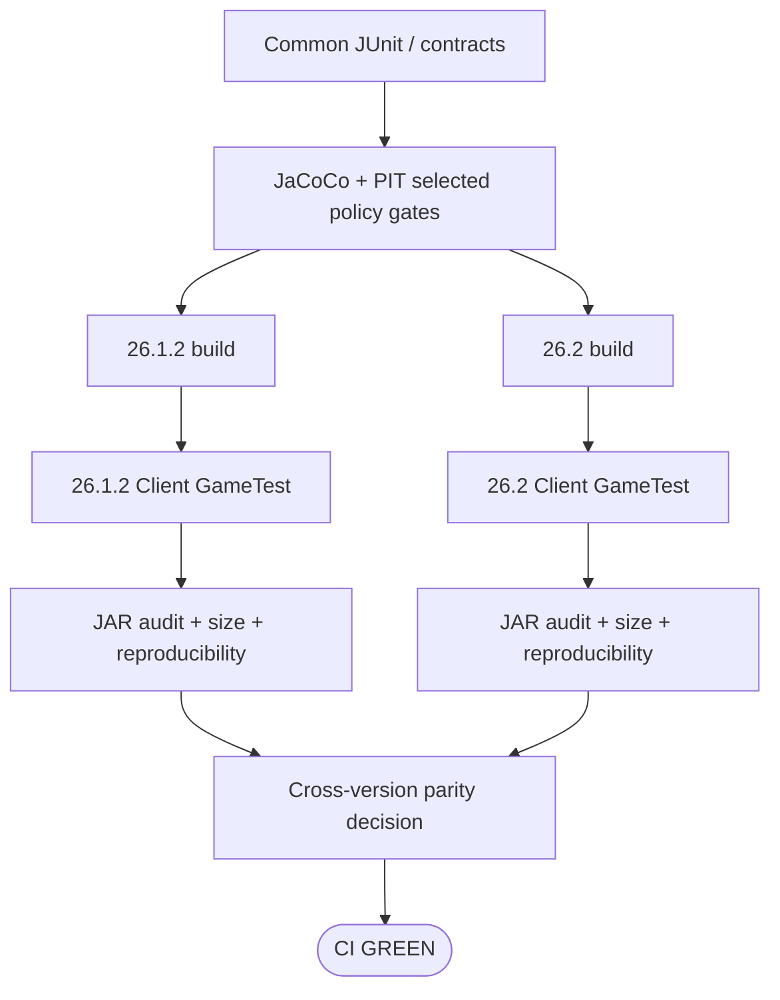

# BlockLens

**English** | [日本語](README_ja.md)

BlockLens is a **client-side visual inspection mod for Minecraft Java Edition**. It rebuilds the useful visual ideas of the AMATERAS resource-pack baseline as compact, testable code instead of shipping thousands of state-specific JSON/PNG files.

The project goal is not "make a resource pack into a JAR." The goal is to preserve the **37-capability visual contract** while improving maintainability, cross-version behavior, configuration, performance evidence, and artifact size.

> **Current project state:** M0 and M1 are complete. The M2 shared semantic-state engine and dual-version adapters are implemented in PR #9. Visual rendering parity for the 13 decoration/orientation capabilities is the next implementation layer; BlockLens does **not** yet claim full 37-feature visual parity.

## Why BlockLens?

The source baseline is useful but structurally expensive: thousands of tiny blockstate/model files encode combinations that can often be represented once as semantics and rendered dynamically.



The migration rule is:

```text
many state-specific JSON / PNG variants
                ↓
shared state interpretation + shared render semantics + minimal unique assets
```

## Supported platforms

| Item | Current contract |
| --- | --- |
| Minecraft | **26.1.2** and **26.2** |
| Loader | Fabric |
| Java | **25** |
| Side | **Client only** |
| Server mod required | No |
| Product policy | Shared across both Minecraft versions |
| Version-specific code | Thin Minecraft/Fabric adapters only |

A feature is not considered complete when it works on only one supported Minecraft line unless a current specification explicitly records an exception.

## 37-capability map

The frozen source baseline contains **37 independently controllable capabilities**.



The supplied reference RPO preset enables five of the 37 capabilities: Blue Ice, Dead Coral, Powder Snow, Sculk Catalyst, and String Tweaks. That preset is only a preset; the other 32 capabilities remain part of the product contract.

## Runtime architecture

BlockLens keeps Minecraft mapping/API differences at the edge and product semantics in shared code.



### Shared semantic state

M2 represents only the information BlockLens needs instead of retaining mapped Minecraft objects in common policy:

- horizontal facing
- axis
- top/bottom half
- stair shape
- mount face
- slab type
- north/east/south/west connections
- honey level
- open / lit / in-wall / powered / attached flags

The semantic state is compact and Minecraft-independent. Version modules translate mapped `BlockState` values into that shared representation.

## Development status

| Milestone | Status | Result |
| --- | --- | --- |
| M0 — source baseline freeze | ✅ Complete | 37/37 capability evidence and machine-readable contract |
| M1 — dual-version quality scaffold | ✅ Complete | Java 25, config, CI, GameTest, reproducible artifacts, size/load baseline |
| M2 — shared state engine | 🔧 Implemented in PR #9 | semantic model, both adapters, cross-version oracle, bounded lookup |
| M3 — 13 decoration/orientation visuals | ⏭ Next | shared render semantics + visual parity |
| M4–M7 | Planned | outline, resource highlights, Nether Tweaks, full interaction hardening |
| M8 | Planned | final performance/load/size hardening |
| M9 | Planned | release-readiness and public artifact audit |

Authoritative implementation order: [`knowledge/current/roadmap.md`](knowledge/current/roadmap.md).

## M1 verified baseline

The M1 scaffold was intentionally tiny before visual rendering code expanded.

| Minecraft | Runtime JAR | BlockLens init | Client GameTest | Reproducible artifact |
| --- | ---: | ---: | --- | --- |
| 26.1.2 | **14,481 B** | ~**7.513 ms** | PASS | PASS |
| 26.2 | **14,476 B** | ~**2.684 ms** | PASS | PASS |

These are **M1 baselines**, not promises that later feature-complete artifacts remain 14 KiB.

```text
Source resource-pack ZIP   2,366,865 B  ████████████████████████████████████████
M1 26.1.2 runtime JAR         14,481 B  ▏
M1 26.2 runtime JAR           14,476 B  ▏
Hard release maximum       1,183,432 B  ████████████████████
Stretch target               716,800 B  ████████████
```

Per release artifact:

- required: **< 1,183,433 bytes**
- stretch: **<= 716,800 bytes (700 KiB)**

Functional parity and correctness have higher priority than byte count.

## Quality graph

Minecraft integration changes must pass both version branches.



Current automated quality includes:

- JUnit 5
- exact 37-capability contract tests
- cross-version state/config parity contracts
- selected JaCoCo verification
- selected PIT mutation testing
- Fabric Client GameTest on both supported versions
- config persistence checks
- runtime JAR structure/privacy/residue audit
- clean-rebuild SHA-256 reproducibility audit
- runtime JAR byte budget
- startup/load structural contracts

## Engineering Graph Loop

BlockLens uses an explicit development graph. Code written is not equivalent to work completed.


A failure always loops through **DIAGNOSE → FIX → VERIFY**. It does not skip directly to completion.

The authoritative rules, exit criteria, and `DONE / BLOCKED / PARTIAL` terminal states are defined in [`knowledge/current/engineering-loop.md`](knowledge/current/engineering-loop.md).

## Repository layout

```text
BlockLens/
├─ common/                  # shared product policy, config, semantic state, contracts
├─ versions/
│  ├─ mc26_1_2/            # thin 26.1.2 Minecraft/Fabric adapter
│  └─ mc26_2/              # thin 26.2 Minecraft/Fabric adapter
├─ gametest/                # shared Client GameTest source/resources
├─ gradle/                  # version-module convention and build rules
├─ knowledge/
│  ├─ index.md
│  └─ current/              # authoritative current specification
├─ AGENTS.md                # engineering rules
└─ README_ja.md             # Japanese README
```

## Build and verify

Java 25 is required.

Shared semantic/config quality gate:

```bash
./gradlew qualityGate
```

Full build-oriented CI entry point:

```bash
./gradlew ciGate
```

Per-version client integration checks are also executed by GitHub Actions. A Minecraft/Fabric integration change is not complete until **both** supported versions are green for the current head SHA.

## Performance rules

BlockLens intentionally avoids work that does not belong on startup or the render hot path:

- no runtime classpath/reflection feature discovery
- no startup update/network check
- no telemetry initialization
- no normal-path legacy RPO parsing
- no eager geometry generation for disabled features
- no whole-world or unbounded loaded-chunk scan each frame
- no per-frame rebuilding of unchanged retained geometry
- bounded target/capability lookup where practical
- explicit cache invalidation and cleanup around reload/world transitions

Performance claims require evidence. Startup/load, resource reload, runtime frame behavior, allocations/memory, and JAR bytes are measured as separate budgets.

## Resource-pack and shader compatibility direction

BlockLens prefers to preserve the texture supplied by Minecraft or the user's active resource pack, then layer the additional visual information on top where technically safe.

Shader/backend compatibility is verified rather than assumed. Minecraft 26.2 OpenGL is a required track; Vulkan is tracked separately and is not claimed merely because OpenGL passes.

## Non-goals

- embedding the original resource pack unchanged inside the JAR
- removing capabilities merely to meet a size target
- duplicating product policy between Minecraft version directories
- requiring a BlockLens server component for visual features
- adding unrelated gameplay automation
- treating the currently enabled five RPO options as the complete product
- claiming shader/backend compatibility without verification

## Source and licensing note

The AMATERAS resource pack is used as a **behavioral/visual reference baseline**. Its internal structure is not the target architecture for BlockLens.

The baseline contains attribution to other creators and no redistribution permission should be assumed from this repository. Before public release, every third-party texture, model, text, or other retained asset must have its redistribution/license status verified. Functional ideas can instead be reimplemented with original code/rendering where appropriate.

## Project documentation

- Engineering rules: [`AGENTS.md`](AGENTS.md)
- Knowledge index: [`knowledge/index.md`](knowledge/index.md)
- Product contract: [`knowledge/current/product-spec.md`](knowledge/current/product-spec.md)
- Architecture: [`knowledge/current/architecture.md`](knowledge/current/architecture.md)
- Quality strategy: [`knowledge/current/quality-strategy.md`](knowledge/current/quality-strategy.md)
- Performance strategy: [`knowledge/current/performance-strategy.md`](knowledge/current/performance-strategy.md)
- Roadmap: [`knowledge/current/roadmap.md`](knowledge/current/roadmap.md)
- Engineering Graph Loop: [`knowledge/current/engineering-loop.md`](knowledge/current/engineering-loop.md)

`knowledge/current/` is the source of truth. README files are user-facing summaries and must be corrected when they fall behind current specifications.
