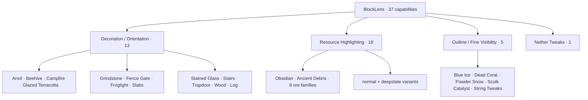
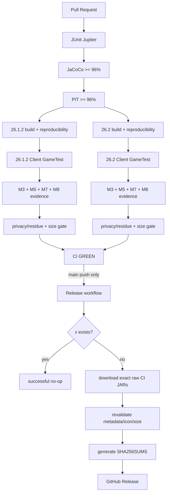

# BlockLens

<p align="center">
  
</p>

**English** | [日本語](README_ja.md)

BlockLens is a **client-side visual inspection mod for Minecraft Java Edition**. It recreates the useful visual behavior of the pinned AMATERAS resource-pack baseline as compact, testable code instead of redistributing thousands of state-specific JSON/PNG files.

The product contract contains **37 independently configurable capabilities**. Minecraft-version differences are isolated behind thin adapters while configuration, semantic state, target policy, rendering behavior, quality gates, and release automation are shared across Minecraft **26.1.2** and **26.2**.

> **Current state:** **M0-M9 are complete and BlockLens v0.1.0 is published and verified.** The release was produced from successful `main` CI **#245 / `34768792311`** at commit `a4b63087004d687c3c8223d0d95c6c95fb2c5156`. The published JARs are exactly the CI-verified artifacts. The icon-inclusive no-growth baseline is **95,333 B**, with a strict **100 KiB** release budget.

## Release

**v0.1.0** is the first verified release line.

| Minecraft | Published JAR | Size | SHA-256 |
| --- | --- | ---: | --- |
| 26.1.2 | `BlockLens-26.1.2-v0.1.0.jar` | **95,332 B** | `191f579fe7d574c94614b611c01420fa6887684e2fabc597966515490f59d24b` |
| 26.2 | `BlockLens-26.2-v0.1.0.jar` | **95,333 B** | `3848de8a07836d829d12ab5ed09ee650d5e1bebd4e0249b254436dda9c5a54be` |

The release also publishes `SHA256SUMS.txt`. Release run **#3 / `34769093202`** completed successfully and verified the exact asset set after publication.

## Supported environment

| Item | Current contract |
| --- | --- |
| Minecraft | **26.1.2** and **26.2** |
| Loader | Fabric Loader **0.19.3+** |
| Fabric API | **0.155.2+26.1.2** / **0.160.0+26.2** |
| Java | **25+** |
| Side | **Client only** |
| Server-side BlockLens | Not required |
| Verified renderer path | Default / shader-OFF OpenGL |
| Shader-ON | Not yet claimed as supported |
| Minecraft 26.2 Vulkan | Experimental |

## 37-capability product map



The supplied RPO enables five capabilities by default—Blue Ice, Dead Coral, Powder Snow, Sculk Catalyst, and String Tweaks. That preset is not the complete product scope.

## Runtime architecture


Runtime principles:

- **323 capability-to-target bindings** / **320 unique Minecraft block targets**
- no whole-world target scan
- no per-frame registry scan
- semantic interpretation at model bake
- primitive enabled-capability mask on the render hot path
- direct active-base emission when no represented capability is enabled
- immutable/bounded cue and instruction reuse
- bounded retained-capability structure verified across repeated resource reloads
- client-only packaging with no nested runtime dependency JARs

## Technology foundation

BlockLens is intentionally small at runtime, but its engineering and QA foundation is deliberately strict.

| Layer | Technology | Role in BlockLens |
| --- | --- | --- |
| Language | **Java 25** | Production code, shared semantic engine, Fabric adapters, tests |
| Build | **Gradle 9.5.1** | Multi-project build, deterministic artifacts, verification tasks |
| Minecraft tooling | **Fabric Loom 1.17.19** | Minecraft mappings, development runtime, build integration |
| Loader | **Fabric Loader 0.19.3** | Client-side mod loading |
| Runtime API | **Fabric API** | Version-specific Minecraft/Fabric hooks and Client GameTest integration |
| Unit / contract tests | **JUnit Jupiter 5.14.4** | Semantic, config, target-policy, repository, regression and release contracts |
| Test platform | **JUnit Platform** | JUnit 5 execution through Gradle |
| Coverage | **JaCoCo 0.8.15** | Line-coverage reporting and hard coverage gate |
| Mutation testing | **PIT 1.19.0** | Mutation coverage, mutation score and test-strength verification |
| PIT JUnit 5 adapter | **pitest-junit5-plugin 1.2.3** | JUnit 5 mutation-test execution |
| Real-client integration | **Fabric Client GameTest** | Real Minecraft client startup, reload, dimension and rendering verification |
| Headless graphics CI | **Xvfb / Ubuntu 24.04** | Real-client and framebuffer testing in GitHub Actions |
| CI/CD | **GitHub Actions** | Shared quality gate, dual-version verification, evidence capture, release automation |
| Artifact integrity | **SHA-256** | Reproducibility, CI/release byte identity and published checksums |
| Release publishing | **GitHub CLI (`gh`) + GitHub REST API** | Release orchestration and exact raw CI-artifact handoff |

### Java and JUnit

Production and test code compile against **Java 25**. The common semantic/configuration layer is tested with **JUnit Jupiter 5.14.4** on the **JUnit Platform**. Repository-contract tests also protect build/release invariants—for example, the M9 contract prevents the release pipeline from accidentally extracting an `archive:false` raw JAR artifact instead of publishing the verified JAR bytes.

Compilation uses `-Xlint:deprecation`, `-Xlint:unchecked`, and **`-Werror`**, so configured Java warnings are treated as build failures rather than release-time cleanup work.

### JaCoCo and PIT

The common product-policy surface uses both structural coverage and mutation testing:

- JaCoCo line coverage: **>= 96%**
- PIT mutation coverage: **>= 96%**
- PIT mutation score: **>= 96%**
- PIT test strength: **>= 96%**

JaCoCo answers whether important code is executed. PIT goes further by deliberately mutating logic and checking whether the tests detect the change. BlockLens therefore does not treat a high line-coverage percentage alone as proof that the test suite is strong.

### Fabric Client GameTest

Unit tests cannot prove that Minecraft actually starts, resources resolve, models bake, dimensions transition correctly, or framebuffer evidence is produced. Both supported versions therefore run **Fabric Client GameTest** under **Xvfb** in CI.

The real-client gate covers configuration round-trips, resource reload, Overworld/Nether transitions, all-37 integration, all-OFF restoration, M3/M5/M7 visual evidence, M8 load/performance/retention observations, and BlockLens-owned model resolution.

## Automated quality and release pipeline



### Release safety properties

`.github/workflows/release.yml` deliberately separates verification from publication:

- release runs only after the named **CI** workflow succeeds;
- only successful **pushes to `main`** are eligible;
- the release job checks out the **exact verified commit SHA**;
- the release job does **not rebuild BlockLens**;
- CI runtime JARs are uploaded as raw `archive:false` artifacts and the release job downloads those exact payloads directly through the GitHub Actions artifact API;
- the downloaded payload is validated as a JAR before publication;
- Minecraft version, mod version, client-only metadata, icon presence and size budgets are rechecked;
- `mod_version` is the release-version source of truth;
- if `v<mod_version>` already exists, publication becomes a successful no-op;
- SHA-256 checksums are generated and the final asset set is verified after publication.

This raw-artifact handoff was exercised by the live **v0.1.0** publication, not only by static tests.

## Milestone status

- **M0-M7:** product contract, architecture, all 37 core capabilities and dual-version real-client gate complete.
- **M8:** performance/load/retention/size hardening complete.
- **M9:** release readiness and live v0.1.0 publication complete.

The M8 pre-icon baseline was **88,973 B**. M9 intentionally added the repository-owned release icon and froze the measured icon-inclusive shared baseline at **95,333 B**. The **100 KiB** release ceiling and source-pack **<50%** hard maximum were not relaxed.

## Installation

1. Install Fabric Loader for the target Minecraft version.
2. Install the matching Fabric API.
3. Use Java 25 or later.
4. Download the matching JAR from the `v0.1.0` GitHub Release.
5. Put the JAR in the Minecraft `mods` directory.
6. Launch the client.

BlockLens is client-only; a server-side BlockLens installation is not required.

## Build and verify

```bash
./gradlew qualityGate
./gradlew ciGate
```

Useful per-version gates:

```bash
./gradlew :versions:mc26_1_2:build :versions:mc26_1_2:versionSmokeContract :versions:mc26_1_2:verifyRuntimeJarBudget
./gradlew :versions:mc26_2:build :versions:mc26_2:versionSmokeContract :versions:mc26_2:verifyRuntimeJarBudget
```

Per-version builds also write deterministic runtime-size evidence to `build/reports/blocklens/runtime-jar-size.txt`.

## Compatibility scope

Verified support is intentionally narrower than “anything Fabric can run”:

- default / shader-OFF OpenGL: **verified**
- representative non-vanilla active resource-pack preservation: **verified fixture**
- arbitrary third-party resource packs: **not universally claimed**
- representative shader-ON configurations: **not yet claimed**
- Minecraft 26.2 Vulkan: **experimental**

Issue #5 remains the authority for shader-ON and broader external compatibility work. Those unchecked combinations are outside the v0.1.0 advertised support boundary, not hidden release blockers.

## Release / redistribution audit

The runtime JAR contains BlockLens code/resources and BlockLens-owned icon/models. CI rejects nested dependency JARs, local paths, logs, saves, crash dumps, secret/private-key markers, source RPO residue and retired runtime-policy bytecode. AMATERAS PNG assets are not redistributed.

No explicit open-source license is granted by the repository unless a `LICENSE` file is added. GitHub Release publication by the repository owner does not imply third-party redistribution rights.

## Engineering Graph Loop


The first release attempt exposed a raw-artifact handoff defect. Graph Loop returned through **DIAGNOSE → FIX → VERIFY** in PR #20, then reran PR CI, `main` CI, and the live Release workflow before M9 was considered done.

## Project documentation

- [`AGENTS.md`](AGENTS.md) — engineering rules
- [`knowledge/index.md`](knowledge/index.md) — knowledge index
- [`knowledge/current/product-spec.md`](knowledge/current/product-spec.md) — product contract
- [`knowledge/current/architecture.md`](knowledge/current/architecture.md) — architecture
- [`knowledge/current/quality-strategy.md`](knowledge/current/quality-strategy.md) — quality strategy
- [`knowledge/current/performance-strategy.md`](knowledge/current/performance-strategy.md) — performance strategy
- [`knowledge/current/m8-performance.md`](knowledge/current/m8-performance.md) — M8 evidence
- [`knowledge/current/release-readiness.md`](knowledge/current/release-readiness.md) — M9/release evidence
- [`knowledge/current/roadmap.md`](knowledge/current/roadmap.md) — roadmap
- [`knowledge/current/engineering-loop.md`](knowledge/current/engineering-loop.md) — Graph Loop

`knowledge/current/` is the source of truth. README files do not claim compatibility or performance beyond verified evidence.
