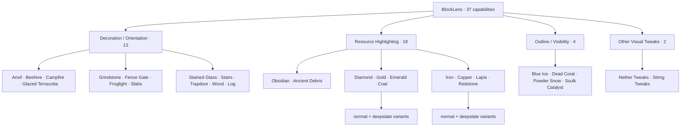
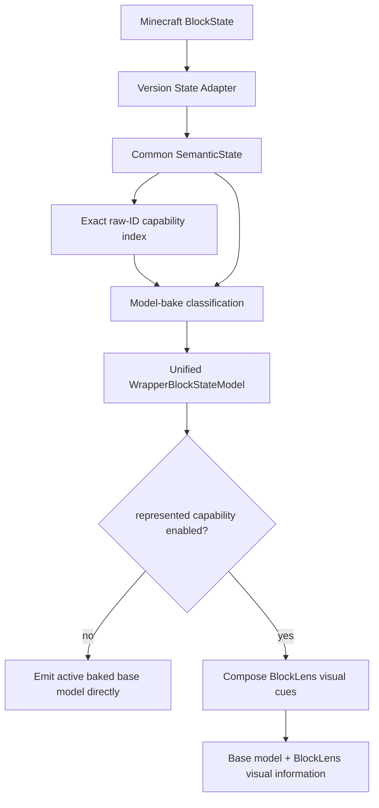
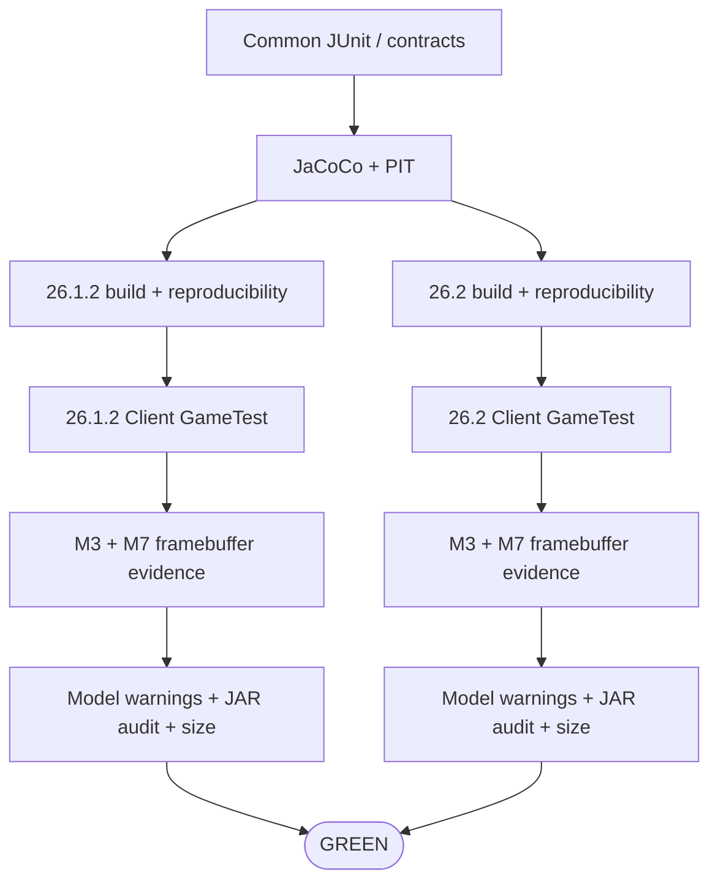

# BlockLens

**English** | [日本語](README_ja.md)

BlockLens is a **client-side visual inspection mod for Minecraft Java Edition**. It reconstructs the useful visual behavior of the pinned AMATERAS resource-pack baseline as compact, testable code instead of shipping thousands of state-specific JSON/PNG files.

The product contract contains **37 independently configurable capabilities**. BlockLens keeps Minecraft-version differences at thin adapter boundaries and shares state interpretation, configuration, target policy, and render semantics across Minecraft **26.1.2** and **26.2**.

> **Current state:** M0–M3 are complete. M4 Outline/Fine Visibility and M6 Nether Tweaks have reached core parity. All 18 M5 Resource Highlight controls are implemented. The M7 automated core gate is green for all 37 capabilities, including all-on, real native config-file save/reload, resource reload, dimension round-trip, Nether-Tweaks-only evidence, the frozen five-feature preset, and all-off restoration. Representative third-party resource packs, shader-ON paths, Vulkan, dedicated dark-area highlight evidence, M8 performance work, and M9 release readiness remain open.

## Supported environment

| Item | Current contract |
| --- | --- |
| Minecraft | **26.1.2** and **26.2** |
| Loader | Fabric |
| Java | **25** |
| Side | **Client only** |
| Server-side BlockLens | Not required |
| Product policy | Shared across both Minecraft versions |
| Version-specific code | Thin Minecraft/Fabric adapters |
| Verified renderer path | Default / shader-OFF OpenGL CI path |
| Vulkan | Experimental track; not implied by OpenGL success |

## 37-capability map



The supplied RPO enables five capabilities—Blue Ice, Dead Coral, Powder Snow, Sculk Catalyst, and String Tweaks—but that is only a preset. The other 32 remain part of the product contract.

## Unified runtime architecture



Current target scope:

- **323 capability-to-target bindings**
- **320 unique Minecraft block targets**
- intentional overlap through capability bitmasks
- no whole-world target scan
- no per-frame registry scan
- semantic interpretation at model bake
- primitive enabled-capability mask on the render hot path
- direct active-base emission when no represented capability is enabled

## Implemented visual families

### M3 — Decoration / Orientation · 13 ✅

All 13 decoration/orientation capabilities are rendered procedurally over the active baked model. State-aware behavior includes axis, stairs, slabs, trapdoors, gates, beehives, campfires, grindstones, stained glass, and related targets. Both supported Minecraft lines have rendered all-13, reload, and OFF-restoration evidence.

Authoritative contract: [`knowledge/current/m3-visual-semantics.md`](knowledge/current/m3-visual-semantics.md).

### M4 — Outline / Fine Visibility · 5 ✅ core parity

Implemented: Blue Ice, Dead Coral, Powder Snow, Sculk Catalyst, and String Tweaks. Sculk `bloom` is retained, and all **64 Tripwire semantic states** for N/E/S/W + `powered` + `attached` are covered by regression tests.

### M5 — Resource Highlighting · 18 🔧 core implementation complete

All 18 frozen resource-highlight controls are integrated into the same wrapper. The active baked base model is preserved while BlockLens adds a full-bright procedural accent using emissive rendering, diffuse shading disabled, and ambient occlusion disabled.

The shader-OFF/default OpenGL path passes on both versions. Dedicated dark-area evidence, representative shader-ON verification, and representative third-party resource-pack compatibility remain open before broader support is claimed.

### M6 — Nether Tweaks · 27 exact targets ✅ core parity

The pinned source ZIP was inspected directly; behavior is not guessed from the RPO key name. The dominant 16×16 source grammar is a **14×14 flat interior + 1-pixel frame**, with an additional upper band for Nylium.

BlockLens recreates that behavior with a source-derived palette plus two tiny BlockLens-owned reusable models: `interior_fill` and `upper_band`. No AMATERAS PNG is copied. CI fails if those models are missing or have incomplete texture references.

## M7 automated core integration gate

The same real Fabric Client GameTest runs on Minecraft **26.1.2** and **26.2**. It currently verifies:

- all 37 capabilities ON simultaneously
- config codec/mask round-trip
- **real `config/blocklens.properties` save → runtime reload → exact restoration**
- resource reload with all 37 enabled
- deterministic framebuffer evidence after reload
- Overworld → Nether → Overworld round-trip
- Nether Tweaks enabled alone
- frozen five-feature reference preset
- all 37 OFF / active base restoration
- bounded zero-world-scan target lookup
- BlockLens-owned model resolution

The native config acceptance uses the real Fabric config directory, flips all 37 booleans, persists through the production `BlockLensConfigFiles.save(...)` path, reloads through `BlockLensRuntime.reloadConfig(...)`, checks the runtime bitmask, and restores the original config before visual tests continue. Filesystem reload is explicit configuration work and is **not** performed on the render hot path.

Latest implementation verification: **GitHub Actions `34730806632` (run #160)**.

| Evidence | Minecraft 26.1.2 | Minecraft 26.2 |
| --- | ---: | ---: |
| all-37 ON vs OFF ROI delta | **3,917 px** | **3,903 px** |
| after resource reload vs OFF | **3,911 px** | **3,903 px** |
| Nether Tweaks only vs OFF | **764 px** | **764 px** |
| five-feature preset vs OFF | **1,072 px** | **1,063 px** |
| dimension round-trip | PASS | PASS |
| config codec round-trip | PASS | PASS |
| native config-file save/reload | **PASS** | **PASS** |
| BlockLens model resolution | PASS | PASS |

Each version archives five deterministic M7 screenshots, a manifest, and screenshot SHA-256 list.

Authoritative M4–M7 evidence: [`knowledge/current/m4-m7-parity.md`](knowledge/current/m4-m7-parity.md).

## Development status

| Milestone | Status | Result |
| --- | --- | --- |
| M0 | ✅ Complete | pinned source baseline / 37-capability contract |
| M1 | ✅ Complete | Java 25, dual-version build, CI, Client GameTest, artifact gates |
| M2 | ✅ Complete | shared semantic state + thin version adapters |
| M3 | ✅ Complete | 13 decoration/orientation capabilities with rendered parity |
| M4 | ✅ Core parity | five outline/fine-visibility capabilities |
| M5 | 🔧 Core implementation complete | 18 resource highlights; compatibility evidence remains |
| M6 | ✅ Core parity | 27 exact Nether targets and isolated framebuffer evidence |
| M7 | 🔧 Automated core gate green | all-37, native config reload, resource reload, dimension, preset, OFF restoration |
| M8 | Planned | performance/load/size hardening |
| M9 | Planned | release readiness and public artifact audit |

Authoritative roadmap: [`knowledge/current/roadmap.md`](knowledge/current/roadmap.md).

## Current artifact evidence

Run `34730806632` produced:

| Minecraft | Runtime JAR | SHA-256 | Client GameTest |
| --- | ---: | --- | --- |
| 26.1.2 | **92,988 B** | `bf07d2f19f4edeb3a4ec630e62449e01ab83dd0010e2105932cabf84a98a2857` | PASS |
| 26.2 | **92,988 B** | `13af1b1d7ba9ee17f693202862226c43d687540b6f2b94c5cd0e41c1c297f272` | PASS |

Current size budgets per runtime artifact:

- required: **< 1,183,433 bytes**
- stretch: **<= 716,800 bytes (700 KiB)**

Historical M1 baselines were 14,481 B for 26.1.2 and 14,476 B for 26.2; those are not current artifact sizes.

## Automated quality



Current gates include exact capability/state contracts, JaCoCo, PIT, real Client GameTest on both versions, native config persistence/reload acceptance, M3/M7 framebuffer artifacts, model-resource warning checks, reproducible JAR rebuilds, privacy/residue checks, and byte budgets.

## Still pending

A green M7 core gate is **not** a claim that every compatibility path is finished. Still open:

- dedicated dark-area Resource Highlight framebuffer evidence
- representative third-party active resource-pack matrix
- representative shader path with shader **ON**
- Minecraft 26.2 Vulkan experimental verification
- M8 startup/resource-reload/frame-time/allocation/cache measurements
- M9 licensing/attribution audit, compatibility notes, clean Prism/Fabric smoke tests, release notes, and public artifact audit

## Build and verify

Java 25 is required.

```bash
./gradlew qualityGate
./gradlew ciGate
```

A Minecraft/Fabric integration change is not complete until **both supported versions are green for the current head**.

## Project documentation

- [`AGENTS.md`](AGENTS.md) — engineering rules
- [`knowledge/index.md`](knowledge/index.md) — knowledge index
- [`knowledge/current/product-spec.md`](knowledge/current/product-spec.md) — product contract
- [`knowledge/current/architecture.md`](knowledge/current/architecture.md) — architecture
- [`knowledge/current/quality-strategy.md`](knowledge/current/quality-strategy.md) — quality strategy
- [`knowledge/current/performance-strategy.md`](knowledge/current/performance-strategy.md) — performance strategy
- [`knowledge/current/roadmap.md`](knowledge/current/roadmap.md) — roadmap
- [`knowledge/current/m3-visual-semantics.md`](knowledge/current/m3-visual-semantics.md) — M3 visual semantics
- [`knowledge/current/m4-m7-parity.md`](knowledge/current/m4-m7-parity.md) — M4–M7 core parity evidence
- [`knowledge/current/engineering-loop.md`](knowledge/current/engineering-loop.md) — Graph Loop

`knowledge/current/` is the source of truth. README files are user-facing summaries and must be updated whenever completed implementation changes their meaning.
