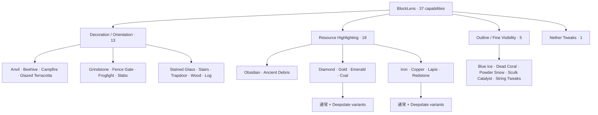
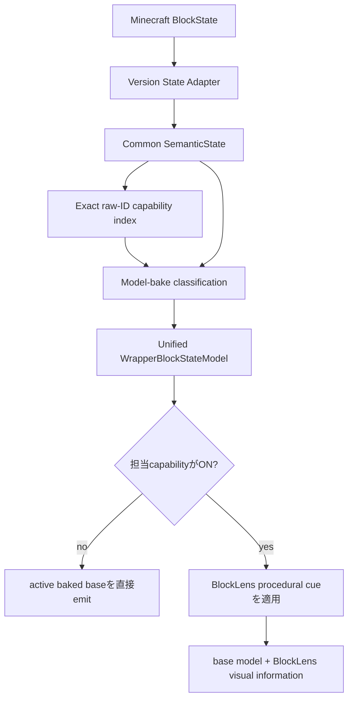
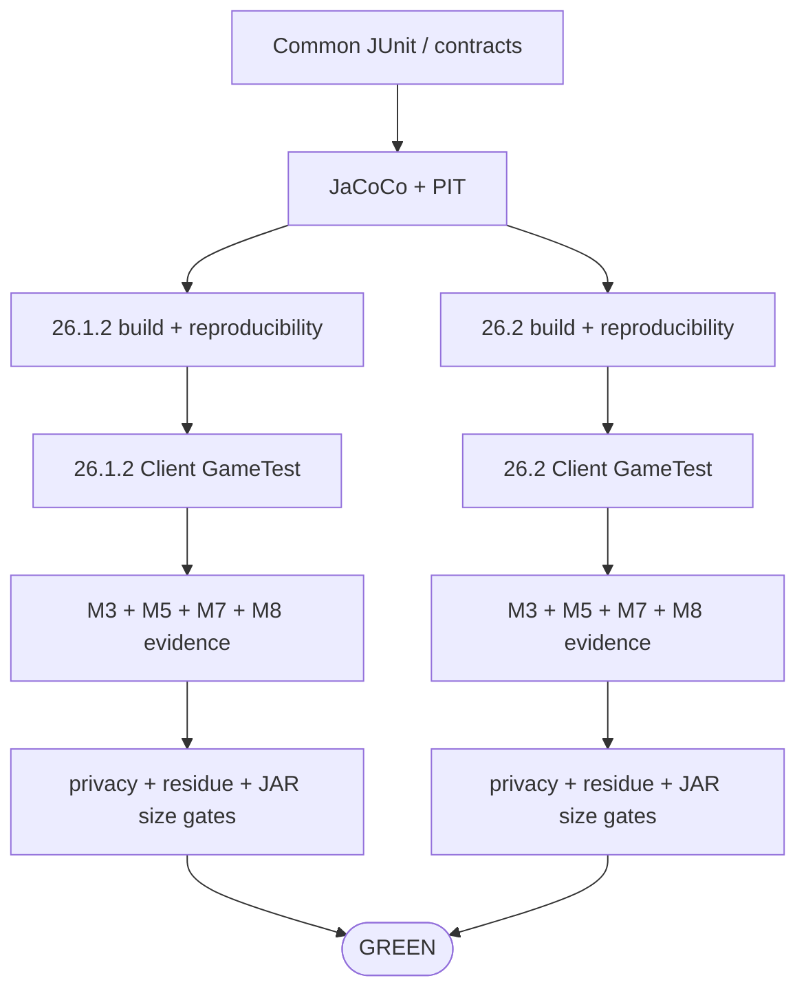

# BlockLens

[English](README.md) | **日本語**

BlockLensは、Minecraft Java Edition向けの**クライアント専用ビジュアル検査MOD**です。固定したAMATERASリソースパックbaselineの有用な視認性を、何千個ものstate別JSON/PNGをそのまま再配布するのではなく、コンパクトでテスト可能なコードとして再構築します。

製品契約は**独立設定可能な37機能**です。Minecraft固有差分は薄いadapter境界へ閉じ込め、設定・状態解釈・target policy・render semanticsはMinecraft **26.1.2**と**26.2**で共有します。

> **現在の状態:** M0〜M7のcore behaviorは実装・継続検証済みです。現在はM8のperformance / load / size hardeningを進行中です。37機能を維持したまま、両対応Minecraft版のverified runtime JAR baselineは**93,068 bytes**です。

## 対応環境

| 項目 | 現在仕様 |
| --- | --- |
| Minecraft | **26.1.2** / **26.2** |
| Loader | Fabric |
| Java | **25** |
| 動作側 | **Client only** |
| Server側BlockLens | 不要 |
| 製品仕様 | 両Minecraft版で共有 |
| version固有コード | 薄いMinecraft/Fabric adapter |
| 検証済みrenderer path | default / shader-OFF OpenGL CI path |
| Vulkan | experimental track |

## なぜ元リソパより大幅に小さいのか

固定した元リソースパックは **2,366,865 bytes**、ZIP entry数は**4,535**です。多数の小さなJSON / PNG / RPOで挙動を表現しており、ZIP/container overheadだけでも約**45.9%**あります。

BlockLensではその挙動をshared semantic codeと、ごく少数のBlockLens所有resourceへ移しています。

| Artifact | サイズ | 元リソパ比 |
| --- | ---: | ---: |
| 固定AMATERAS resource pack | **2,366,865 B** | 100% |
| 絶対条件（50%未満） | **< 1,183,433 B** | < 50% |
| BlockLens release budget | **<= 102,400 B (100 KiB)** | <= 4.33% |
| verified M8 baseline | **93,068 B** | **3.93%** |

つまり、37機能という製品scopeを維持しながら、固定source ZIP比で約**96.1%削減**しています。

### M8 サイズルール

1. runtime JARは必ず **1,183,433 B未満**を維持する。
2. 通常のBlockLens release budgetは **100 KiB**。
3. **93,068 B**を現在のverified no-growth baselineとして固定する。
4. baselineを超える増加はregressionとして扱い、意図的な再baselineにはレビュー根拠を必須とする。
5. CI/Gradleでcompressed category totalsと最大entryを含むdeterministic size reportを生成する。

目的はcode golfではありません。保守性・テスト容易性・実行時挙動を壊してまでbyte数を削る方針は取りません。

## 37機能の構成



提供されたRPOで初期ONなのはBlue Ice / Dead Coral / Powder Snow / Sculk Catalyst / String Tweaksの5機能だけですが、これはpresetにすぎません。残り32機能も製品契約に含まれます。

## Runtime Architecture



現在のruntime原則:

- **323 capability-to-target bindings**
- **320 unique Minecraft block targets**
- whole-world target scanなし
- 毎frame registry scanなし
- semantic解釈はmodel bake時
- render hot pathはprimitive enabled-capability mask
- 担当機能がOFFならactive baseを直接emit
- 不要なrepeat allocationはbounded immutable cue/instruction再利用へ置換

## 実装済みVisual Family

### M3 — Decoration / Orientation · 13 ✅

axis、stairs、slab、trapdoor、gate、beehive、campfire、grindstone、stained glass、wood/log orientation等をstate-aware procedural cueとして実装しています。

### M4 — Outline / Fine Visibility · 5 ✅ core parity

Blue Ice / Dead Coral / Powder Snow / Sculk Catalyst / String Tweaksを実装済みです。Sculk bloom stateを保持し、Tripwireは**64 semantic stateすべて**を回帰テストしています。

M8 hardeningでは、M4 visual cueごとに**immutable emissive quad instructionを1個だけ保持**し、emitted quadごとに同じrecordを生成する処理を除去しています。

### M5 — Resource Highlighting · 18 ✅ core/rendered parity

18個すべてのResource Highlightを実装しています。active baked base modelを維持したままfull-bright procedural accentを追加し、resource-only ONとall-OFFを比較するdark-area実Client oracleもあります。

M8ではResource Highlightもcueごとのimmutable instructionを再利用します。これは**構造的にallocation siteを除去した**という事実であり、whole-client CI timingのノイズが大きいため「FPSが何%向上した」といった主張はしていません。

### M6 — Nether Tweaks · exact 27 targets ✅ core parity

source-derived visual grammarをprocedural palette logicと、BlockLens所有の小さな`interior_fill` / `upper_band` modelで再構築しています。AMATERAS PNGは再配布しません。

## M7 Automated Core Integration Gate

Minecraft **26.1.2 / 26.2**で同じFabric Client GameTestを実行し、次を自動検証します。

- 37機能すべて同時ON
- config codec/mask round-trip
- 実`config/blocklens.properties` save → reload → 完全復元
- 37機能ONでresource reload
- deterministic framebuffer evidence
- Overworld → Nether → Overworld往復
- Nether Tweaks単独
- 固定5機能reference preset
- M5 resource-only dark-area evidence
- 37機能all-OFF / active base復元
- bounded zero-world-scan target lookup
- BlockLens所有model resolution

## M8 Performance / Size Hardening

M8は **measure → 不要な処理を構造的に除去 → behavior gate再実行 → evidence記録** の順番で進めます。

最初のreal-client baselineでは次を記録しています。

- resource reload warmup + raw samples
- reload median / nearest-rank P95
- OFF vs Resource Highlight ON rebuild timing
- JVM thread-allocation delta
- BlockLens initialization timing
- wrapped model count

whole-client rebuild/allocation windowにはrunner noiseと大きなoutlierが確認されています。そのため現時点では、これらのsampleから**測定上の高速化を主張しません**。

代わりに、次の構造改善を明確に保証します。

- M5のrepeat immutable instruction constructionを除去
- 現在のM8 hardeningでM4のrepeat immutable instruction constructionも除去
- retained instruction数はenum value数でbounded
- world scan / registry scanを新規導入しない
- M3/M5/M7 behavior evidenceをregression authorityとして維持
- JAR sizeを第一級のCI contractとして扱う

M8 evidence正本: [`knowledge/current/m8-performance.md`](knowledge/current/m8-performance.md)

## 開発状況

| Milestone | 状態 | 内容 |
| --- | --- | --- |
| M0 | ✅ 完了 | pinned source baseline / 37-capability contract |
| M1 | ✅ 完了 | Java 25 / dual-version build / CI / Client GameTest / artifact gate |
| M2 | ✅ 完了 | shared semantic state + thin adapter |
| M3 | ✅ 完了 | 13 Decoration/Orientation |
| M4 | ✅ Core parity | 5 Outline/Fine Visibility |
| M5 | ✅ Core/rendered parity | 18 Resource Highlights + dark-area evidence |
| M6 | ✅ Core parity | exact 27 Nether targets |
| M7 | ✅ Automated core gate | all-37 / config / reload / dimension / preset / OFF復元 |
| M8 | 🔧 進行中 | performance / allocation / reload / retained-memory / **100 KiB size hardening** |
| M9 | 予定 | release readiness / public artifact audit |

## 現在のArtifact Evidence

PR #17最終確認: **GitHub Actions `34736446316`**。

| Minecraft | Runtime JAR | Client GameTest / quality gates |
| --- | ---: | --- |
| 26.1.2 | **93,068 B** | PASS |
| 26.2 | **93,068 B** | PASS |

両versionでM8 performance manifest、M3/M5/M7 visual evidence、reproducible runtime JARも生成済みです。

## Automated Quality



runtime / compatibility変更は、current headで両Minecraft版がGREENになるまで完了扱いにしません。

## Engineering Graph Loop


実装しただけでは完了ではありません。失敗時は**DIAGNOSE → FIX → VERIFY**へ戻ります。

## まだ未完了の項目

core gateがGREENでも全互換性を検証済みという意味ではありません。残件には次があります。

- representative shader-ON verification
- broader third-party resource-pack compatibility evidence
- Minecraft 26.2 Vulkan experimental verification
- 有用なperformance toleranceを固定できる回数のM8 repeated observation
- reproducibleなframe-time percentile evidence
- retained cache / geometry / lazy-initialization evidence
- M9 licensing / attribution / public release audit

## Build / Verify

Java 25が必要です。

```bash
./gradlew qualityGate
./gradlew ciGate
```

version別buildではruntime artifact budgetも検証し、`build/reports/blocklens/runtime-jar-size.txt`へcompressed category totalsと最大entryを出力します。

## Project Documentation

- [`AGENTS.md`](AGENTS.md) — engineering rule
- [`knowledge/index.md`](knowledge/index.md) — knowledge index
- [`knowledge/current/product-spec.md`](knowledge/current/product-spec.md) — product contract
- [`knowledge/current/architecture.md`](knowledge/current/architecture.md) — architecture
- [`knowledge/current/quality-strategy.md`](knowledge/current/quality-strategy.md) — quality strategy
- [`knowledge/current/performance-strategy.md`](knowledge/current/performance-strategy.md) — performance strategy
- [`knowledge/current/m8-performance.md`](knowledge/current/m8-performance.md) — M8 evidence / limitation
- [`knowledge/current/roadmap.md`](knowledge/current/roadmap.md) — roadmap
- [`knowledge/current/engineering-loop.md`](knowledge/current/engineering-loop.md) — Graph Loop

`knowledge/current/`を正本とします。READMEでは、evidenceで確認できていないcompatibilityやperformanceを過大に主張しません。
