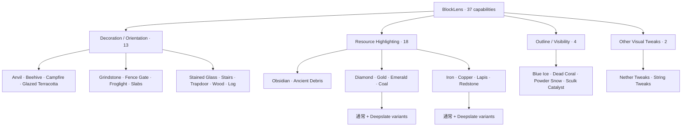
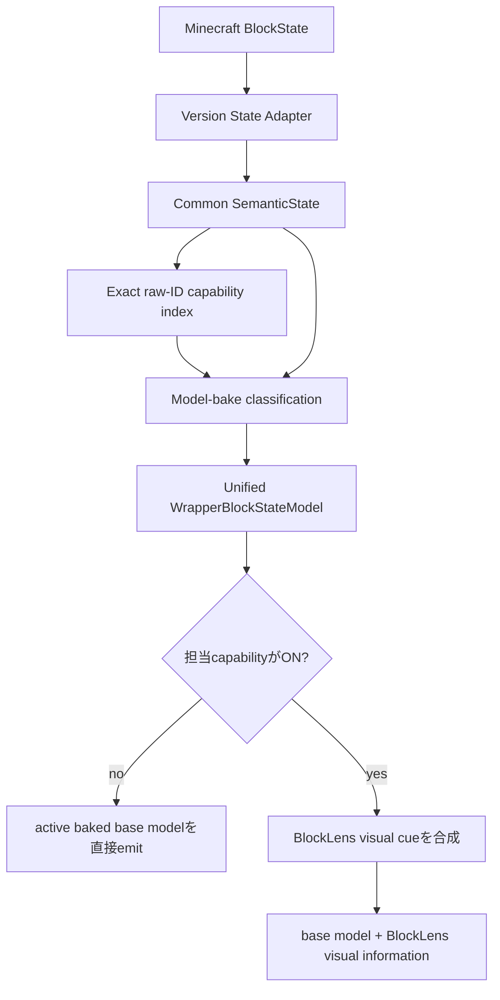
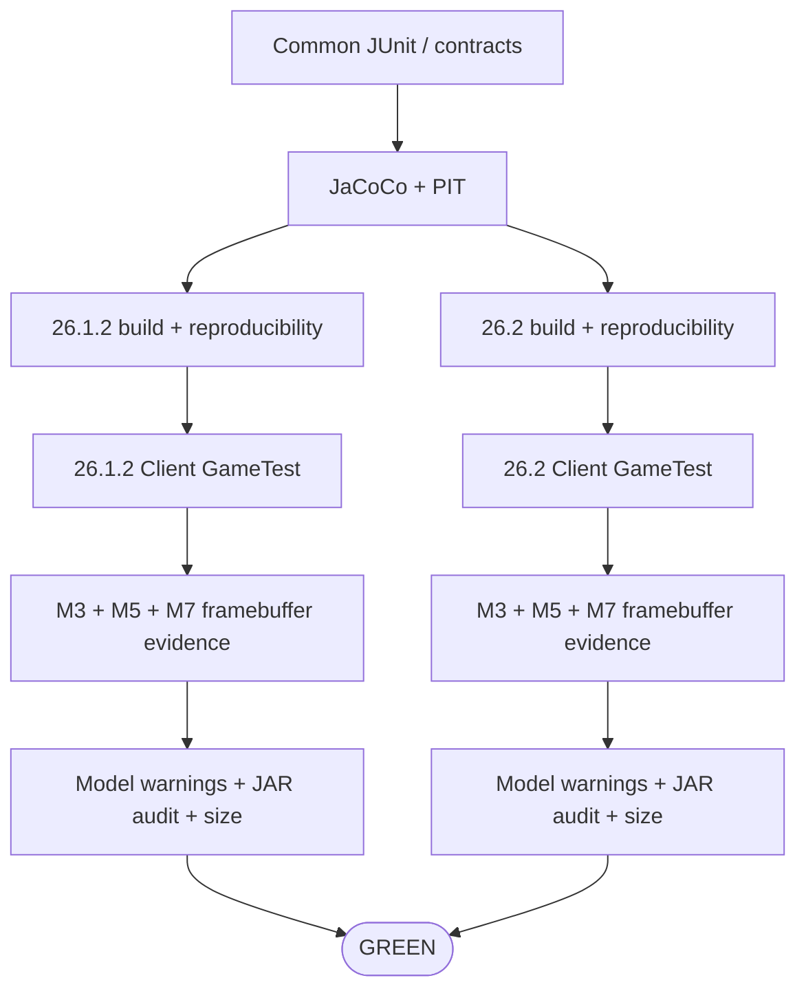

# BlockLens

[English](README.md) | **日本語**

BlockLensは、Minecraft Java Edition向けの**クライアント専用ビジュアル検査MOD**です。固定したAMATERASリソースパックbaselineの有用な視認性を、何千個ものstate別JSON/PNGをそのまま配布するのではなく、コンパクトでテスト可能なコードとして再構築します。

製品契約は**独立設定可能な37機能**です。Minecraft固有差分は薄いadapter境界へ閉じ込め、状態解釈・設定・target policy・render semanticsはMinecraft **26.1.2**と**26.2**で共有します。

> **現在の状態:** M0〜M3は完了済みです。M4 Outline/Fine VisibilityとM6 Nether Tweaksはcore parityへ到達し、M5 Resource Highlightの18機能もすべて実装済みで、両Minecraft版のdark-area専用rendered evidenceまで取得済みです。M7 automated core gateでは、37機能同時ON、**実native config fileの保存・再読込**、resource reload、dimension往復、Nether Tweaks単独、M5 Resource Highlight単独暗所、固定5機能preset、全OFF復元まで両versionでGREENです。代表的third-party resource pack、shader ON、Vulkan、M8性能検証、M9 release readinessは引き続き未完了です。

## 対応環境

| 項目 | 現在仕様 |
| --- | --- |
| Minecraft | **26.1.2** / **26.2** |
| Loader | Fabric |
| Java | **25** |
| 動作側 | **Client only** |
| Server側BlockLens | 不要 |
| 製品仕様 | 両Minecraft版で共有 |
| version固有コード | 薄いMinecraft/Fabric adapter |
| 検証済みrenderer path | default / shader-OFF OpenGL CI path |
| Vulkan | experimental track。OpenGL成功だけでは対応扱いにしない |

## 37機能の構成



提供されたRPOではBlue Ice / Dead Coral / Powder Snow / Sculk Catalyst / String Tweaksの5機能だけがONですが、これはpresetにすぎません。残り32機能も製品契約に含まれます。

## 統合Runtime Architecture



現在のtarget scope:

- **323 capability-to-target bindings**
- **320 unique Minecraft block targets**
- capability bitmaskによる意図的なtarget overlap
- whole-world target scanなし
- 毎frame registry scanなし
- semantic解釈はmodel bake時
- render hot pathはprimitive enabled-capability mask
- 担当機能がすべてOFFならactive baseを直接emit

## 実装済みVisual Family

### M3 — Decoration / Orientation · 13 ✅

13機能すべてをactive baked model上のprocedural cueとして実装しています。axis、stairs、slab、trapdoor、gate、beehive、campfire、grindstone、stained glass等のstateを反映し、両Minecraft版でall-13、reload、OFF復元のrendered evidenceを取得済みです。

正本: [`knowledge/current/m3-visual-semantics.md`](knowledge/current/m3-visual-semantics.md)

### M4 — Outline / Fine Visibility · 5 ✅ core parity

Blue Ice / Dead Coral / Powder Snow / Sculk Catalyst / String Tweaksを実装済みです。Sculkの`bloom`を保持し、TripwireはN/E/S/W + `powered` + `attached`の**64 semantic stateすべて**を回帰テストしています。

### M5 — Resource Highlighting · 18 ✅ core/rendered parity

18個のResource Highlightを同一wrapperへ統合しています。active baked base modelを維持したまま、emissive rendering・diffuse shading無効・ambient occlusion無効のfull-bright procedural accentを追加します。

all-37 sceneとは独立した実Client dark-area oracleも追加しました。密閉した無照明のblack-concrete暗室へ18種類のresource targetだけを配置し、Resource Highlight 18機能だけONのframebufferと全37機能OFFのframebufferを固定ROIで比較します。

GitHub Actions **`34731643950` (run #168)** の実測値:

| Dark-area evidence | Minecraft 26.1.2 | Minecraft 26.2 |
| --- | ---: | ---: |
| ON vs OFF差分pixel | **5,041 px** | **5,051 px** |
| 明確に明るくなったpixel | **4,758 px** | **4,769 px** |
| OFF平均輝度 | **1** | **1** |
| ON平均輝度 | **5** | **5** |
| ROI総輝度増加量 | **361,663** | **362,456** |
| screenshot目視確認 | PASS | PASS |

両versionのON/OFF画像も実際に確認済みです。同じ18ブロック配置がOFFではほぼ暗闇へ沈み、ONではBlockLensのresource accentによって明確に視認できます。代表的shader ONとthird-party resource pack互換性は別検証であり、この結果だけではsupportを主張しません。

### M6 — Nether Tweaks · exact 27 targets ✅ core parity

固定したsource ZIPを直接確認し、RPO key名から推測実装はしていません。主要な16×16 source grammarは**14×14 flat interior + 1px frame**で、Nyliumには追加のupper bandがあります。

BlockLensではsource-derived paletteと、BlockLens所有の小さな`interior_fill` / `upper_band` modelで再構成します。AMATERAS PNGはコピーしていません。CIではmodel欠落だけでなくBlockLens所有Nether modelのtexture reference不足もREDになります。

## M7 Automated Core Integration Gate

同じ実Fabric Client GameTestをMinecraft **26.1.2 / 26.2**へ実行し、現在は次を自動検証しています。

- 37機能すべて同時ON
- config codec/mask round-trip
- **実`config/blocklens.properties`の保存 → runtime再読込 → 元状態の完全復元**
- 37機能ONのままresource reload
- reload後のdeterministic framebuffer evidence
- Overworld → Nether → Overworld往復
- Nether TweaksだけON
- 固定5機能reference preset
- M5 Resource Highlight 18機能だけONのdark-area framebuffer evidence
- 37機能すべてOFF / active base復元
- bounded / zero-world-scan target lookup
- BlockLens所有modelのresource resolution

native config acceptanceでは実Fabric config directoryを使い、37個すべてのbooleanを反転してproductionの`BlockLensConfigFiles.save(...)`で保存し、`BlockLensRuntime.reloadConfig(...)`でruntimeへ再読込します。enabled bitmaskを確認後、visual testへ進む前に元のconfig本文とruntime状態を復元します。filesystem reloadは明示的な設定操作であり、**render hot pathでは実行しません**。

最新implementation verification: **GitHub Actions `34731643950` (run #168)**。

| Evidence | Minecraft 26.1.2 | Minecraft 26.2 |
| --- | ---: | ---: |
| all-37 ON vs OFF ROI差分 | **3,908 px** | **3,914 px** |
| resource reload後 vs OFF | **3,934 px** | **3,909 px** |
| Nether Tweaksのみ vs OFF | **834 px** | **765 px** |
| 5機能preset vs OFF | **1,090 px** | **1,072 px** |
| M5 dark-area evidence | **PASS** | **PASS** |
| dimension round-trip | PASS | PASS |
| config codec round-trip | PASS | PASS |
| native config-file save/reload | **PASS** | **PASS** |
| BlockLens model resolution | PASS | PASS |

各versionでM7のdeterministic screenshot 5枚 + manifest/SHA-256一覧と、M5 dark-area screenshot 2枚 + 専用manifest/SHA-256一覧をartifactとして保存します。

M4〜M7 evidence正本: [`knowledge/current/m4-m7-parity.md`](knowledge/current/m4-m7-parity.md)

## 開発状況

| Milestone | 状態 | 内容 |
| --- | --- | --- |
| M0 | ✅ 完了 | pinned source baseline / 37-capability contract |
| M1 | ✅ 完了 | Java 25 / dual-version build / CI / Client GameTest / artifact gate |
| M2 | ✅ 完了 | shared semantic state + thin version adapter |
| M3 | ✅ 完了 | 13 Decoration/Orientationのrendered parity |
| M4 | ✅ Core parity | 5 Outline/Fine Visibility機能 |
| M5 | ✅ Core/rendered parity | 18 Resource Highlights + dark-area専用framebuffer evidence。広範な互換性検証は継続 |
| M6 | ✅ Core parity | 27 exact Nether targets / 単独framebuffer evidence |
| M7 | 🔧 Automated core gate GREEN | all-37 / native config reload / resource reload / dimension / M5 dark-area / preset / OFF復元 |
| M8 | 予定 | performance / load / size hardening |
| M9 | 予定 | release readiness / public artifact audit |

正本roadmap: [`knowledge/current/roadmap.md`](knowledge/current/roadmap.md)

## 現在のArtifact Evidence

run `34731643950`:

| Minecraft | Runtime JAR | SHA-256 | Client GameTest |
| --- | ---: | --- | --- |
| 26.1.2 | **92,988 B** | `bf07d2f19f4edeb3a4ec630e62449e01ab83dd0010e2105932cabf84a98a2857` | PASS |
| 26.2 | **92,988 B** | `13af1b1d7ba9ee17f693202862226c43d687540b6f2b94c5cd0e41c1c297f272` | PASS |

M5 evidenceはtest/CI専用であり、production runtime assetやJARサイズは増えていません。

現在のruntime artifact size budget:

- 必須: **< 1,183,433 bytes**
- stretch: **<= 716,800 bytes (700 KiB)**

M1 historical baselineは26.1.2が14,481 B、26.2が14,476 Bです。これは現在サイズではありません。

## Automated Quality



現在のgateには、exact capability/state contract、JaCoCo、PIT、両versionの実Client GameTest、native config persistence/reload acceptance、M3/M5/M7 framebuffer artifact、model-resource warning check、reproducible JAR rebuild、privacy/residue audit、byte budgetが含まれます。

## Engineering Graph Loop

BlockLensでは、実装しただけでは完了扱いにしません。機能追加・不具合修正・互換性変更・性能変更のすべてで同じGraph Loopを使います。


失敗時は**DIAGNOSE → FIX → VERIFY**へ戻り、直接完了へ進みません。正式なterminal-state ruleは [`knowledge/current/engineering-loop.md`](knowledge/current/engineering-loop.md) を正本とします。

## まだ未完了の項目

M7 core gateがGREENでも、全互換性を検証済みという意味ではありません。残件は次です。

- representative third-party active resource-pack matrix
- shader **ON**の代表path
- Minecraft 26.2 Vulkan experimental verification
- M8 startup / resource reload / frame-time / allocation / cache測定
- M9 licensing / attribution audit、compatibility notes、clean Prism/Fabric smoke test、release notes、public artifact audit

## Build / Verify

Java 25が必要です。

```bash
./gradlew qualityGate
./gradlew ciGate
```

Minecraft/Fabric integration変更は、**現在headで26.1.2 / 26.2両方がGREEN**になるまで完了扱いにしません。

## Project Documentation

- [`AGENTS.md`](AGENTS.md) — engineering rule
- [`knowledge/index.md`](knowledge/index.md) — knowledge index
- [`knowledge/current/product-spec.md`](knowledge/current/product-spec.md) — product contract
- [`knowledge/current/architecture.md`](knowledge/current/architecture.md) — architecture
- [`knowledge/current/quality-strategy.md`](knowledge/current/quality-strategy.md) — quality strategy
- [`knowledge/current/performance-strategy.md`](knowledge/current/performance-strategy.md) — performance strategy
- [`knowledge/current/roadmap.md`](knowledge/current/roadmap.md) — roadmap
- [`knowledge/current/m3-visual-semantics.md`](knowledge/current/m3-visual-semantics.md) — M3 visual semantics
- [`knowledge/current/m4-m7-parity.md`](knowledge/current/m4-m7-parity.md) — M4〜M7 core parity evidence
- [`knowledge/current/engineering-loop.md`](knowledge/current/engineering-loop.md) — Graph Loop

`knowledge/current/`が現在仕様の正本です。READMEはユーザー向け要約として、完了した実装で意味が変わったら随時更新します。
