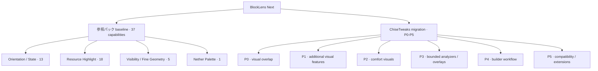
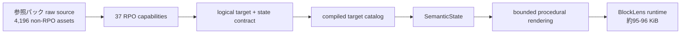
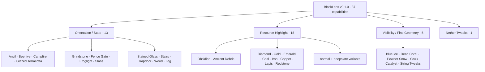
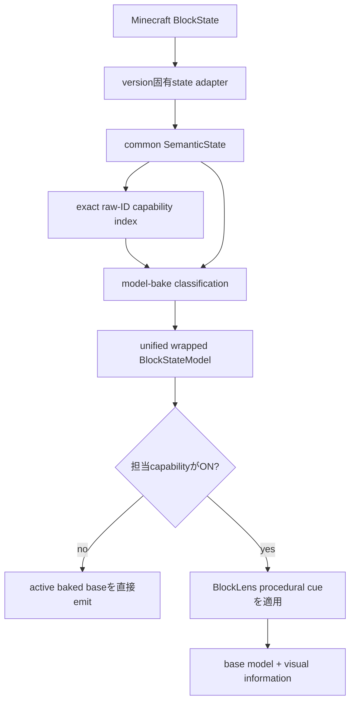
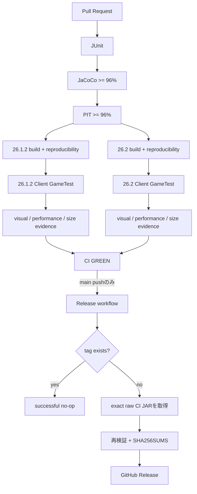

# BlockLens

<p align="center">
  
</p>

[English](README.md) | **日本語**

BlockLensは、Minecraft Java Edition向けの**クライアント専用ビジュアル検査MOD**です。ブロックの向き・状態、資源、細かな形状、ネザーの素材を見分けやすくする46機能を、それぞれ独立して設定できます。[現在の全機能一覧](knowledge/current/features.md)を参照してください。

設計上の目的は、**raw assetのbyte-for-byte同梱ではなく、source/function parity（元ソースが持つ有用な機能の完全再現）**です。複数のblockstate/model/textureが1つの論理機能を表している場合、BlockLensではそれをcompiled target catalog、semantic state、boundedなprocedural renderingへ圧縮します。

> **現在の安定版:** BlockLens **v0.2.2** はMinecraft **26.1.2** / **26.2**向けに**独立設定可能な40機能**と任意のMod Menu設定入口を提供します。現在のmainは**26.3**にも対応しますが、新リリースとしては未公開です。
>
> **歴史的release:** BlockLens **v0.1.0** は変更しない参照パック 37機能のrelease baselineです。P0は当時の**100 KiB**制限の下でv0.2.0として公開され、**328 capability-to-target bindings / 322 unique block targets**へ拡張しました。現行の公開上限は**150 KiB**、より厳しいレビュー済み開発基準は**140 KiB**です。

## 開発版の対応：Minecraft 3バージョン

開発版は **26.1.2 / 26.2 / 26.3** を対象とし、既存40機能を維持して6機能を追加します。Java 25、Fabric Loader **0.19.5以上**、各版に合ったFabric APIが必要です。PR #40の設定画面再設計はマージ済みです。3版の検証結果はPRの最新コミットに対応するCIで確認してください。公開済みリリースに26.3対応が追加されたという意味ではありません。

Windowsで実際のMinecraft画面のUI自動テストを見るには、Java 25とGradle 9.5.1を用意し、`./scripts/run-ui-tests.ps1`（3版すべて）または `./scripts/run-ui-tests.ps1 -Version 26.3` を実行します。実クライアントを順番に開き、テスト後に終了し、失敗時は停止します。CIでは各版10枚の設定画面画像に加え、描画・JARの検証結果を残します。[正確な依存関係と検証状況](knowledge/current/minecraft-26-3.md)を参照してください。

## 製品方針

**BlockLensが母艦です。** ChiseTweaksは移植元となる機能・設計アイデアの供給元であり、runtime dependencyにはしません。



完了済みP0はクローズ済みの **Issue #22** に記録しています。残りの移行は **#42と#34〜#38**、[`knowledge/current/chisetweaks-migration.md`](knowledge/current/chisetweaks-migration.md) で管理します。

## 参照パック raw-source parity

元々の狙いである、**参照パックの有効な生ソースに表現されている機能を全部BlockLensへ取り込む**、という方針は維持しています。ただし「全ファイルをそのままJARへコピーする」という意味ではありません。

最新のraw-source auditでは、M0で固定した証拠構造を再現できました。

- **RPO condition key: 37個**
- supplied archive内の `.rpo` sidecar: **337個**
- 実際に存在するbase fileをgateするsidecar: **336個**
- 337個目は `pale_oak_slab.rpo` という孤立した重複sidecarで、38番目の機能ではない
- non-RPO Minecraft asset: **4,196個**
- 有効なRPO rootから到達可能: **4,101個**
- unreachable/source-residue候補: **95個**
- BlockLens v0.1.0: **37 compiled capabilities / 323 capability-to-target bindings**

つまりraw sourceをそのまま持ち込むのではなく、論理的な機能へ圧縮しています。



### Source → Runtime グルーピング

| Source group | RPO keys | 元ソースの構造 | BlockLens v0.1.0の論理coverage |
| --- | ---: | --- | --- |
| Orientation / Decoration | 13 | blockstate + 大量のmodel/texture dependency | **254 block targets** |
| Resource Highlight | 18 | 独立した18 resource root | **18 block targets** |
| Outline / Visibility | 4 | texture/blockstate gate | Blue Ice + **Dead Coral 20形態** + Powder Snow + Sculk Catalyst |
| String Tweaks | 1 | Tripwire blockstate + dependent geometry | **Tripwire** |
| Nether Tweaks | 1 | **33 textures + 1 model** | **27 Nether block targets** |

特に次の2つは「ファイル数とBlock数が一致しない＝抜け」ではありません。

- **Dead Coral:** source側は15 texture gateですが、wall-fanがfan textureを共有するため論理block形態は20。BlockLensは20形態すべてをtargetにしています。
- **Nether Tweaks:** 33 texture + Magma Block model 1個が、27個の論理block targetを表現しています。BlockLensでは元textureをそのまま積まず、その27 blockを直接targetにします。

37機能すべての詳細表は [`knowledge/current/source-raw-parity-audit.md`](knowledge/current/source-raw-parity-audit.md) に保存し、**Issue #24** で回帰防止まで追跡します。

## 安定版 v0.1.0 の37機能



元RPO presetで初期ONなのはBlue Ice / Dead Coral / Powder Snow / Sculk Catalyst / String Tweaksの5機能ですが、これはpresetであり、製品全体は37機能です。

## P0: ChiseTweaksのVisual重複領域を吸収

P0ではChiseTweaksのFeature frameworkを持ち込まず、既存BlockLens engineを拡張します。

### 新しい独立capability

- Crying Obsidian
- Nether Gold Ore
- Nether Quartz Ore

### 既存capabilityのtarget拡張

- String Tweaks → **Tripwire Hook** を追加
- Nether Tweaks → **Polished Basalt** を追加

最初の37 enum entry、bit位置、source/config key、defaultは固定したまま、新しいcapabilityだけを末尾へ追加します。

公開済みv0.2.0 contract:

- **40 capabilities**
- **328 capability-to-target bindings**
- **322 unique block targets**
- 公開JAR: 両Minecraft版とも **96,248 B**
- release時のcross-platform no-growth baseline: **96,257 B**
- release ceiling: **102,400 B / 100 KiB** のまま

P0はPR #23から`b440d43904e2a93236549efc571b7cc127622352`へmerge済みです。main CI **#270 / `34801429999`** とRelease **#31 / `34802548055`** が成功した後、v0.2.0を公開しました。

## Runtime Architecture



runtime原則:

- compiled catalog方式。reflection/classpath feature discoveryなし
- 通常visual機能でwhole-world target scanなし
- 毎frame registry scanなし
- semantic解釈はmodel bake時
- render hot pathはprimitive enabled-capability mask
- 担当機能がOFFならactive baked baseを直接emit
- immutable / bounded cue・instruction reuse
- repeated resource reloadでもretained-capability構造をboundedに維持
- client-only packaging、nested runtime dependency JARなし

### 現在のsource hardening

現在のsource treeには、必須UI依存を追加しない**Bキー設定画面**と任意の**Mod Menu**入口があります。46設定を**向き・状態／資源／見やすさ／その他**に分類し、説明と独立した有効・無効の操作を表示します。**保存して適用**で変更を保存し、**変更を破棄**と**Esc**では保存せず戻ります。[設定UIの操作と検証範囲](knowledge/current/settings-ui.md)を参照してください。再設計はPR #40でマージ済みです。添付パック同士の実ゲーム併用、元画面との画素単位の一致、シェーダー、Vulkanは未確認です。

config readの上限、同期一時ファイル書き込みと対応filesystemでのatomic置換、immutable config publication、安全なlazy overlay publication、semantic enum/instructionの再利用、wrapped modelごとのdescriptor arrayの2本化は実装済みです。歴史的v0.2.1のlocal artifactは **101,877 B / 101,913 B**で、当時の上限は**102,400 B**でした。現在の3版ゲートはレビュー済み開発基準**143,360 B**と公開上限**153,600 B**を使います。OFF/default/全機能のM8測定は粗い回帰ガードであり、観測されたCI割り当て量のばらつきは[#43](https://github.com/bosatsu25/BlockLens/issues/43)で追跡します。

## Release

**v0.2.2** が最新の公開済み安定版です。対象コミットは`46ae5ccb1e60c92acd796acb0e2b10e740f9dcfc`です。

| Minecraft | 公開JAR | サイズ | SHA-256 |
| --- | --- | ---: | --- |
| 26.1.2 | `BlockLens-26.1.2-v0.2.2.jar` | **102,607 B** | `132312d74c1b160795a22a8dd1afa97c61eef3ced8b181c1b2eddc052f0a28e5` |
| 26.2 | `BlockLens-26.2-v0.2.2.jar` | **102,644 B** | `4e9dbf5bfb4971c7a30e8c69a37240b3637a35b0c25475e5cfdc584195e6f11f` |

カテゴリ設定画面の再設計と3版対応はmainへマージ済みで、[3版の実クライアント検証が成功](https://github.com/bosatsu25/BlockLens/actions/runs/38012153404)しています。26.3用の公開リリースはまだありません。現行基準は開発時**143,360 B（140 KiB）**、公開上限**153,600 B（150 KiB）**、絶対上限**1,183,432 B**です。公開上限の余裕は成長目標ではありません。

**v0.2.0** はP0の歴史的リリース証拠として維持します。

| Minecraft | 公開JAR | サイズ | SHA-256 |
| --- | --- | ---: | --- |
| 26.1.2 | `BlockLens-26.1.2-v0.2.0.jar` | **96,248 B** | `c678c4c5955596db0a1e3064bc1301ad44bb88b6141243e88ca1cefe9973e98a` |
| 26.2 | `BlockLens-26.2-v0.2.0.jar` | **96,248 B** | `54b99d9b66a403195e28850dcfb165083007ee6cddb3521c36176d51af031105` |

release targetは`b440d43904e2a93236549efc571b7cc127622352`です。成功したmain CI **#270 / `34801429999`** のartifactをRelease **#31 / `34802548055`** が`SHA256SUMS.txt`とともに同じbyteのまま公開しました。

**v0.1.0** は37機能の歴史的baselineとして維持します。

| Minecraft | 公開JAR | サイズ | SHA-256 |
| --- | --- | ---: | --- |
| 26.1.2 | `BlockLens-26.1.2-v0.1.0.jar` | **95,332 B** | `191f579fe7d574c94614b611c01420fa6887684e2fabc597966515490f59d24b` |
| 26.2 | `BlockLens-26.2-v0.1.0.jar` | **95,333 B** | `3848de8a07836d829d12ab5ed09ee650d5e1bebd4e0249b254436dda9c5a54be` |

成功した`main` CI **#245 / `34768792311`**、commit `a4b63087004d687c3c8223d0d95c6c95fb2c5156`から生成され、Release run **#3 / `34769093202`** がCI検証済みJARと`SHA256SUMS.txt`をそのまま公開しました。

## 公開済みv0.2.2の対応環境

| 項目 | 現在の検証済みcontract |
| --- | --- |
| Minecraft | **26.1.2** / **26.2** |
| Loader | Fabric Loader **0.19.3以上** |
| Fabric API | **0.155.2+26.1.2** / **0.160.0+26.2** |
| Java | **25以上** |
| 動作側 | **Client only** |
| Server側BlockLens | 不要 |
| 検証済みrenderer path | default / **shader-OFF OpenGL** |
| Shader-ON | 現時点では対応を主張しない |
| Minecraft 26.2 Vulkan | experimental |

Issue [#31](https://github.com/bosatsu25/BlockLens/issues/31)で、開発版各対象の未検証のshader-ON・第三者パック・Vulkanを追跡します。M5のコア実装を扱うIssue #5は完了済みです。

## 技術基盤

BlockLensのruntime自体は小さく保ちますが、開発・QA基盤は厳格です。

| レイヤー | 技術 | 役割 |
| --- | --- | --- |
| 言語 | **Java 25** | production code、semantic engine、adapter、test |
| Build | **Gradle 9.5.1** | multi-project build、deterministic artifact、verification |
| Minecraft開発 | **Fabric Loom 1.17.19** | mapping、development runtime、build integration |
| Loader | **Fabric Loader 0.19.5** | 現在の開発版のclient-side mod loading |
| Runtime API | **Fabric API** | Minecraft/Fabric hook、Client GameTest連携 |
| Unit / contract test | **JUnit Jupiter 5.14.4** | semantic/config/target/repository/release contract |
| Coverage | **JaCoCo 0.8.15** | line coverage gate |
| Mutation testing | **PIT 1.19.0** | mutation coverage / score / test strength |
| PIT JUnit adapter | **pitest-junit5-plugin 1.2.3** | JUnit 5 mutation execution |
| 実Client integration | **Fabric Client GameTest** | 実Minecraft起動/reload/render検証 |
| Headless graphics | **Xvfb / Ubuntu 24.04** | GitHub Actions上のframebuffer test |
| CI/CD | **GitHub Actions** | dual-version quality/release pipeline |
| Artifact integrity | **SHA-256** | reproducibility、CI/Release byte identity |

Java compileでは`-Xlint:deprecation`、`-Xlint:unchecked`、**`-Werror`**を使用します。

品質gate:

- JaCoCo line coverage: **96%以上**
- PIT mutation coverage: **96%以上**
- PIT mutation score: **96%以上**
- PIT test strength: **96%以上**

## 実Client検証

両Minecraft versionで **Fabric Client GameTest** をXvfb上で実行します。config round-trip、resource reload、Overworld/Nether遷移、target/state mapping、全機能ON/OFF復元、rendered visual evidence、resource-pack preservation fixture、M8 performance/retention、model resolution、reproducible artifactまで検証対象です。

開発runtimeが37機能を超えても、元の参照パック 37機能は歴史的regression contractとして残します。

## 自動品質・Releaseパイプライン



Release jobではBlockLensを再buildせず、CIで検証したraw JARそのものを昇格させ、metadata/icon/sizeを再確認してchecksumを公開します。

## Artifact size history

- M8 icon追加前: **88,973 B**
- v0.1.0 icon込み安定baseline: **95,333 B**
- P0開発実測最大: **96,257 B**
- v0.1.0 baselineからP0の最大増加: **924 B**
- 歴史的v0.1.0 / P0のrelease budget: **100 KiB / 102,400 B**
- 現行のレビュー済み開発基準: **140 KiB / 143,360 B**
- 現行の製品公開上限: **150 KiB / 153,600 B**
- source-pack `<50%` absolute hard maximumも維持

容量削減のためにfunctional parity、test、compatibility evidence、安全gateを落とすことは禁止します。

## 導入方法

安定版の場合:

1. 対象Minecraft版のFabric Loaderを導入します。
2. 対応するFabric APIを導入します。
3. Java 25以上を使用します。
4. [GitHub Releasesの`v0.2.2`](https://github.com/bosatsu25/BlockLens/releases/tag/v0.2.2)から26.1.2または26.2用JARを取得します。26.3用の安定版はまだ公開されていません。
5. JARをMinecraftの`mods`フォルダへ入れます。
6. clientを起動します。

BlockLensはclient-onlyなので、server側導入は不要です。

## Build / Verify

Gradle **9.5.1**をPATHに設定し、JAVA_HOMEにJava **25**を設定します。このリポジトリにはGradle Wrapperはありません。

```bash
gradle qualityGate
gradle ciGate
```

version別gate:

```bash
gradle :versions:mc26_1_2:build :versions:mc26_1_2:versionSmokeContract :versions:mc26_1_2:verifyRuntimeJarBudget
gradle :versions:mc26_2:build :versions:mc26_2:versionSmokeContract :versions:mc26_2:verifyRuntimeJarBudget
gradle :versions:mc26_3:build :versions:mc26_3:versionSmokeContract :versions:mc26_3:verifyRuntimeJarBudget
```

## Compatibility Scope

検証済みsupport範囲はevidenceに限定します。

- default / shader-OFF OpenGL: **検証済み**
- representative non-vanilla active resource-pack preservation: **fixtureで検証済み**
- 任意third-party resource pack: **全面保証しない**
- representative shader-ON: **未主張**
- Minecraft 26.2 / 26.3 Vulkan: **未検証**

## Release / Redistribution Audit

runtime JARへ入れるのはBlockLens code/resourceとBlockLens所有assetです。CIはnested dependency JAR、local path、log、save、crash dump、secret/private-key marker、source RPO residue、retired runtime-policy bytecodeを拒否します。参照パックの元PNG/JSONは再配布しません。

## Engineering Graph Loop


## Project Documentation

- [`AGENTS.md`](AGENTS.md) — engineering rule
- [`knowledge/index.md`](knowledge/index.md) — knowledge index
- [`knowledge/current/product-spec.md`](knowledge/current/product-spec.md) — product contract
- [`knowledge/current/architecture.md`](knowledge/current/architecture.md) — architecture
- [`knowledge/current/source-raw-parity-audit.md`](knowledge/current/source-raw-parity-audit.md) — raw-source/RPO parity audit
- [`knowledge/current/chisetweaks-migration.md`](knowledge/current/chisetweaks-migration.md) — ChiseTweaks → BlockLens migration
- [`knowledge/current/quality-strategy.md`](knowledge/current/quality-strategy.md) — quality strategy
- [`knowledge/current/performance-strategy.md`](knowledge/current/performance-strategy.md) — performance strategy
- [`knowledge/current/m8-performance.md`](knowledge/current/m8-performance.md) — M8 evidence
- [`knowledge/current/release-readiness.md`](knowledge/current/release-readiness.md) — M9/release evidence
- [`knowledge/current/roadmap.md`](knowledge/current/roadmap.md) — roadmap
- [`knowledge/current/engineering-loop.md`](knowledge/current/engineering-loop.md) — Graph Loop

`knowledge/current/`を正本とし、READMEでは検証済みevidenceを超える主張をしません。

追加6機能と検証条件は[軽量ビジュアル・快適性機能](knowledge/current/lightweight-visuals.md)に記載しています。公開済みv0.2.2は従来の40機能を提供します。
