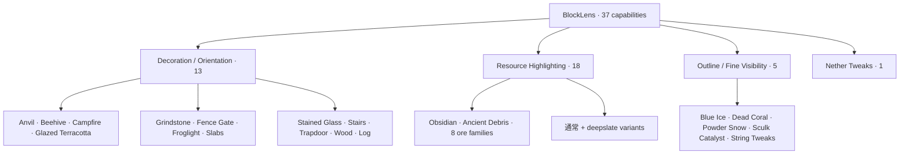
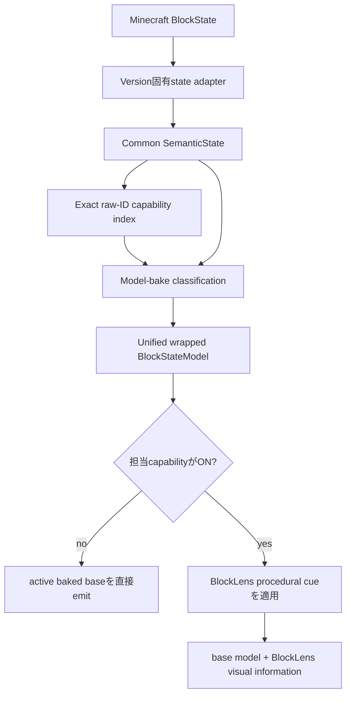
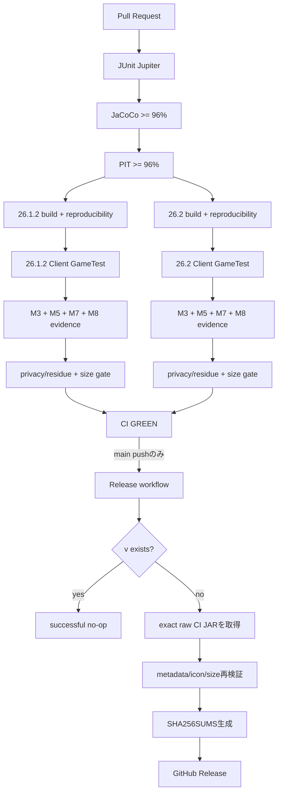

# BlockLens

<p align="center">
  
</p>

[English](README.md) | **日本語**

BlockLensは、Minecraft Java Edition向けの**クライアント専用ビジュアル検査MOD**です。固定したAMATERASリソースパックbaselineの有用な視認性を、何千個ものstate別JSON/PNGをそのまま再配布するのではなく、コンパクトでテスト可能なコードとして再構築しています。

製品契約は**独立設定可能な37機能**です。Minecraft固有差分は薄いadapter境界へ閉じ込め、設定、semantic state、target policy、rendering、品質gate、release automationはMinecraft **26.1.2**と**26.2**で共有します。

> **現在の状態:** **M0〜M9は完了し、BlockLens v0.1.0を正式公開・検証済みです。** Releaseは成功した`main` CI **#245 / `34768792311`**、commit `a4b63087004d687c3c8223d0d95c6c95fb2c5156`から生成され、公開JARはCIで検証したartifactそのものです。アイコン同梱no-growth baselineは **95,333 B**、release budgetは厳格に **100 KiB** です。

## Release

**v0.1.0** が最初の検証済みrelease lineです。

| Minecraft | 公開JAR | サイズ | SHA-256 |
| --- | --- | ---: | --- |
| 26.1.2 | `BlockLens-26.1.2-v0.1.0.jar` | **95,332 B** | `191f579fe7d574c94614b611c01420fa6887684e2fabc597966515490f59d24b` |
| 26.2 | `BlockLens-26.2-v0.1.0.jar` | **95,333 B** | `3848de8a07836d829d12ab5ed09ee650d5e1bebd4e0249b254436dda9c5a54be` |

Releaseには`SHA256SUMS.txt`も同梱します。Release run **#3 / `34769093202`** は成功し、公開後にasset集合まで再検証しています。

## 対応環境

| 項目 | 現在仕様 |
| --- | --- |
| Minecraft | **26.1.2** / **26.2** |
| Loader | Fabric Loader **0.19.3以上** |
| Fabric API | **0.155.2+26.1.2** / **0.160.0+26.2** |
| Java | **25以上** |
| 動作側 | **Client only** |
| Server側BlockLens | 不要 |
| 検証済みrenderer path | default / shader-OFF OpenGL |
| Shader-ON | 現時点では対応を主張しない |
| Minecraft 26.2 Vulkan | experimental |

## 37機能の構成



提供されたRPOで初期ONなのはBlue Ice / Dead Coral / Powder Snow / Sculk Catalyst / String Tweaksの5機能ですが、これはpresetであり、製品契約そのものは37機能です。

## Runtime Architecture



runtime原則:

- **323 capability-to-target bindings** / **320 unique Minecraft block targets**
- whole-world target scanなし
- 毎frame registry scanなし
- semantic解釈はmodel bake時
- render hot pathはprimitive enabled-capability mask
- 担当機能がOFFならactive baseを直接emit
- immutable / bounded cue・instruction reuse
- repeated resource reloadでもretained-capability構造が増加しないことを実Clientで検証
- client-only packaging、nested dependency JARなし

## 技術基盤

BlockLensのruntime自体は小さく保ちますが、開発・QA基盤は意図的に厳格にしています。

| レイヤー | 技術 | BlockLensでの役割 |
| --- | --- | --- |
| 言語 | **Java 25** | 本体、shared semantic engine、Fabric adapter、test |
| Build | **Gradle 9.5.1** | multi-project build、deterministic artifact、検証task |
| Minecraft開発基盤 | **Fabric Loom 1.17.19** | mapping、開発runtime、build統合 |
| Loader | **Fabric Loader 0.19.3** | client MOD loading |
| Runtime API | **Fabric API** | version固有hook、Client GameTest連携 |
| Unit / contract test | **JUnit Jupiter 5.14.4** | semantic/config/target-policy/repository/regression/release contract |
| Test実行基盤 | **JUnit Platform** | Gradle上でのJUnit 5実行 |
| Coverage | **JaCoCo 0.8.15** | line coverage可視化とhard gate |
| Mutation testing | **PIT 1.19.0** | mutation coverage / score / test strength検証 |
| PIT JUnit 5 adapter | **pitest-junit5-plugin 1.2.3** | JUnit 5 mutation test実行 |
| 実Client integration | **Fabric Client GameTest** | Minecraft client起動、reload、dimension、rendering検証 |
| Headless graphics | **Xvfb / Ubuntu 24.04** | GitHub Actions上でのreal-client / framebuffer検証 |
| CI/CD | **GitHub Actions** | quality gate、dual-version検証、evidence保存、release automation |
| Artifact integrity | **SHA-256** | reproducibility、CI/Release byte同一性、公開checksum |
| Release publishing | **GitHub CLI (`gh`) + GitHub REST API** | release制御とraw CI artifactの同一byte引き渡し |

### JavaとJUnit

本体コードとtestは**Java 25**でcompileします。commonのsemantic/configuration層は**JUnit Jupiter 5.14.4**を**JUnit Platform**上で実行して検証します。またrepository contract testにより、build/releaseの構造自体も回帰対象にしています。

たとえばM9では、CIが`archive:false`で保存したraw JARをRelease側が誤って展開しないことをJUnit contractで保護しています。つまりJUnitは単なるメソッド単体試験だけではなく、**リポジトリの品質・release設計そのものの契約試験**にも使っています。

Java compileは`-Xlint:deprecation`、`-Xlint:unchecked`、**`-Werror`**を使用し、設定対象のwarningをrelease直前の後回し事項にせずbuild failureとして扱います。

### JaCoCoとPIT

common product-policy surfaceには以下のhard gateがあります。

- JaCoCo line coverage: **96%以上**
- PIT mutation coverage: **96%以上**
- PIT mutation score: **96%以上**
- PIT test strength: **96%以上**

JaCoCoは重要コードが実行されたかを確認します。一方PITはロジックを意図的に変異させ、その変異をtestが検出できるか確認します。そのためBlockLensでは「coverageが高い」だけでtest品質が十分とは判断しません。

### Fabric Client GameTest

unit testだけでは、Minecraftが実際に起動すること、resource/modelが解決すること、dimension遷移、resource reload、framebuffer描画などは保証できません。そのため両対応versionで**Fabric Client GameTest**を**Xvfb**上の実ClientとしてCI実行します。

実Client gateではconfig round-trip、resource reload、Overworld/Nether往復、all-37 integration、all-OFF復元、M3/M5/M7 visual evidence、M8 load/performance/retention observation、BlockLens所有model resolutionまで検証します。

## 自動品質・Releaseパイプライン



### Releaseの安全設計

`.github/workflows/release.yml`は検証と公開を意図的に分離しています。

- `CI` workflowが成功した後だけ実行
- **`main`へのpush**だけrelease候補
- CIで検証した**同一commit SHA**をcheckout
- Release jobではBlockLensを**再buildしない**
- CI runtime JARはraw `archive:false` artifactとして保存し、Release側はGitHub Actions artifact APIからそのpayloadを直接取得
- 取得payloadがJARとして正しいことをpublish前に検証
- Minecraft version、mod version、client-only metadata、icon、size budgetを再検証
- `gradle.properties`の`mod_version`をrelease versionの正本にする
- `v<mod_version>`が存在すれば重複releaseを作らずsuccessful no-op
- SHA-256 checksumを生成し、公開後にasset集合まで検証

このraw-artifact handoffはstatic testだけでなく、実際の**v0.1.0公開**で通過済みです。

## Milestone Status

- **M0〜M7:** product contract、architecture、37 core capabilities、dual-version real-client gate完了
- **M8:** performance / load / retention / size hardening完了
- **M9:** release readinessとv0.1.0 live publication完了

M8のicon追加前baselineは **88,973 B**。M9ではrepository-owned icon追加分だけを実測してshared baselineを **95,333 B** に固定しました。**100 KiB** release ceilingとsource-pack **<50%** hard maximumは緩和していません。

## 導入方法

1. 対象Minecraft版のFabric Loaderを導入します。
2. 対応するFabric APIを導入します。
3. Java 25以上を使用します。
4. GitHub Releasesの`v0.1.0`から対象Minecraft版JARを取得します。
5. JARをMinecraftの`mods`フォルダへ入れます。
6. clientを起動します。

BlockLensはclient-onlyのため、server側へBlockLensを導入する必要はありません。

## Build / Verify

```bash
./gradlew qualityGate
./gradlew ciGate
```

version別の主なgate:

```bash
./gradlew :versions:mc26_1_2:build :versions:mc26_1_2:versionSmokeContract :versions:mc26_1_2:verifyRuntimeJarBudget
./gradlew :versions:mc26_2:build :versions:mc26_2:versionSmokeContract :versions:mc26_2:verifyRuntimeJarBudget
```

version別buildは`build/reports/blocklens/runtime-jar-size.txt`へdeterministicなsize evidenceも出力します。

## Compatibility Scope

検証済みsupport範囲は意図的に限定しています。

- default / shader-OFF OpenGL: **検証済み**
- representative non-vanilla active resource-pack preservation: **fixtureで検証済み**
- 任意のthird-party resource pack: **全面対応は主張しない**
- representative shader-ON: **現時点では対応を主張しない**
- Minecraft 26.2 Vulkan: **experimental**

Issue #5はshader-ONおよび外部compatibilityの正本として残します。未検証組み合わせはv0.1.0のadvertised support boundary外であり、隠れたrelease blockerではありません。

## Release / Redistribution Audit

runtime JARに入るのはBlockLensのcode/resourceとBlockLens所有のicon/modelです。CIはnested dependency JAR、local path、log、save、crash dump、secret/private-key marker、source RPO residue、retired runtime-policy bytecodeの混入を拒否します。AMATERAS PNGは再配布しません。

repositoryに`LICENSE`が追加されない限り、明示的なopen-source licenseは付与されません。repository ownerによるGitHub Release公開は、第三者への再配布権を自動的に付与するものではありません。

## Engineering Graph Loop


初回Releaseではraw artifact handoffの欠陥が見つかりました。Graph Loopに従って**DIAGNOSE → FIX → VERIFY**へ戻り、PR #20、PR CI、`main` CI、実Release workflowをすべて再実行してからM9を完了扱いにしています。

## Project Documentation

- [`AGENTS.md`](AGENTS.md) — engineering rule
- [`knowledge/index.md`](knowledge/index.md) — knowledge index
- [`knowledge/current/product-spec.md`](knowledge/current/product-spec.md) — product contract
- [`knowledge/current/architecture.md`](knowledge/current/architecture.md) — architecture
- [`knowledge/current/quality-strategy.md`](knowledge/current/quality-strategy.md) — quality strategy
- [`knowledge/current/performance-strategy.md`](knowledge/current/performance-strategy.md) — performance strategy
- [`knowledge/current/m8-performance.md`](knowledge/current/m8-performance.md) — M8 evidence
- [`knowledge/current/release-readiness.md`](knowledge/current/release-readiness.md) — M9 / release evidence
- [`knowledge/current/roadmap.md`](knowledge/current/roadmap.md) — roadmap
- [`knowledge/current/engineering-loop.md`](knowledge/current/engineering-loop.md) — Graph Loop

`knowledge/current/`を正本とし、READMEでは検証済み範囲を超えるcompatibilityやperformanceを主張しません。
