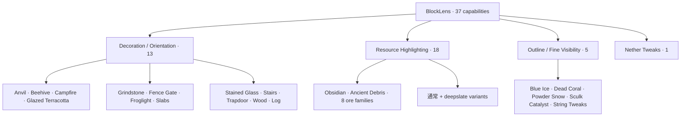
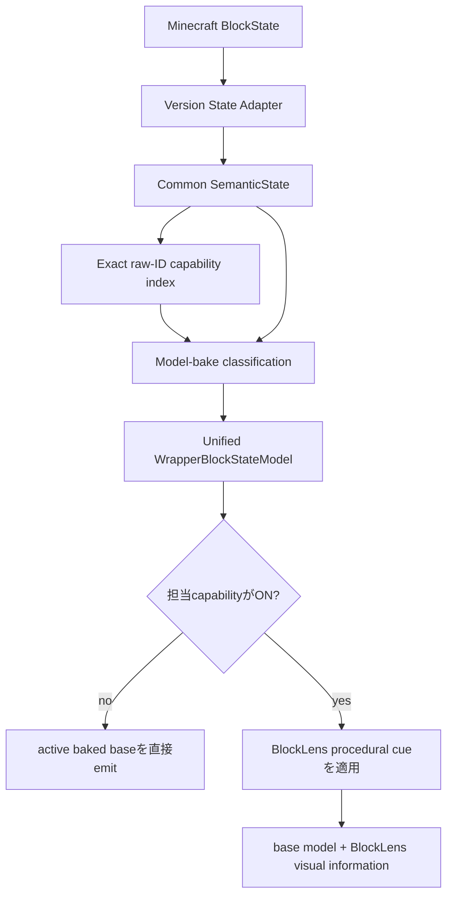

# BlockLens

[English](README.md) | **日本語**

BlockLensは、Minecraft Java Edition向けの**クライアント専用ビジュアル検査MOD**です。固定したAMATERASリソースパックbaselineの有用な視認性を、何千個ものstate別JSON/PNGをそのまま再配布するのではなく、コンパクトでテスト可能なコードとして再構築します。

製品契約は**独立設定可能な37機能**です。Minecraft固有差分は薄いadapter境界へ閉じ込め、設定・状態解釈・target policy・render semanticsはMinecraft **26.1.2**と**26.2**で共有します。

> **現在の状態:** M0〜M8は完了しています。37機能を維持したまま両Minecraft版で検証済みで、最終M8 runtime JARは**88,973 bytes**です。no-growth、100 KiB release budget、real-client performance、frame percentile、reload retention、visual regressionをCI gateとして保持します。

## 対応環境

| 項目 | 現在仕様 |
| --- | --- |
| Minecraft | **26.1.2** / **26.2** |
| Loader | Fabric |
| Java | **25** |
| 動作側 | **Client only** |
| Server側BlockLens | 不要 |
| 製品仕様 | 両Minecraft版で共有 |
| version固有コード | 薄いMinecraft/Fabric adapter |
| 検証済みrenderer path | default / shader-OFF OpenGL CI path |
| Vulkan | experimental track |

## 37機能の構成



提供されたRPOで初期ONなのはBlue Ice / Dead Coral / Powder Snow / Sculk Catalyst / String Tweaksの5機能だけですが、これはpresetにすぎません。残り32機能も製品契約に含まれます。

## Runtime Architecture



runtime原則:

- **323 capability-to-target bindings** / **320 unique Minecraft block targets**
- whole-world target scanなし
- 毎frame registry scanなし
- semantic解釈はmodel bake時
- render hot pathはprimitive enabled-capability mask
- 担当機能がOFFならactive baseを直接emit
- immutable cue/instructionをbounded reuse
- repeated resource reloadでもretained-capability構造が増加しないことを実Clientで検証

## Visual Family

### M3 — Decoration / Orientation · 13 ✅

axis、stairs、slab、trapdoor、gate、beehive、campfire、grindstone、stained glass、wood/log orientation等をstate-aware procedural cueとして実装しています。

### M4 — Outline / Fine Visibility · 5 ✅ core parity

Blue Ice / Dead Coral / Powder Snow / Sculk Catalyst / String Tweaksを実装済みです。Sculk bloom stateを保持し、Tripwireは**64 semantic stateすべて**を回帰テストしています。

M8ではvisibility cueごとにimmutable emissive quad instructionを1個だけ保持し、両version adapterから直接再利用します。

### M5 — Resource Highlighting · 18 ✅ core/rendered parity

18個すべてのResource Highlightを実装しています。active baked base modelを維持したままfull-bright procedural accentを追加し、resource-only ONとall-OFFを比較するdark-area実Client oracleもあります。

M8ではresource cueごとのimmutable instruction再利用と重複color state削除も実施しました。これは構造的なallocation-site削減であり、whole-client CIのノイズが大きいため「FPSが何%向上した」という主張はしていません。

### M6 — Nether Tweaks · exact 27 targets ✅ core parity

source-derived visual grammarをprocedural palette logicと、BlockLens所有の小さな`interior_fill` / `upper_band` modelで再構築しています。AMATERAS PNGは再配布しません。

## M7 Automated Core Integration Gate

Minecraft **26.1.2 / 26.2**で同じFabric Client GameTestを実行し、37機能同時ON、native config save/reload、resource reload、deterministic framebuffer、dimension往復、Nether Tweaks単独、固定5機能preset、M5暗所、all-OFF復元、bounded lookup、BlockLens所有model resolutionを検証します。

representative shader-ON、より広いthird-party resource-pack matrix、Vulkan experimental verificationは別のcompatibility/release trackであり、core gateのGREENだけで対応済みとは扱いません。

## M8 Performance / Load / Size Hardening ✅

M8は完了しました。最終検証は **GitHub Actions `34738345474` (run #223)** です。

### Artifact size

固定した元リソースパックは **2,366,865 B** です。

| Artifact / rule | サイズ | 元リソパ比 |
| --- | ---: | ---: |
| 固定AMATERAS resource pack | **2,366,865 B** | 100% |
| 絶対条件 | **< 1,183,433 B** | < 50% |
| BlockLens release budget | **<= 102,400 B (100 KiB)** | <= 4.33% |
| PR #17 pre-optimization baseline | **93,068 B** | 3.93% |
| **最終M8 runtime JAR** | **88,973 B** | **3.76%** |

最終artifactはPR #17 baselineより **4,095 B（4.4%）小さく**、37機能を維持したまま固定source ZIP比で **96.24%削減**しています。**88,973 Bを両Minecraft版の最終no-growth baseline**としてfreezeします。

CI/Gradleはexact bytes、entry count、compressed category totals、最大20 entryを含むdeterministic JAR reportも生成し、retired runtime-policy bytecodeの再混入を拒否します。

### Real-client regression evidence

複数回の実測を踏まえ、M8では「高速化率」ではなく粗いmedian-based regression guardを固定しました。

- resource reload median: **<= 6.0 s**
- rebuild median: **<= 2.5 s**
- total / render-relevant allocation median: **<= 32 MiB**

最終run #223:

| Metric | 26.1.2 | 26.2 |
| --- | ---: | ---: |
| reload median | **3.842 s** | **4.069 s** |
| OFF / Resource-ON rebuild median | **1.493 / 1.510 s** | **1.532 / 1.512 s** |
| OFF frame-main median | **5.026 ms** | **5.054 ms** |
| Resource-ON frame-main median | **5.078 ms** | **5.092 ms** |
| Resource-ON frame-main P95 | **7.969 ms** | **11.441 ms** |
| Resource-ON frame-main P99 | **12.009 ms** | **12.538 ms** |

frame metricは**main render-pass duration**であり、present-to-presentの完全なframe timeではありません。P95/P99 tailはevidenceとして保存しますが、FPS改善の宣伝値には使いません。

### Reload retention / cache evidence

両versionとも3回のmeasured reloadで完全一致しました。

```text
wrapped models:             7820, 7820, 7820
retained capability slots:  7827, 7827, 7827
max capabilities/model:        2,    2,    2
Nether wrapped models:         33,   33,   33
reloadRetentionStable=true
```

Nether overlayはwrapper単位のlazy cacheとone-attempt guardを維持し、quad emissionへ計測counterは追加していません。

M8 evidence正本: [`knowledge/current/m8-performance.md`](knowledge/current/m8-performance.md)

## 開発状況

| Milestone | 状態 | 内容 |
| --- | --- | --- |
| M0 | ✅ 完了 | pinned source baseline / 37-capability contract |
| M1 | ✅ 完了 | Java 25 / dual-version build / CI / Client GameTest / artifact gate |
| M2 | ✅ 完了 | shared semantic state + thin adapter |
| M3 | ✅ 完了 | 13 Decoration/Orientation |
| M4 | ✅ Core parity | 5 Outline/Fine Visibility |
| M5 | ✅ Core/rendered parity | 18 Resource Highlights + dark-area evidence |
| M6 | ✅ Core parity | exact 27 Nether targets |
| M7 | ✅ Automated core gate | all-37 / config / reload / dimension / preset / OFF復元 |
| M8 | ✅ 完了 | performance/load/retention evidence + 最終 **88,973 B** no-growth baseline |
| M9 | 予定 | release readiness / public artifact audit |

## Automated Quality


runtime / compatibility変更はcurrent headで両Minecraft版がGREENになるまで完了扱いにしません。

## Engineering Graph Loop


実装しただけでは完了ではありません。失敗時は**DIAGNOSE → FIX → VERIFY**へ戻ります。

## Build / Verify

Java 25が必要です。

```bash
./gradlew qualityGate
./gradlew ciGate
```

version別buildではruntime artifact budgetも検証し、`build/reports/blocklens/runtime-jar-size.txt`へsize evidenceを出力します。

## Project Documentation

- [`AGENTS.md`](AGENTS.md) — engineering rule
- [`knowledge/index.md`](knowledge/index.md) — knowledge index
- [`knowledge/current/product-spec.md`](knowledge/current/product-spec.md) — product contract
- [`knowledge/current/architecture.md`](knowledge/current/architecture.md) — architecture
- [`knowledge/current/quality-strategy.md`](knowledge/current/quality-strategy.md) — quality strategy
- [`knowledge/current/performance-strategy.md`](knowledge/current/performance-strategy.md) — performance strategy
- [`knowledge/current/m8-performance.md`](knowledge/current/m8-performance.md) — M8正本
- [`knowledge/current/roadmap.md`](knowledge/current/roadmap.md) — roadmap
- [`knowledge/current/engineering-loop.md`](knowledge/current/engineering-loop.md) — Graph Loop

`knowledge/current/`を正本とします。READMEではevidenceで確認できていないcompatibilityやperformanceを過大に主張しません。
