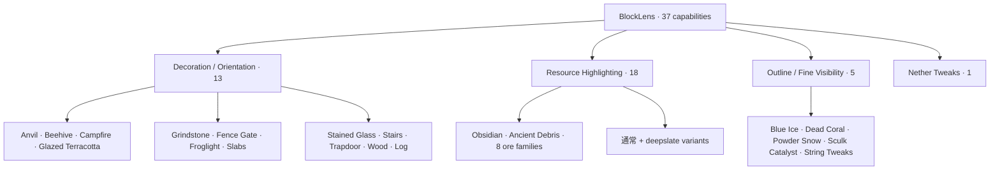
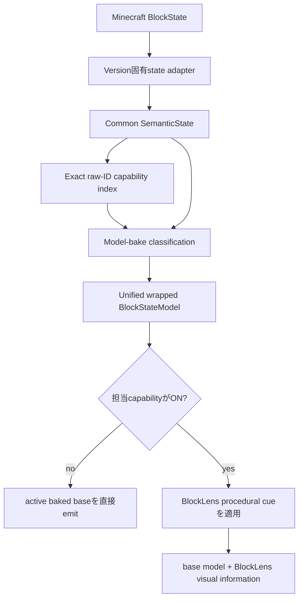
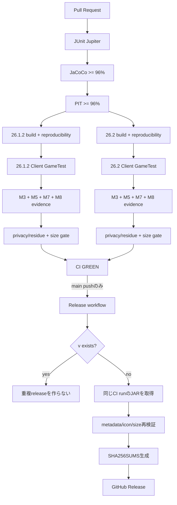

# BlockLens

<p align="center">
  
</p>

[English](README.md) | **日本語**

BlockLensは、Minecraft Java Edition向けの**クライアント専用ビジュアル検査MOD**です。固定したAMATERASリソースパックbaselineの有用な視認性を、何千個ものstate別JSON/PNGをそのまま再配布するのではなく、コンパクトでテスト可能なコードとして再構築しています。

製品契約は**独立設定可能な37機能**です。Minecraft固有差分は薄いadapter境界へ閉じ込め、設定、semantic state、target policy、rendering、品質gate、release automationはMinecraft **26.1.2**と**26.2**で共有します。

> **現在の状態:** M0〜M9のrelease-readiness実装は完了しています。検証済みrelease lineは **v0.1.0** で、成功した`main` CIの成果物からのみ公開されます。アイコン同梱runtime JARのno-growth baselineは両Minecraft版で **95,333 B**、release budgetは厳格に **100 KiB** です。

## 対応環境

| 項目 | 現在仕様 |
| --- | --- |
| Minecraft | **26.1.2** / **26.2** |
| Loader | Fabric Loader **0.19.3以上** |
| Fabric API | **0.155.2+26.1.2** / **0.160.0+26.2** |
| Java | **25以上** |
| 動作側 | **Client only** |
| Server側BlockLens | 不要 |
| 検証済みrenderer path | default / shader-OFF OpenGL |
| Shader-ON | 現時点では対応を主張しない |
| Minecraft 26.2 Vulkan | experimental |

## 37機能の構成



提供されたRPOで初期ONなのはBlue Ice / Dead Coral / Powder Snow / Sculk Catalyst / String Tweaksの5機能だけですが、これはpresetであり、製品契約そのものは37機能です。

## Runtime Architecture



runtime原則:

- **323 capability-to-target bindings** / **320 unique Minecraft block targets**
- whole-world target scanなし
- 毎frame registry scanなし
- semantic解釈はmodel bake時
- render hot pathはprimitive enabled-capability mask
- 担当機能がOFFならactive baseを直接emit
- immutable / bounded cue・instruction reuse
- repeated resource reloadでもretained-capability構造が増加しないことを実Clientで検証
- client-only packaging、nested dependency JARなし

## 技術基盤

BlockLensのruntime自体は小さく保ちますが、周囲の開発・品質基盤はかなり厳格です。

| レイヤー | 技術 | BlockLensでの役割 |
| --- | --- | --- |
| 言語 | **Java 25** | 本体、shared semantic engine、Fabric adapter、test |
| Build | **Gradle 9.5.1** | multi-project build、検証task、deterministic artifact |
| Minecraft開発基盤 | **Fabric Loom 1.17.19** | Minecraft開発runtime・mapping・build統合 |
| Loader | **Fabric Loader 0.19.3** | client MOD loading |
| Runtime API | **Fabric API** | version固有hook、Client GameTest連携 |
| Unit / contract test | **JUnit Jupiter 5.14.4** | semantic/config/target-policy/repository/regression contract |
| Test実行基盤 | **JUnit Platform** | Gradle上でのJUnit 5実行 |
| Coverage | **JaCoCo 0.8.15** | line coverageの可視化とhard gate |
| Mutation testing | **PIT 1.19.0** | product-policy logicのmutation score / test strength検証 |
| PIT JUnit 5 adapter | **pitest-junit5-plugin 1.2.3** | JUnit 5 mutation test実行 |
| 実Client integration | **Fabric Client GameTest** | Minecraft client起動、reload、dimension、render path検証 |
| Headless graphics | **Xvfb / Ubuntu 24.04** | GitHub Actions上のreal-client framebuffer検証 |
| CI/CD | **GitHub Actions** | quality gate、dual-version build、visual/performance evidence、release |
| Artifact integrity | **SHA-256** | 再現性とrelease checksum |
| Release publishing | **GitHub CLI (`gh`)** | CIで検証したJARそのものをGitHub Releaseへ公開 |

### 品質閾値

common product-policy surfaceには明示的なhard gateがあります。

- JaCoCo line coverage: **96%以上**
- PIT mutation coverage: **96%以上**
- PIT mutation score: **96%以上**
- PIT test strength: **96%以上**
- Java compileは`-Xlint:deprecation`、`-Xlint:unchecked`、**`-Werror`**を使用

「テストが存在する」だけでは完了にせず、重要なsemantic/config/render-policy logicのmutationを十分に検出できるかまで検証します。

## 自動品質パイプライン



### Releaseの安全設計

`.github/workflows/release.yml`はbuildとpublishを意図的に分離しています。

- `CI` workflowが成功した後だけ実行
- **`main`へのpush**だけrelease候補
- release jobはCIが検証した**同一commit SHA**をcheckout
- release jobでは再buildせず、**成功したCI runが生成したruntime JARそのもの**をdownload
- Minecraft version、mod version、client-only metadata、icon、size budgetをpublish直前に再検証
- `gradle.properties`の`mod_version`をrelease versionの正本にする
- `v<mod_version>`が既に存在すれば成功終了し、重複releaseを作らない
- publish前にSHA-256 checksumを生成

したがってREADMEだけを`main`で修正しても、既存の`v0.1.0`がもう一度作られることはありません。新releaseにはreviewされたversion bumpが必要です。

## Visual Family

### M3 — Decoration / Orientation · 13 ✅

axis、stairs、slab、trapdoor、gate、beehive、campfire、grindstone、stained glass、wood/log orientation等をstate-aware procedural cueとして実装しています。

### M4 — Outline / Fine Visibility · 5 ✅ core parity

Blue Ice / Dead Coral / Powder Snow / Sculk Catalyst / String Tweaksを実装済みです。Sculk bloom stateを保持し、Tripwireは**64 semantic stateすべて**を回帰テストしています。

### M5 — Resource Highlighting · 18 ✅ core/rendered parity

18個すべてのResource Highlightを実装しています。active baked base modelを維持したままfull-bright procedural accentを追加し、dark-areaとdeterministic active-resource-packの実Client evidenceで保護します。

### M6 — Nether Tweaks · exact 27 targets ✅ core parity

source-derived visual grammarをprocedural palette logicとBlockLens所有の小さな`interior_fill` / `upper_band` modelで再構築しています。AMATERAS PNGは再配布しません。

### M7 — Automated full-product gate ✅

両Minecraft版で同じclient integration oracleを実行し、37機能、config round-trip、resource reload、dimension往復、Nether behavior、固定5機能preset、M5暗所、all-OFF復元、bounded lookup、owned model resolutionを検証します。

### M8 — Performance / Load / Retention / Size Hardening ✅

M8では「FPSが何%上がった」とは主張せず、evidence-basedなgross-regression guardを固定しています。

- resource reload median: **6.0 s以下**
- terrain rebuild median: **2.5 s以下**
- allocation median: **32 MiB以下**

アイコン追加前のM8 runtime baselineは **88,973 B** でした。M9では製品アセットであるアイコン分だけを実測した **95,333 B** へ明示的にrebaselineし、**100 KiB** release ceilingとsource-pack **<50%** hard maximumは維持します。

### M9 — Release Readiness ✅

M9ではrepository-owned icon、release metadata、publish直前再検証、SHA-256生成、成功した`main` CI artifactからのGitHub Release自動公開を追加しています。

## 導入方法

1. 対象Minecraft版のFabric Loaderを導入します。
2. 対応するFabric APIを導入します。
3. Java 25以上を使用します。
4. GitHub Releasesから対象Minecraft版のJARを取得します。
5. JARをMinecraftの`mods`フォルダへ入れます。
6. clientを起動します。

BlockLensはclient-onlyのため、server側へBlockLensを導入する必要はありません。

## Build / Verify

Java 25が必要です。

```bash
./gradlew qualityGate
./gradlew ciGate
```

version別の主なgate:

```bash
./gradlew :versions:mc26_1_2:build :versions:mc26_1_2:versionSmokeContract :versions:mc26_1_2:verifyRuntimeJarBudget
./gradlew :versions:mc26_2:build :versions:mc26_2:versionSmokeContract :versions:mc26_2:verifyRuntimeJarBudget
```

version別buildは`build/reports/blocklens/runtime-jar-size.txt`へdeterministicなsize evidenceも出力します。

## Compatibility Scope

検証済みsupport範囲は意図的に限定しています。

- default / shader-OFF OpenGL: **検証済み**
- representative non-vanilla active resource-pack preservation: **fixtureで検証済み**
- 任意のthird-party resource pack: **全面対応は主張しない**
- representative shader-ON: **現時点では対応を主張しない**
- Minecraft 26.2 Vulkan: **experimental**

Issue #5はshader-ON compatibilityの正本として残します。これは37機能のcore parityやrelease automationのblockerではなく、未検証組み合わせを対応済みと宣伝しないためのtrackです。

## Release / Redistribution Audit

runtime JARに入るのはBlockLensのcode/resourceとBlockLens所有のicon/modelです。CIはnested dependency JAR、local path、log、save、crash dump、secret/private-key marker、source RPO residue、retired runtime-policy bytecodeの混入を拒否します。AMATERAS PNGは再配布しません。

repositoryに`LICENSE`が追加されない限り、明示的なopen-source licenseは付与されません。repository ownerによるGitHub Release公開は、第三者への再配布権を自動的に付与するものではありません。

## Engineering Graph Loop


実装しただけでは完了ではありません。失敗時は**DIAGNOSE → FIX → VERIFY**へ戻します。

## Project Documentation

- [`AGENTS.md`](AGENTS.md) — engineering rule
- [`knowledge/index.md`](knowledge/index.md) — knowledge index
- [`knowledge/current/product-spec.md`](knowledge/current/product-spec.md) — product contract
- [`knowledge/current/architecture.md`](knowledge/current/architecture.md) — architecture
- [`knowledge/current/quality-strategy.md`](knowledge/current/quality-strategy.md) — quality strategy
- [`knowledge/current/performance-strategy.md`](knowledge/current/performance-strategy.md) — performance strategy
- [`knowledge/current/m8-performance.md`](knowledge/current/m8-performance.md) — M8 evidence正本
- [`knowledge/current/release-readiness.md`](knowledge/current/release-readiness.md) — M9/release contract
- [`knowledge/current/roadmap.md`](knowledge/current/roadmap.md) — roadmap
- [`knowledge/current/engineering-loop.md`](knowledge/current/engineering-loop.md) — Graph Loop

`knowledge/current/`を正本とします。READMEではevidenceで確認できていないcompatibilityやperformanceを過大に主張しません。
