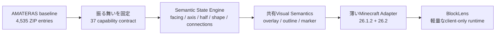
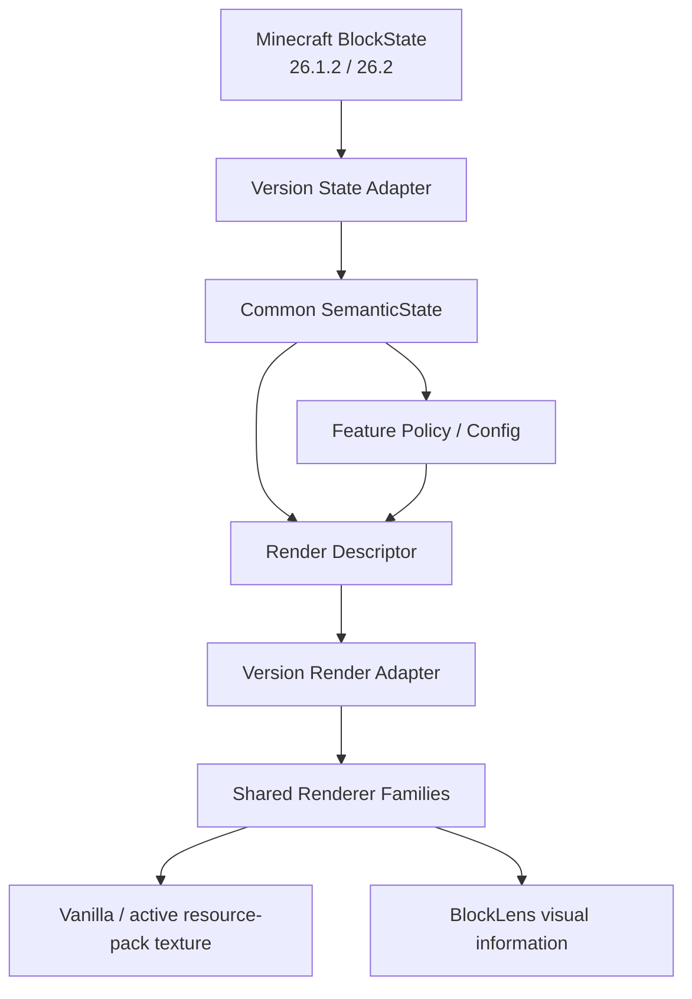
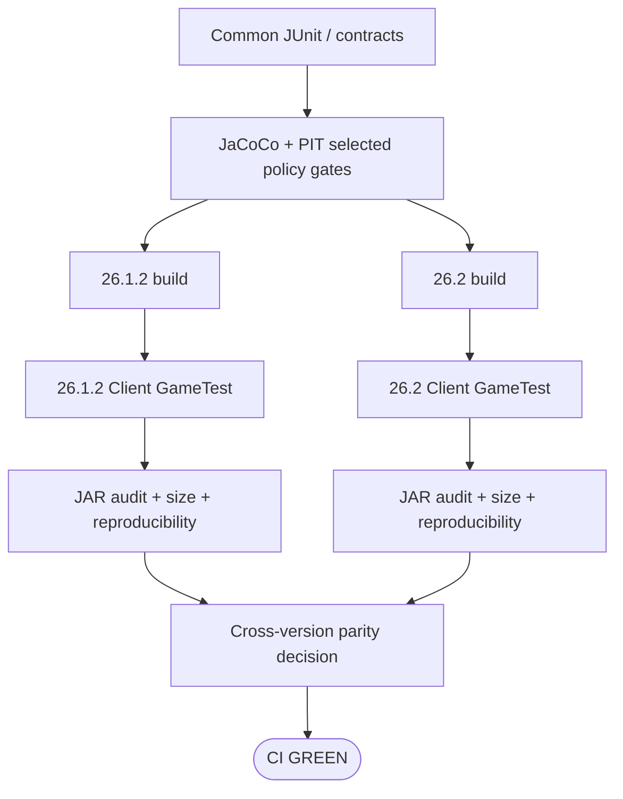
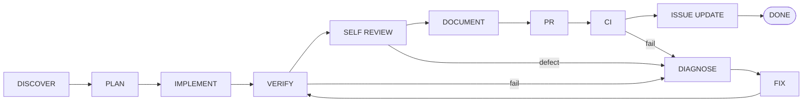

# BlockLens

[English](README.md) | **日本語**

BlockLensは、Minecraft Java Edition向けの**クライアント専用ビジュアル検査MOD**です。

AMATERASリソースパックで得られていた視認性・状態把握の価値を、何千個ものstate別JSON/PNGをそのまま抱える方式ではなく、**共通の状態解釈 + 共有レンダリング + 最小限の固有アセット**として再構築します。

目的は「リソースパックをJARに詰めること」ではありません。**37機能のユーザー価値を維持しながら、保守性・設定・Minecraftバージョン差分・品質保証・性能・配布物サイズを改善すること**が目的です。

> **現在の状態:** M0・M1は完了済みです。M2の共通Semantic State Engineと26.1.2 / 26.2両対応adapterはPR #9で実装済みです。次の主実装は13個のDecoration / Orientation機能の実描画です。現時点では37機能すべての表示パリティ完成を主張しません。

## BlockLensが解決したいこと

元のリソースパックは有用ですが、状態の組み合わせを大量の小さなJSON・モデル・PNGで表現しています。BlockLensでは、同じ意味をコード上のsemantic stateとして1回だけ表し、共有レンダラーへ渡します。



移行の基本原則は次です。

```text
大量のstate別 JSON / PNG
          ↓
共通状態解釈 + 共通描画 + 最小限の固有アセット
```

## 対応環境

| 項目 | 現在仕様 |
| --- | --- |
| Minecraft | **26.1.2** / **26.2** |
| Loader | Fabric |
| Java | **25** |
| 動作側 | **Client only** |
| Server側MOD | 不要 |
| 製品仕様 | 両Minecraft版で共通 |
| version固有コード | Minecraft/Fabric adapterの薄い層だけ |

現在仕様に明示的な例外がない限り、片方のMinecraft版でしか動かない機能は完了扱いにしません。

## 37機能の構成

凍結したsource baselineでは、**37個の独立設定可能な機能**があります。


提供されたRPO presetではBlue Ice / Dead Coral / Powder Snow / Sculk Catalyst / String Tweaksの5個だけがONですが、これはあくまでpresetです。残り32機能もBlockLensの機能契約から外しません。

## Runtime Architecture

Minecraftのmapped API差分は端に閉じ込め、製品ロジックはcommonへ集約します。



### M2 Semantic State

M2では、BlockLensが必要とする情報だけをMinecraft非依存の形へ圧縮しています。

- horizontal facing
- axis
- top / bottom half
- stair shape
- mount face
- slab type
- north / east / south / west connections
- honey level
- open / lit / in-wall / powered / attached

Version moduleはmapped `BlockState` をこの共通表現へ変換するだけにし、製品仕様を重複させません。

## 開発状況

| Milestone | 状態 | 内容 |
| --- | --- | --- |
| M0 — Source baseline freeze | ✅ 完了 | 37/37機能の根拠・machine-readable contract |
| M1 — Dual-version quality scaffold | ✅ 完了 | Java 25 / config / CI / GameTest / artifact audit / size・load baseline |
| M2 — Shared state engine | 🔧 PR #9で実装済み | semantic model / 両version adapter / cross-version oracle / bounded lookup |
| M3 — 13 Decoration / Orientation | ⏭ 次 | shared render semantics + visual parity |
| M4–M7 | 予定 | outline / resource highlight / Nether Tweaks / 全機能相互作用 |
| M8 | 予定 | performance / load / size 最終hardening |
| M9 | 予定 | release readiness / public artifact audit |

正本の実装順序は [`knowledge/current/roadmap.md`](knowledge/current/roadmap.md) です。

## M1実測baseline

M1は描画実装を増やす前の意図的に小さい基盤です。

| Minecraft | Runtime JAR | BlockLens init | Client GameTest | Reproducible artifact |
| --- | ---: | ---: | --- | --- |
| 26.1.2 | **14,481 B** | 約 **7.513 ms** | PASS | PASS |
| 26.2 | **14,476 B** | 約 **2.684 ms** | PASS | PASS |

これは**M1時点のbaseline**であり、全機能実装後も14 KiBのままになるという意味ではありません。

```text
Source resource-pack ZIP   2,366,865 B  ████████████████████████████████████████
M1 26.1.2 runtime JAR         14,481 B  ▏
M1 26.2 runtime JAR           14,476 B  ▏
Hard release maximum       1,183,432 B  ████████████████████
Stretch target               716,800 B  ████████████
```

各release artifactの目標:

- 必須: **< 1,183,433 bytes**
- stretch: **<= 716,800 bytes (700 KiB)**

ただし、容量より**機能パリティ・correctness・診断性**を優先します。

## Quality Graph

Minecraft連携変更は両versionの分岐を通過する必要があります。



現在の自動品質ゲート:

- JUnit 5
- 37機能exact contract
- cross-version state/config parity
- JaCoCo selected coverage gate
- PIT mutation gate
- 両Minecraft版Fabric Client GameTest
- config persistence
- runtime JAR structure/privacy/residue audit
- clean rebuild SHA-256 reproducibility
- runtime JAR byte budget
- startup/load structural contract

## Engineering Graph Loop

BlockLensでは、実装しただけではDONEになりません。



失敗時は必ず **DIAGNOSE → FIX → VERIFY** に戻します。「修正したはず」でCIを飛ばしてDONEにはしません。

正式ルール・各nodeのexit condition・`DONE / BLOCKED / PARTIAL`の完了状態は [`knowledge/current/engineering-loop.md`](knowledge/current/engineering-loop.md) を正本とします。

## Repository構成

```text
BlockLens/
├─ common/                  # 共通product policy / config / semantic state / contracts
├─ versions/
│  ├─ mc26_1_2/            # 26.1.2用の薄いadapter
│  └─ mc26_2/              # 26.2用の薄いadapter
├─ gametest/                # 両version共通Client GameTest
├─ gradle/                  # version module共通build rule
├─ knowledge/
│  ├─ index.md
│  └─ current/              # 現在仕様の正本
├─ AGENTS.md                # 開発規約
└─ README.md                # English README
```

## Build / Verify

Java 25が必要です。

共通semantic/config品質ゲート:

```bash
./gradlew qualityGate
```

build系を含むCI entry point:

```bash
./gradlew ciGate
```

Minecraft/Fabric連携を変更した場合は、GitHub Actions上で**現在head SHAの26.1.2 / 26.2両方がGREEN**になるまで完了扱いにしません。

## Performance Rule

startupやrender hot pathで不要な処理を行わないことを設計ルールにしています。

- runtime classpath/reflection feature discoveryなし
- startup update/network checkなし
- telemetry初期化なし
- 通常起動時のlegacy RPO parseなし
- OFF機能のgeometry eager生成なし
- 毎frameのwhole-world / unbounded chunk scanなし
- 変化していないgeometryの毎frame rebuildなし
- target/capability lookupは可能な限りbounded / O(1)
- reload / world transition時は明示的にcache/stateを破棄

性能改善は推測で主張せず、startup/load・resource reload・runtime/frame・allocation/memory・JAR bytesを別々に測定します。

## Resource Pack / Shader Compatibility

可能な限りMinecraft本体またはユーザーが有効化しているresource packのtextureを保ち、その上へBlockLensの情報を重ねる方向です。

Shader/backend互換性は「Vanillaで動いた」だけでは対応扱いにしません。26.2 OpenGLは必須検証track、Vulkanは別のexperimental trackとして管理します。

## Non-goals

- 元リソースパックをそのままJARへ内包すること
- 容量目標のために37機能を削ること
- Minecraft versionごとに製品ロジックを丸ごと複製すること
- visual機能のためにserver-side BlockLensを必須にすること
- 無関係なgameplay automationを追加すること
- 現在ONの5 RPO項目だけを製品全体として扱うこと
- 未検証shader/backendを「対応」と表記すること

## Source / Licenseについて

AMATERASリソースパックは**behavior / visual reference baseline**として扱います。内部構造をそのままBlockLensの実装へコピーすることは目標ではありません。

baselineには他作者へのattributionが含まれており、redistribution permissionがあるとは仮定しません。公開前に、runtime JARへ残る第三者texture / model / textなどのライセンス・再配布可否を必ず確認します。可能なものはオリジナルコード・描画処理で機能価値を再実装します。

## ドキュメント

- Engineering rules: [`AGENTS.md`](AGENTS.md)
- Knowledge index: [`knowledge/index.md`](knowledge/index.md)
- Product contract: [`knowledge/current/product-spec.md`](knowledge/current/product-spec.md)
- Architecture: [`knowledge/current/architecture.md`](knowledge/current/architecture.md)
- Quality strategy: [`knowledge/current/quality-strategy.md`](knowledge/current/quality-strategy.md)
- Performance strategy: [`knowledge/current/performance-strategy.md`](knowledge/current/performance-strategy.md)
- Roadmap: [`knowledge/current/roadmap.md`](knowledge/current/roadmap.md)
- Engineering Graph Loop: [`knowledge/current/engineering-loop.md`](knowledge/current/engineering-loop.md)

`knowledge/current/` が現在仕様の正本です。READMEはユーザー向けの要約であり、current specificationと食い違った場合はREADME側を修正します。
