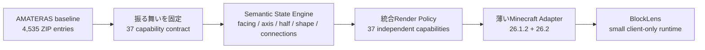
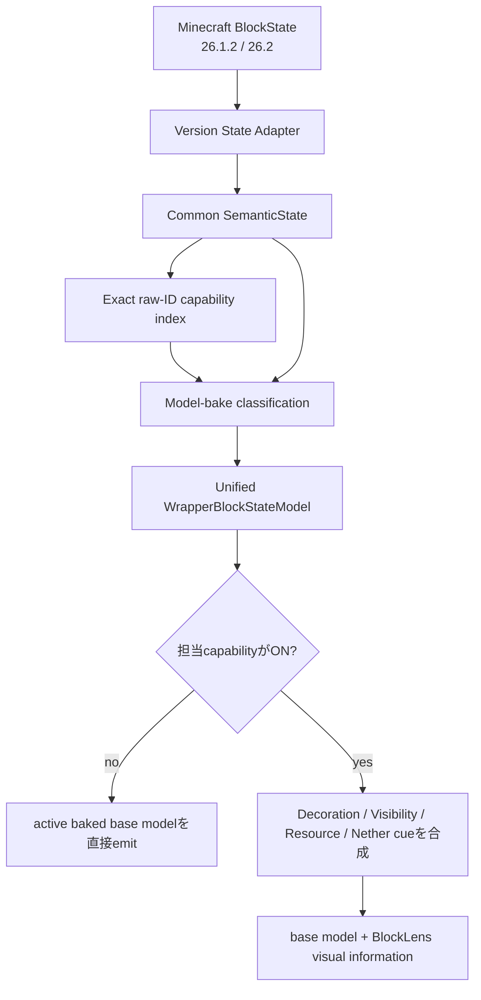
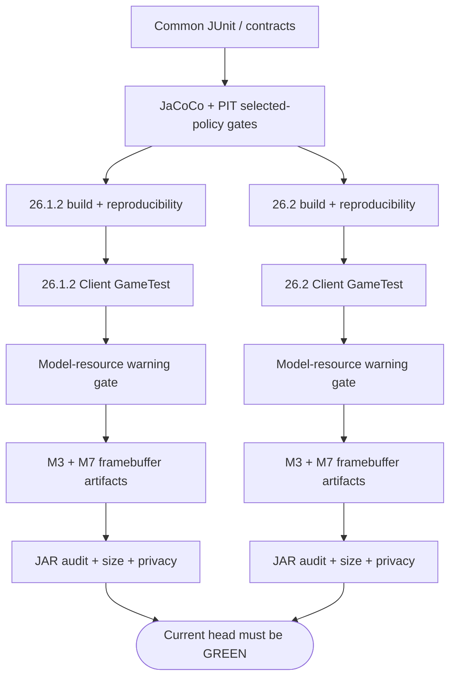

# BlockLens

[English](README.md) | **日本語**

BlockLensは、Minecraft Java Edition向けの**クライアント専用ビジュアル検査MOD**です。

AMATERASリソースパックで得られていた視認性・状態把握の価値を、何千個ものstate別JSON/PNGをそのまま抱える方式ではなく、**共通の状態解釈 + 統合レンダリング + 最小限のBlockLens所有アセット**として再構築します。

目的は「リソースパックをJARに詰めること」ではありません。**37機能のユーザー価値を維持しながら、保守性・設定・Minecraftバージョン差分・テスト可能性・性能評価・配布物サイズを改善すること**が目的です。

> **現在の状態:** M0〜M3は完了済みです。M4〜M6のcore renderingはMinecraft **26.1.2 / 26.2**両方で実装・自動検証済みです。M7のautomated core integration gateも、37機能同時ON、resource reload、dimension往復、Nether Tweaks単独、固定5機能preset、全OFF復元までGREENです。一方、代表的なthird-party resource pack、shader ON、Vulkan、実config file再読込、M8/M9の性能・release readinessはまだ未完了です。

## BlockLensが解決したいこと

元のリソースパックは有用ですが、状態の組み合わせを大量の小さなJSON・モデル・PNGで表現しています。BlockLensでは、同じ意味をsemantic stateとして1回だけ表し、共通render policyへ渡します。



```text
大量のstate別 JSON / PNG
          ↓
共通状態解釈 + 共通描画 + 最小限のBlockLens所有geometry
```

## 対応環境

| 項目 | 現在仕様 |
| --- | --- |
| Minecraft | **26.1.2** / **26.2** |
| Loader | Fabric |
| Java | **25** |
| 動作側 | **Client only** |
| Server側MOD | 不要 |
| 製品仕様 | 両Minecraft版で共通 |
| version固有コード | Minecraft/Fabric adapterの薄い層だけ |
| 必須renderer track | OpenGL / default CI path |
| Vulkan | experimental track。OpenGL成功だけでは対応扱いにしない |

現在仕様に明示的な例外がない限り、片方のMinecraft版でしか動かない機能は完了扱いにしません。

## 37機能の構成

凍結したsource baselineでは、**37個の独立設定可能な機能**があります。


提供されたRPO presetではBlue Ice / Dead Coral / Powder Snow / Sculk Catalyst / String Tweaksの5個だけがONですが、これはあくまでpresetです。残り32機能もBlockLensの製品契約から外しません。

## 統合Runtime Architecture

Minecraftのmapped API差分は端に閉じ込め、製品ロジックはcommonへ集約します。



現在の統合target scope:

- **323 capability-to-target bindings**
- **320 unique Minecraft block targets**
- capability bitmaskで意図的なtarget overlapを合成
- whole-world target scanなし
- 毎frame registry scanなし
- semantic解釈はmodel bake時
- render hot pathはprimitive enabled-capability mask

代表的なoverlapとして、Obsidianは`gaming.obsidian + others.nethertweaks`、Crimson/Warped Stemは`deco.log + others.nethertweaks`を同時に持ちます。

## 実装済みVisual Family

### M3 — Decoration / Orientation · 13機能 ✅

13個のDecoration/Orientation機能は、active baked modelの上へBlockLens独自のprocedural cueを適用します。

主な性質:

- source baselineに固定したexact targetだけを対象にする
- 13 toggleはすべて独立
- X/Y/Z軸の共通visual grammar
- stairs / slab / trapdoor / fence gate / beehive / campfire / grindstone等のstateを反映
- Stained Glassはopaque / solid-layer behavior
- 26.1.2 / 26.2両方でall-13 framebuffer evidence
- resource reloadとOFF復元を自動回帰

現在仕様: [`knowledge/current/m3-visual-semantics.md`](knowledge/current/m3-visual-semantics.md)

### M4 — Outline / Fine Visibility · 5機能 ✅ core parity

実装済み:

- Blue Ice
- Dead Coral
- Powder Snow
- Sculk Catalyst
- String Tweaks

共通state engineでSculkの`bloom`、TripwireのN/E/S/W + `powered` + `attached`を保持します。Tripwireは**64 semantic stateすべて**をcommon regression testで検証しています。

### M5 — Resource Highlighting · 18機能 🔧 core implementation complete

凍結した18個のResource Highlightをすべて同一wrapperへ統合しています。BlockLensはactive baked base modelを保持したまま、次のfull-bright procedural accentを追加します。

- emissive rendering
- diffuse shading無効
- ambient occlusion無効

shader-OFF / default OpenGL CI pathは両versionでPASSしています。ただし代表的なshader ONとthird-party resource packの互換性は、実測するまで対応を主張しません。

### M6 — Nether Tweaks · exact 27 targets ✅ core parity

固定したsource ZIPを直接調査し、推測実装はしていません。sourceの主要grammarは次です。

```text
16×16 surface
├─ 14×14 flat interior = 196 pixels
└─ 1px frame          =  60 pixels
```

Nyliumには上部color bandがあります。

BlockLensではAMATERAS PNGをコピーせず、source-derived paletteと次の2個の小さなBlockLens所有modelだけで再構成します。

- `interior_fill`
- `upper_band`

CIではBlockLens所有Nether modelが解決できない場合だけでなく、texture referenceが不足している場合もREDになります。

## M7 Automated Core Integration Gate

同じClient GameTestをMinecraft **26.1.2 / 26.2**へ実行します。

現在自動検証しているもの:

- 37機能すべて同時ON
- config encode/decode mask round-trip
- 37機能ONのままresource reload
- reload後のdeterministic framebuffer capture
- Overworld → Nether → Overworldのdimension往復
- **Nether TweaksだけON**
- 固定5機能reference preset
- 37機能すべてOFF / base rendering復元
- bounded / zero-world-scan target lookup
- BlockLens所有modelのresource resolution

各Minecraft版で次の5枚とmanifest、screenshot SHA-256一覧をCI artifactとして保存します。

1. `m7-all37-on.png`
2. `m7-all37-reloaded.png`
3. `m7-nether-only.png`
4. `m7-reference-preset.png`
5. `m7-all37-off-active-pack.png`

README更新前に確認した最新implementation runは **GitHub Actions `34729441969`** です。

| Evidence | Minecraft 26.1.2 | Minecraft 26.2 |
| --- | ---: | ---: |
| all-37 ON vs OFF ROI差分 | **3,917 px** | **3,932 px** |
| resource reload後 vs OFF | **3,911 px** | **3,904 px** |
| Nether Tweaksのみ vs OFF | **834 px** | **765 px** |
| 5機能preset vs OFF | **1,067 px** | **1,063 px** |
| dimension round-trip | PASS | PASS |
| config codec round-trip | PASS | PASS |
| BlockLens model resolution | PASS | PASS |

詳細な正本: [`knowledge/current/m4-m7-parity.md`](knowledge/current/m4-m7-parity.md)

## まだ未完了の項目

M7 automated core gateがGREENでも、すべての互換性検証が終わった意味ではありません。

未完了:

- representative third-party active resource-pack matrix
- shader **ON**の代表support path
- codec/persistence smokeより踏み込んだ実config-file save/reload acceptance
- Vulkan experimental validationとOpenGL supportとの明確な分離
- Resource Highlight専用のdark-area framebuffer evidence
- M8 startup / reload / frame / allocation performance hardening
- M9 release readiness / licensing / attribution / compatibility notes / public artifact audit

## 開発状況

| Milestone | 状態 | 内容 |
| --- | --- | --- |
| M0 — Source baseline freeze | ✅ 完了 | 37/37機能の根拠・machine-readable contract |
| M1 — Dual-version quality scaffold | ✅ 完了 | Java 25 / config / CI / GameTest / reproducible artifact / baseline |
| M2 — Shared state engine | ✅ 完了 | semantic model / 両version adapter / real-client oracle / bounded lookup |
| M3 — 13 Decoration / Orientation | ✅ 完了 | 両version rendered parity / reload / OFF復元 |
| M4 — Outline / Fine Visibility | ✅ Core parity | 5機能 / state semantics / dual-version integration |
| M5 — 18 Resource Highlights | 🔧 Core実装完了 | unified full-bright rendering。互換性matrixは未完了 |
| M6 — Nether Tweaks | ✅ Core parity | 27 exact targets / source-derived grammar / 単独framebuffer evidence |
| M7 — Full-product hardening | 🔧 Automated core gate GREEN | all-37 / reload / dimension / preset / OFF。互換性matrixは未完了 |
| M8 | 予定 | performance / load / size 最終hardening |
| M9 | 予定 | release readiness / public artifact audit |

正本の実装順序は [`knowledge/current/roadmap.md`](knowledge/current/roadmap.md) です。

## Artifact Size

### 現在のM4–M7 implementation evidence

GitHub Actions run `34729441969`:

| Minecraft | Runtime JAR | Client GameTest | Model resolution | M7 visual evidence |
| --- | ---: | --- | --- | --- |
| 26.1.2 | **92,790 B** | PASS | PASS | PASS |
| 26.2 | **92,790 B** | PASS | PASS | PASS |

現在のsize budgetを大きく下回っています。

- 必須: **< 1,183,433 bytes**
- stretch: **<= 716,800 bytes (700 KiB)**

### Historical M1 baseline

M1は描画実装前の意図的に小さい基盤です。

| Minecraft | M1 Runtime JAR | BlockLens init | Client GameTest |
| --- | ---: | ---: | --- |
| 26.1.2 | 14,481 B | 約7.513 ms | PASS |
| 26.2 | 14,476 B | 約2.684 ms | PASS |

M1の14 KiBはhistorical baselineであり、現在のartifact sizeではありません。

## Quality Graph



現在の自動品質ゲートには、JUnit 5、37機能exact contract、cross-version state/config parity、JaCoCo、PIT、両version Client GameTest、config persistence smoke、all-target model-pipeline oracle、M3/M7 framebuffer artifact、BlockLens所有model resource warning gate、runtime JAR privacy/residue audit、reproducible build、JAR byte budgetが含まれます。

## Engineering Graph Loop

BlockLensでは、実装しただけではDONEになりません。


失敗時は必ず **DIAGNOSE → FIX → VERIFY** に戻します。正式ルールと`DONE / BLOCKED / PARTIAL`は [`knowledge/current/engineering-loop.md`](knowledge/current/engineering-loop.md) を正本とします。

## Repository構成

```text
BlockLens/
├─ common/                  # 共通product/config/state/render policy + BlockLens assets
├─ versions/
│  ├─ mc26_1_2/            # 26.1.2用の薄いMinecraft/Fabric adapter
│  └─ mc26_2/              # 26.2用の薄いMinecraft/Fabric adapter
├─ gametest/                # 両version共通の実Client visual/integration oracle
├─ gradle/                  # multi-version build rule / artifact gate
├─ knowledge/
│  ├─ index.md
│  └─ current/              # 現在仕様・証拠の正本
├─ AGENTS.md
└─ README.md
```

## Build / Verify

Java 25が必要です。

```bash
./gradlew qualityGate
./gradlew ciGate
```

Minecraft/Fabric連携を変更した場合は、**現在head SHAの26.1.2 / 26.2両方がGREEN**になるまで完了扱いにしません。

## Performance Rule

startupやrender hot pathで不要な処理を行わないことを設計ルールにしています。

- runtime classpath/reflection feature discoveryなし
- startup update/network checkなし
- telemetry初期化なし
- 通常起動時のlegacy RPO parseなし
- 毎frameのwhole-world / unbounded chunk scanなし
- 毎frame registry scan / BlockState reinterpretationなし
- 変化していないgeometryの毎frame rebuildなし
- raw-IDベースのbounded target lookup
- render enable判定はprimitive config mask
- resource reload / world transition時の明示invalidaton
- OFF時は元wrapped modelを直接emitするfast path

M8ではstartup/load・resource reload・frame behavior・allocation/memory・artifact sizeを別々に測定します。

## Resource Pack / Shader Compatibility

可能な限りMinecraft本体またはユーザーが有効化しているresource packのbaked model/textureをbaseとして保ち、BlockLensが必要な追加情報だけを適用します。

テスト用resource overrideではbase-model preservationとOFF復元を確認済みですが、これは未実施のrepresentative third-party resource-pack matrixの代わりではありません。

shader/backend互換性は推測で主張しません。shader-OFF / default OpenGL CI pathはPASSしています。shader-ONとVulkanは別verification trackです。

## Non-goals

- 元リソースパックをそのままJARへ内包すること
- 容量目標のために37機能を削ること
- Minecraft versionごとに製品仕様を複製すること
- visual機能のためにBlockLens server componentを必須にすること
- 関係ないgameplay automationを追加すること
- 現在ONの5 presetだけを製品全体として扱うこと
- 証拠なしでshader/backend/resource-pack互換性を主張すること

## Source / Licensing

AMATERAS resource packは**behavioral / visual reference baseline**として使用しています。その内部構造をBlockLensのtarget architectureにはしません。

baselineには他creatorへのattributionがあり、redistribution permissionは当然には仮定できません。そのためBlockLensではsource binary assetをコピーするより、original procedural codeとBlockLens所有の小さなgeometryを優先します。public release前にはM9で最終licensing / attribution auditが必要です。

## Project Documentation

- 開発規約: [`AGENTS.md`](AGENTS.md)
- Knowledge Index: [`knowledge/index.md`](knowledge/index.md)
- Product Contract: [`knowledge/current/product-spec.md`](knowledge/current/product-spec.md)
- Architecture: [`knowledge/current/architecture.md`](knowledge/current/architecture.md)
- Quality Strategy: [`knowledge/current/quality-strategy.md`](knowledge/current/quality-strategy.md)
- Performance Strategy: [`knowledge/current/performance-strategy.md`](knowledge/current/performance-strategy.md)
- Roadmap: [`knowledge/current/roadmap.md`](knowledge/current/roadmap.md)
- M3 Visual Semantics: [`knowledge/current/m3-visual-semantics.md`](knowledge/current/m3-visual-semantics.md)
- M4–M7 Core Parity Evidence: [`knowledge/current/m4-m7-parity.md`](knowledge/current/m4-m7-parity.md)
- Engineering Graph Loop: [`knowledge/current/engineering-loop.md`](knowledge/current/engineering-loop.md)

`knowledge/current/`が現在仕様の正本です。READMEはユーザー向け要約として、完了した実装で意味が変わったら随時更新します。
