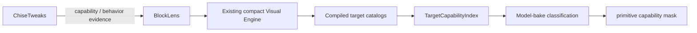

# ChiseTweaks → BlockLens Migration

Status: **P0 published / P1-P2 merged / remaining migrations tracked individually**

Current publication is v0.2.2; the development tree targets 26.1.2 / 26.2 / 26.3 with 57 capabilities. P1/P2 #42, Analyzer #34 and Scene Filter #35 have merged delivery records; Builder Assist #36 and ore extensions #37 have separate implementation/evidence contracts. The current user-authorized development and release ceiling is 200 KiB. Historical P0/140/150 KiB statements below remain release-era evidence. See [roadmap.md](roadmap.md), [remaining-delivery.md](remaining-delivery.md) and the separate #31 external-compatibility boundary. #43 completed the measured test-environment exception while preserving the unresolved historical allocation cause.

The [Masa evaluation and standalone decision](masa-integration-decisions.md) records eight intentional external-integration exclusions and the separate read-only #36 candidate. ChiseTweaks is retained, not deprecated or archived: BlockLens does not provide complete parity and future migrations are not in a verified public release.

BlockLens is the destination product. ChiseTweaks is a source of proven capabilities and UX ideas; it is **not** a runtime dependency and its feature framework is not copied into BlockLens.

## Direction

The original 37-capability source migration baseline remains frozen historical evidence. P0 appends capabilities and target bindings without changing the first 37 `CapabilityId` ordinals or their default values.

## P0 mapping

| ChiseTweaks feature | BlockLens destination | P0 action |
| --- | --- | --- |
| `material_highlights` | Resource capabilities | Reuse the existing 18 resource capabilities; append Crying Obsidian, Nether Gold Ore, Nether Quartz Ore |
| `hidden_surface_trace` | Blue Ice / Dead Coral / Powder Snow / Sculk Catalyst | Reuse existing BlockLens capabilities; no duplicate engine |
| `fine_thread_trace` | `STRING_TWEAKS` | Keep Tripwire and add Tripwire Hook under the same capability |
| `nether_palette` | `NETHER_TWEAKS` | Keep the original 27 BlockLens targets and add ChiseTweaks-only Polished Basalt |

### Material-highlight detail

P0 current resource scope is **21 independently configurable capabilities**:

- the original 18 source-derived resource capabilities;
- `gaming.crying_obsidian`;
- `gaming.nether_gold_ore`;
- `gaming.nether_quartz_ore`.

The three appended capabilities default to OFF and use the existing BlockLens resource-highlight engine. Their clean-room accent colors are based on ChiseTweaks-authored semantic color definitions rather than copied third-party texture pixels.

### Fine-line detail

`STRING_TWEAKS` now owns both:

- `minecraft:tripwire`;
- `minecraft:tripwire_hook`.

The version adapters treat directional connection properties as optional for this semantic family, while `powered` and `attached` remain required. This allows Tripwire Hook to share the lightweight visibility path without pretending it has Tripwire's four connection properties.

### Nether detail

The source M0 Nether contract remains exactly **27 targets** and keeps its original direct-path hash. Runtime P0 scope is the additive union of:

- all 27 original BlockLens Nether targets, including Obsidian;
- ChiseTweaks-only `minecraft:polished_basalt`.

No original target is removed to imitate ChiseTweaks.

## P0 runtime totals

After the P0 target/capability expansion:

- runtime capabilities: **40** = 37 frozen M0 capabilities + 3 additive Chise material capabilities;
- capability-to-target bindings: **328**;
- unique Minecraft targets: **322**;
- Resource bindings: **21**;
- Visibility/Fine bindings: **25**;
- Nether bindings: **28**.

These counts are executable contracts, not only documentation.

## P0 release evidence

PR #23 was squash-merged as `b440d43904e2a93236549efc571b7cc127622352`. Main CI **#270 / `34801429999`** completed its common quality gate and both real-client version jobs successfully. Release **#31 / `34802548055`** then published v0.2.0 from the exact CI artifacts:

- Minecraft 26.1.2: **96,248 B**, SHA-256 `c678c4c5955596db0a1e3064bc1301ad44bb88b6141243e88ca1cefe9973e98a`;
- Minecraft 26.2: **96,248 B**, SHA-256 `54b99d9b66a403195e28850dcfb165083007ee6cddb3521c36176d51af031105`;
- `SHA256SUMS.txt` is the third release asset.

The original 37-capability source contract remains a permanent regression boundary. Issue #22 is closed for P0; remaining P1-P5 work is tracked in #42 and #34-#38.

## Architecture invariants

P0 must retain all of the following:

- BlockLens remains client-only;
- no ChiseTweaks runtime dependency;
- no second visual engine;
- no ordinary-feature world scan;
- no per-frame registry scan;
- model-bake semantic classification;
- `long` primitive capability masks and the all-OFF fast path;
- exact compiled target catalogs rather than suffix/category guessing;
- JUnit / JaCoCo / PIT / Client GameTest / reproducibility gates;
- evidence-based JAR-size baseline changes only;
- **100 KiB release budget remains unchanged**.

## Later phases

P1+ will evaluate ChiseTweaks capabilities that are not simple overlap—Glass/Kelp/Bright rendering, comfort tweaks, world overlays/analyzers, scene filters, Builder Assist, modded-ore compatibility and selected integrations—while preserving BlockLens's compact engine-first design.
