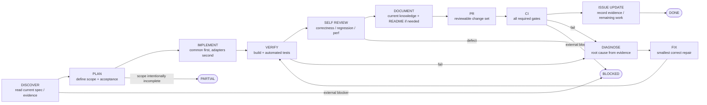
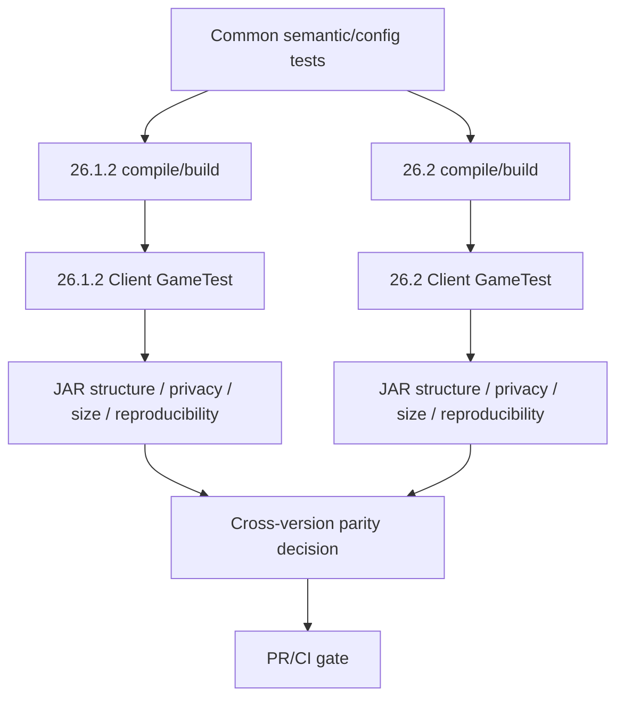

# BlockLens Engineering Graph Loop

Status: **authoritative current development workflow**

BlockLens uses a directed development graph with explicit verification loops. A change is not complete because code was written; it is complete only after the required graph nodes have passed.

## 1. Canonical graph



## 2. Graph rule

The graph defines dependencies, not ceremony.

- Do not implement before the current behavior/specification is known well enough to define acceptance.
- Shared product policy belongs in `common` before version-specific duplication is considered.
- Minecraft integration changes must traverse both supported version nodes.
- Documentation is part of the graph when behavior, architecture, workflow, compatibility, or user-facing status changes.
- A PR is not DONE until its required CI graph is green and issue/knowledge state matches reality.

## 3. Loop rule

Failures always return to evidence-driven diagnosis rather than skipping forward.

```text
VERIFY / SELF REVIEW / CI failure
            ↓
        DIAGNOSE
            ↓
           FIX
            ↓
         VERIFY
            ↓
      SELF REVIEW → ... → CI
```

Loop invariants:

1. Preserve the failing evidence before editing.
2. Identify the smallest root cause that explains the failure.
3. Prefer a shared fix when both Minecraft versions are affected.
4. Add or strengthen a regression test whenever the defect is mechanically representable.
5. Re-run the failed gate and the relevant upstream/downstream gates.
6. Never mark a node green from expectation alone.

## 4. Required node exits

| Node | Minimum exit condition |
| --- | --- |
| DISCOVER | `AGENTS.md`, `knowledge/index.md`, and only relevant `knowledge/current/*` read; evidence/source identified |
| PLAN | scope, non-goals, supported versions, acceptance criteria, and likely regression surfaces known |
| IMPLEMENT | requested behavior exists without reverting unrelated user changes |
| VERIFY | relevant JUnit/contracts/build/GameTests pass locally or in CI evidence |
| SELF REVIEW | correctness, regression, compatibility, rendering state, persistence, performance, maintainability, testability reviewed |
| DOCUMENT | current knowledge and user-facing docs match actual implementation |
| PR | focused diff, accurate body, issue references, no unsupported claims |
| CI | all required jobs green for the current head SHA |
| ISSUE UPDATE | completed tasks and remaining tasks reflect the merged implementation |
| DONE | merged or otherwise explicitly delivered with all required evidence |

## 5. Terminal states

Only these terminal states are allowed:

- **DONE** — all required graph nodes passed.
- **BLOCKED** — an external dependency, permission, unavailable environment, or unsupported platform prevents completion; blocker and completed evidence are recorded.
- **PARTIAL** — deliberately limited scope was delivered, but the remaining graph is explicitly open; PARTIAL must never be presented as DONE.

## 6. BlockLens-specific verification graph

For changes that touch Minecraft/Fabric integration:



No single-version success is sufficient unless a current specification explicitly records a version exception.

## 7. Scope discipline

The loop must not become an excuse for unrelated refactoring.

- Respect user changes already present in the branch.
- Do not revert unrelated work.
- Do not revive archived/deprecated/superseded behavior.
- Do not make features mutually exclusive unless the current specification requires it.
- Assume all visual features may be enabled together.
- Performance and JAR-size optimizations must preserve behavior first.

## 8. Documentation rule

README files are user-facing summaries, not the source of truth. If README and `knowledge/current/` disagree, fix the README; do not silently redefine the product from README text.
