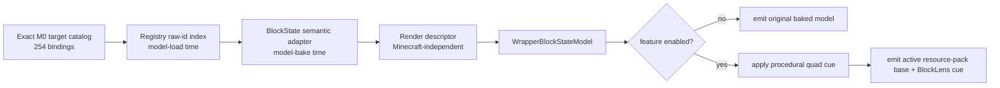
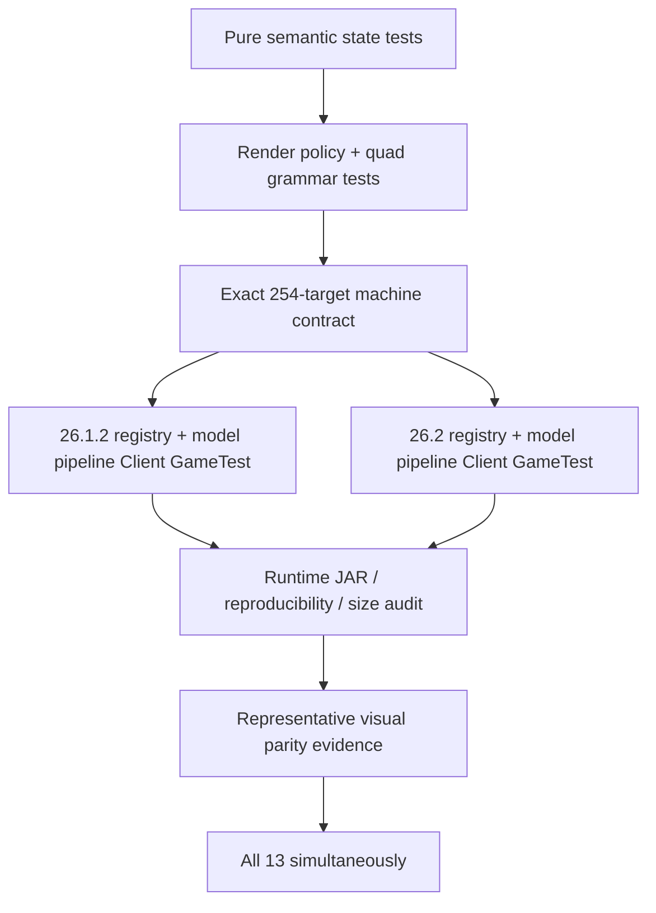

# M3 Decoration / Orientation Visual Semantics

Status: **authoritative current M3 visual contract — implementation in progress**

This document separates two things that must not be conflated:

1. behavior and visual intent derived from the pinned AMATERAS source baseline,
2. BlockLens-owned procedural rendering choices used to reproduce that value without redistributing source binary assets.

The pinned source remains:

```text
AMATERAS_Resourcepack_mc26.1.2.zip
SHA-256: 36e5c5bba4e77f05b8c22d549593dfb95e8aebc7bfebdba57e229257b46640ef
```

## 1. Scope

M3 owns exactly 13 independently controllable capabilities and 254 exact source target bindings:

| Capability | M0 target count | State semantics |
| --- | ---: | --- |
| Anvil | 1 | facing |
| Beehive | 1 | facing + honey level 0..5 |
| Campfire | 2 | facing + lit |
| Fence Gate | 12 | facing + open + in-wall |
| Froglight | 3 | axis |
| Glazed Terracotta | 16 | facing |
| Grindstone | 1 | mount face + facing |
| Log | 24 | axis |
| Slabs | 61 | bottom / top / double |
| Stained Glass | 32 | opaque behavior + pane connections |
| Stairs | 58 | facing + half + five shapes |
| Trapdoor | 21 | facing + half + open |
| Wood | 22 | axis |

The exact target names remain machine-checked against `capability-contract.tsv`. M3 must not silently broaden scope using suffix matching such as every future `*_stairs` block.

## 2. Source-derived visual findings

The following is evidence from the pinned source pack, not a claim that BlockLens must copy source pixels:

- Log/Wood orientation uses a consistent axis-color grammar. Representative source textures encode X with red, Y with green, and Z with blue cues.
- Slab source variants add high-contrast red state/boundary information.
- Stair source variants encode facing/half/shape with high-contrast state markings rather than relying on the base texture alone.
- Glazed Terracotta source variants make facing visibly obvious with a directional graphic.
- Campfire and Beehive source variants encode facing while preserving their block identity; Beehive also has source states for all six honey levels.
- Froglight variants encode X/Y/Z axis state.
- Grindstone variants encode mount face and horizontal facing.
- Trapdoor variants encode open/closed, half, and facing.
- Stained Glass has an explicit source meaning: **Make stained glasses opaque**. It is not merely an orientation/highlight feature.

The authoritative state/target evidence remains `capability-map.md` and `capability-contract.tsv`.

## 3. BlockLens procedural visual grammar

BlockLens does not copy the source pack's textures into the runtime JAR. It keeps the currently baked Minecraft/active-resource-pack model as the base and applies procedural render information to it.

Current shared cue policy:

| Semantic cue | BlockLens procedural behavior |
| --- | --- |
| Axis X | red cue on X end faces |
| Axis Y | green cue on Y end faces |
| Axis Z | blue cue on Z end faces |
| Basic facing | stable high-contrast facing cue |
| Beehive honey=5 | distinct full-honey facing cue |
| Campfire lit/unlit | facing cue changes with lit state |
| Grindstone | mount surface cue + facing cue |
| Fence Gate | facing cue distinguishes open/closed |
| Slab | visible top/bottom state boundary |
| Stained Glass | force solid rendering layer while enabled; base color is not procedurally replaced |
| Stairs | facing cue distinguishes shape; separate half boundary cue |
| Trapdoor | closed uses panel surface cue; open uses facing-plane cue |

These colors and mappings are common product policy in `common`, not duplicated in Minecraft-version adapters.

## 4. Runtime pipeline



### Ownership rules

- No whole-world scan.
- No per-frame registry scan.
- Minecraft `BlockState` interpretation occurs during model bake, not for every rendered frame.
- The render hot path uses immutable descriptors and primitive capability masks.
- If none of the capabilities represented by a wrapper are enabled, the wrapped model is emitted directly with no BlockLens quad transform.
- BlockLens owns only its additional render transformation. It does not replace the user's base resource-pack model with copied AMATERAS models/textures.

## 5. Configuration behavior

All 13 capabilities remain independent.

A target may participate in multiple BlockLens capabilities elsewhere in the product. Target indexing therefore stores a capability bit-set rather than a mutually exclusive single value.

The native config remains the source of enable/disable truth. `BlockLensConfig` also exposes an immutable 64-bit enabled mask for hot-path checks; this is a runtime optimization only and does not change config-file semantics.

## 6. Compatibility / rendering-state contract

- Feature OFF must use normal baked Minecraft/active-resource-pack rendering.
- Enabling one M3 feature must not implicitly disable another.
- All 13 being enabled at once is a required test condition.
- Stained Glass solid-layer behavior must be isolated to that capability and must not leak to unrelated models.
- Geometry/cache keys must reflect enabled BlockLens rendering state when it affects emitted geometry.
- Resource reload must rebuild wrapped models from the newly baked active-resource-pack models rather than retaining stale model instances.

## 7. Verification layers

M3 is verified in layers:



Current automated contracts already cover semantic combinations, independent toggles at policy level, exact target scope, registry availability, and model-pipeline registration. Representative rendered visual parity and final all-13 in-game evidence remain required before M3 is DONE.

## 8. Licensing boundary

The AMATERAS pack contains attribution to other creators and no redistribution permission is assumed.

Therefore M3 follows a fail-closed asset policy:

- source textures/models are reference evidence,
- source binary assets are not copied into BlockLens by default,
- procedural cues and original code are preferred,
- any future retained third-party binary asset requires explicit redistribution/license verification before public release.
