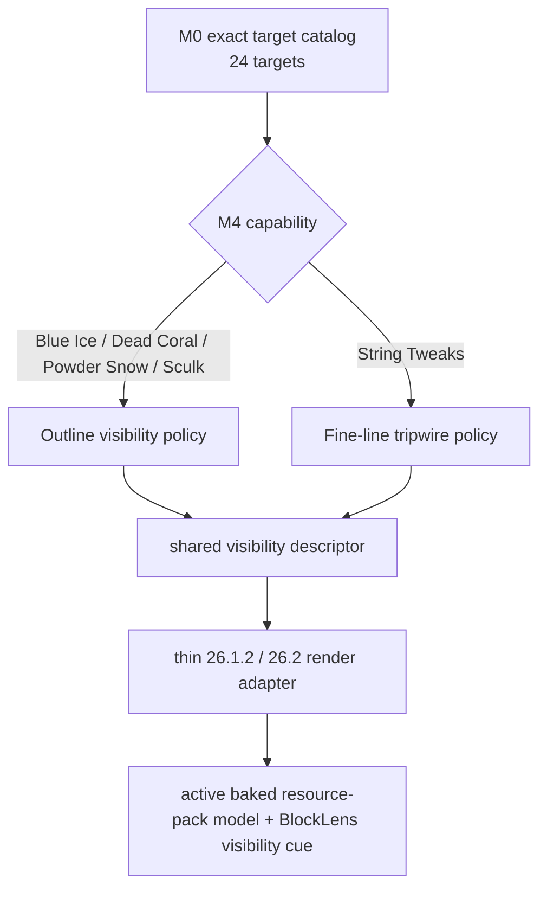
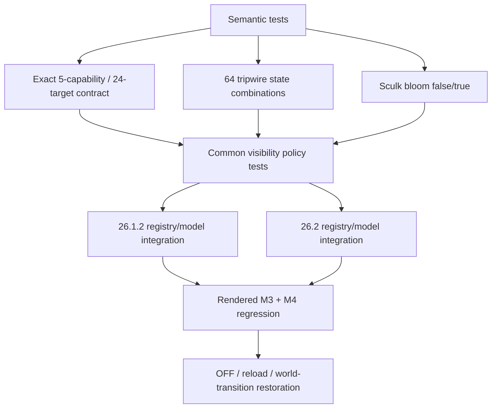

# M4 Outline / Fine Visibility Visual Semantics

Status: **authoritative current M4 contract — implementation in progress**

M4 migrates the five source capabilities that improve visibility without turning them into the resource-highlight family owned by M5.

The pinned behavioral source remains:

```text
AMATERAS_Resourcepack_mc26.1.2.zip
SHA-256: 36e5c5bba4e77f05b8c22d549593dfb95e8aebc7bfebdba57e229257b46640ef
```

## 1. Scope

M4 owns exactly five independently controlled capabilities and 24 unique Minecraft targets:

| Capability | Exact targets | Source state semantics |
| --- | ---: | --- |
| Blue Ice | 1 | static visibility outline |
| Dead Coral | 20 | static visibility outline over block/coral/fan/wall-fan forms |
| Powder Snow | 1 | static visibility outline |
| Sculk Catalyst | 1 | `bloom=false,true` |
| String Tweaks | 1 (`tripwire`) | `attached`, `powered`, N/E/S/W connections; 64 source variants |

M4 must use exact target scope from `capability-contract.tsv`; suffix/category scans are not part of the runtime contract.

## 2. Source-derived visual evidence

These findings come from the pinned source pack and define visual intent without granting permission to redistribute its binary assets.

### Outline family

- **Blue Ice:** preserves blue-ice identity and introduces a saturated blue boundary. The source highlight color includes exact opaque blue `#0000FF`.
- **Dead Coral:** preserves the gray/dead-coral identity while adding saturated pink/magenta visibility accents. Representative source highlight pixels include `#D962A3`.
- **Powder Snow:** preserves the white snow identity while adding a pale cyan boundary. The source boundary includes `#A5F6FF`.
- **Sculk Catalyst:** preserves the dark sculk/catalyst identity while emphasizing cyan/teal detail. `bloom=false` and `bloom=true` select different source models; bloom uses animated side/top textures. Representative cyan values include `#29DFEB`, while bloom frames also contain `#16DEEC`.

### String Tweaks family

The source `tripwire.json` contains all 64 combinations of:

```text
attached=false,true
east=false,true
north=false,true
powered=false,true
south=false,true
west=false,true
```

The geometry is connection-sensitive. The source uses:

- `tripwire_0.png`: bright green `#00FF00` plus white line pixels when `powered=false`
- `tripwire_1.png`: bright red `#FF0000` plus white line pixels when `powered=true`

For every connection shape inspected, the `attached_*` source model is byte-identical to its corresponding non-attached model. `attached` therefore remains part of the state-parity contract but does not independently change the M4 source geometry/color. `powered` selects green versus red visibility treatment; N/E/S/W connections select the fine-line shape.

## 3. Product architecture

M4 intentionally uses two common visual-policy families rather than forcing five features into one renderer concept:



Rules:

- The active Minecraft/resource-pack model remains the base.
- No AMATERAS PNG/model is copied into the runtime JAR by default.
- All five controls remain independent and may be enabled together with all M3 controls.
- No world scan or per-frame registry scan.
- Exact target lookup must remain bounded/O(1) after bootstrap.
- OFF must bypass M4 transformations and return normal active-resource-pack rendering.

## 4. Semantic-state requirements

The existing compact `SemanticState` already carries N/E/S/W connections plus `powered` and `attached`. M4 adds only what is missing:

- an explicit `bloom` bit for Sculk Catalyst,
- a composite tripwire factory that retains connections + powered + attached in one packed state.

This avoids creating Minecraft-specific state objects in common code and avoids reinterpreting `BlockState` in the render hot path.

## 5. Common cue contract

The initial source-derived common cue palette is:

| Cue | Source-derived accent |
| --- | --- |
| Blue Ice outline | `#0000FF` |
| Dead Coral outline | `#D962A3` |
| Powder Snow outline | `#A5F6FF` |
| Sculk Catalyst idle outline | `#29DFEB` |
| Sculk Catalyst bloom outline | `#16DEEC` |
| Tripwire unpowered line | `#00FF00` |
| Tripwire powered line | `#FF0000` |

The common descriptor owns semantic choice; Minecraft-version adapters own only API translation/render glue.

## 6. Verification graph



M4 is DONE only when both supported Minecraft versions provide rendered evidence for all five capabilities, M3+M4 simultaneous operation, OFF restoration, resource reload, and world-transition cleanup.

## 7. Licensing boundary

The pinned source is behavioral/visual evidence only. Source textures/models are not runtime assets unless redistribution rights are separately verified. M4 prefers original code and procedural cues so the public artifact remains independent of third-party binary redistribution permission.
