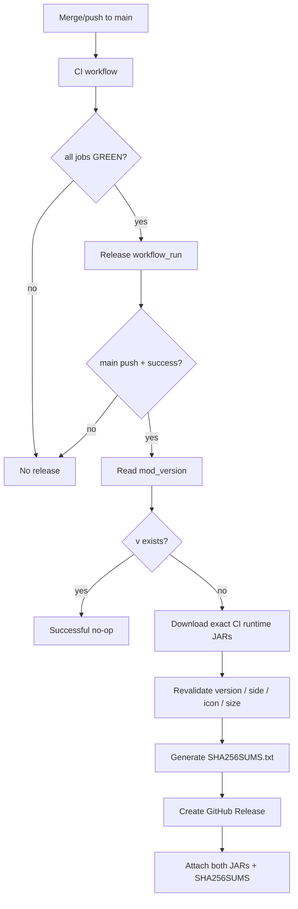

# BlockLens M9 Release Readiness

Status: **release pipeline implemented / authoritative M9 release contract**

## Purpose

M9 turns the verified M0-M8 product into a reproducible public release process. The release path must preserve the same 37-capability contract, the same dual-version behavior, the existing quality thresholds, and the strict runtime-artifact budget.

A release is not rebuilt independently. GitHub Releases receive the **exact runtime JARs that passed the successful `main` CI run**.

## Release identity

- release version source: `mod_version` in `gradle.properties`
- current release line: **0.1.0**
- Git tag: **v0.1.0**
- supported Minecraft: **26.1.2 / 26.2**
- Java: **25+**
- side: **client only**

A version is idempotent: if `v<mod_version>` already exists, the release workflow succeeds without publishing a duplicate.

## Technology foundation

| Layer | Technology | Release/quality role |
| --- | --- | --- |
| Language | Java 25 | shared runtime, version adapters, tests |
| Build | Gradle 9.5.1 | multi-project build, deterministic archives, verification tasks |
| Minecraft build tooling | Fabric Loom 1.17.19 | development/runtime/build integration |
| Loader | Fabric Loader 0.19.3 | client-only loading contract |
| Runtime integration | Fabric API | Minecraft/Fabric hooks and Client GameTest |
| Unit/contract testing | JUnit Jupiter 5.14.4 | semantic/config/render/repository contracts |
| Test runtime | JUnit Platform | JUnit 5 execution from Gradle |
| Coverage | JaCoCo 0.8.15 | line coverage gate |
| Mutation testing | PIT 1.19.0 | mutation coverage, mutation score, test strength |
| PIT/JUnit bridge | pitest-junit5-plugin 1.2.3 | JUnit 5 mutation execution |
| Real-client integration | Fabric Client GameTest | real Minecraft client validation |
| Headless render runner | Xvfb / Ubuntu 24.04 | framebuffer and client integration in CI |
| CI/CD | GitHub Actions | quality, dual-version verification, artifact handoff, release |
| Release client | GitHub CLI (`gh`) | exact-artifact download and GitHub Release publication |
| Integrity | SHA-256 | reproducibility and published checksums |

## Quality gates

The common Java policy layer retains the M8 thresholds:

```text
JaCoCo line coverage:      >= 96%
PIT mutation coverage:     >= 96%
PIT mutation score:        >= 96%
PIT test strength:         >= 96%
Java warnings:             -Xlint:deprecation -Xlint:unchecked -Werror
```

Per supported Minecraft line, CI also requires:

- build + `versionSmokeContract`
- deterministic/reproducible runtime JAR SHA-256
- real Fabric Client GameTest
- owned-model resource-resolution checks
- M3 rendered visual evidence
- M5 dark-area visual evidence
- M5 deterministic active-resource-pack preservation evidence
- M7 all-37 integration evidence
- M8 performance/retention observation
- privacy/residue audit
- runtime size budget

## Automated release chain



### Important invariant

`release.yml` does **not** call Gradle to rebuild the MOD. This avoids the classic CI/CD gap where a tested binary and a published binary are different files. Publication uses the artifacts from `github.event.workflow_run.id` and targets `github.event.workflow_run.head_sha`.

## Release icon and explicit rebaseline

M8 completed with a no-growth runtime baseline of **88,973 B** on both Minecraft lines. M9 intentionally added the repository-owned BlockLens icon and the Fabric metadata reference to that icon.

The old baseline was deliberately left unchanged for the first M9 measurement run so CI would reject unexplained growth. GitHub Actions **run `34766720469` (#232)** produced:

| Minecraft | Icon-inclusive runtime JAR |
| --- | ---: |
| 26.1.2 | **95,332 B** |
| 26.2 | **95,333 B** |

The shared no-growth baseline is therefore frozen at the larger verified value:

```text
runtime_jar_baseline_bytes=95333
runtime_jar_release_budget_bytes=102400
runtime_jar_hard_max_bytes=1183432
```

This is a reviewed product-asset rebaseline, not a relaxed budget. The **100 KiB release budget remains unchanged**.

Relative to the pinned 2,366,865 B source resource pack, the icon-inclusive maximum runtime artifact is about **4.03%** of the source and remains about **95.97% smaller**.

## Artifact / privacy / security audit

The version smoke contract and release validation reject or protect against:

- nested dependency JARs in the runtime artifact
- source `.java` files
- `.git` residue
- logs, crash reports, saves, screenshots and local run directories
- absolute/local developer paths
- credential/private-key markers
- source RPO/package residue that should not ship
- retired runtime policy classes
- wrong Minecraft version metadata
- wrong/non-client environment metadata
- missing packaged BlockLens icon
- unexplained JAR growth

Release publication additionally verifies the exact CI artifact against baseline, release-budget and hard-maximum limits before upload.

## Redistribution / licensing audit

- AMATERAS PNG assets are **not** redistributed in the BlockLens runtime JAR.
- BlockLens ships its own code, localization, small owned models, and repository-owned icon.
- The runtime artifact does not bundle third-party dependency JARs.
- No open-source license is implied unless a repository `LICENSE` explicitly grants one. GitHub Release publication by the owner does not automatically grant third-party redistribution rights.

## Compatibility support boundary

Officially verified:

- Minecraft 26.1.2 / 26.2
- Fabric client-only path
- default / shader-OFF OpenGL rendering path
- representative deterministic non-vanilla active-resource-pack preservation fixture

Not currently claimed:

- representative shader-ON configurations
- universal third-party resource-pack compatibility
- Minecraft 26.2 Vulkan as stable support

Minecraft 26.2 Vulkan remains experimental. Issue #5 remains the compatibility authority for representative shader-ON work and any evidence-required shader-state adaptation. These unchecked external combinations are not blockers for the core 37-capability release because they are explicitly excluded from the supported scope.

## M9 exit checklist

- [x] repository-owned MOD icon committed
- [x] Fabric metadata references the packaged icon on both versions
- [x] icon-inclusive size measured with the old baseline still enforced first
- [x] no-growth baseline explicitly re-frozen at 95,333 B
- [x] 100 KiB release budget unchanged
- [x] Java/JUnit/JaCoCo/PIT/Fabric/Gradle technical foundation documented
- [x] English README updated
- [x] Japanese README updated
- [x] licensing/redistribution posture audited and documented
- [x] compatibility/version support boundary documented without overclaiming
- [x] release workflow consumes exact successful-main-CI artifacts
- [x] duplicate release prevention by `mod_version` / tag
- [x] SHA-256 generation automated
- [x] release notes generation automated
- [x] release-time metadata/icon/size revalidation
- [x] M9 repository contracts protected by JUnit
- [ ] final PR-head CI GREEN
- [ ] merge to `main`
- [ ] post-merge `main` CI GREEN
- [ ] first `v0.1.0` GitHub Release published and verified

The final four operational items are completed only with live GitHub Actions evidence; they are not pre-declared successful.
