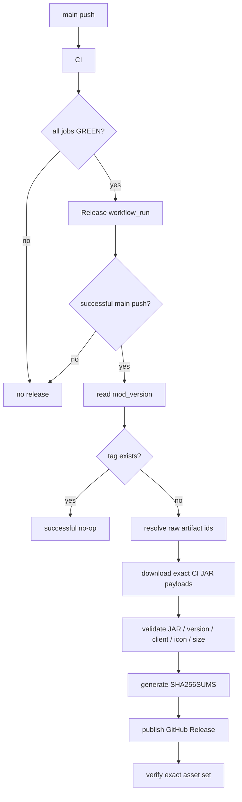

# BlockLens M9 Release Readiness

Status: **current publication boundary plus immutable historical release evidence**

## Current release: v0.3.0

BlockLens **v0.3.0** expands product coverage to **57 independently configurable capabilities** across **Minecraft 26.1.2, 26.2, and 26.3**, completing P1-P5 migration, bounded world analyzers, scene filters, builder assist, ore extension APIs, synchronized conventional tags, pinned Sodium terrain integration, private reference-pack validation (#31), and comprehensive codebase hardening (#57).

| Minecraft | Target | Capabilities | Release ceiling |
| --- | --- | ---: | ---: |
| 26.1.2 | `BlockLens-26.1.2-v0.3.0.jar` | 57 | 204,800 B (<= 200 KiB) |
| 26.2 | `BlockLens-26.2-v0.3.0.jar` | 57 | 204,800 B (<= 200 KiB) |
| 26.3 | `BlockLens-26.3-v0.3.0.jar` | 57 | 204,800 B (<= 200 KiB) |

## Historical published stable release: v0.2.2

[v0.2.2](https://github.com/bosatsu25/BlockLens/releases/tag/v0.2.2) was published at target `46ae5ccb1e60c92acd796acb0e2b10e740f9dcfc`, with 40 capabilities and optional Mod Menu integration delivered by #27 / PR #30. GitHub release assets were verified on 2026-10-10:

| Minecraft | Release asset | Bytes | SHA-256 |
| --- | --- | ---: | --- |
| 26.1.2 | `BlockLens-26.1.2-v0.2.2.jar` | **102,607 B** | `132312d74c1b160795a22a8dd1afa97c61eef3ced8b181c1b2eddc052f0a28e5` |
| 26.2 | `BlockLens-26.2-v0.2.2.jar` | **102,644 B** | `4e9dbf5bfb4971c7a30e8c69a37240b3637a35b0c25475e5cfdc584195e6f11f` |

Current gates are the user-authorized **204,800 B (200 KiB)** development and product release ceiling, and **1,183,432 B** absolute ceiling. Historical 100 KiB statements below describe v0.1.0/v0.2.0, not current policy. External shader/pack/Vulkan combinations remain #31; M8 diagnostic implementation is merged through PR #45/#47, while #43 completed its measured test-environment exception, retaining the unproven historical cause. See [roadmap.md](roadmap.md).

Current packaging permits exactly one owned `blocklens-runtime` container with exact compiled-byte, metadata and recursive privacy audits; see [runtime-packaging.md](runtime-packaging.md). The historical blanket nested-JAR prohibition below is replaced only for this owned container. Third-party dependency containers remain forbidden.

## Historical stable release: v0.2.0

P0 was published as **v0.2.0** without changing the historical v0.1.0 release.

- release target: `b440d43904e2a93236549efc571b7cc127622352`
- final main CI: **run #270 / `34801429999` — GREEN**
- final Release workflow: **run #31 / `34802548055` — GREEN**
- release state: published, not draft, not prerelease
- product contract: **40 capabilities / 328 bindings / 322 unique targets**

| Minecraft | Release asset | Bytes | SHA-256 |
| --- | --- | ---: | --- |
| 26.1.2 | `BlockLens-26.1.2-v0.2.0.jar` | **96,248 B** | `c678c4c5955596db0a1e3064bc1301ad44bb88b6141243e88ca1cefe9973e98a` |
| 26.2 | `BlockLens-26.2-v0.2.0.jar` | **96,248 B** | `54b99d9b66a403195e28850dcfb165083007ee6cddb3521c36176d51af031105` |

`SHA256SUMS.txt` is the third and only additional asset. The release target and attached digests were re-read from GitHub after publication. The exact artifacts came from successful main CI; the Release workflow did not rebuild them.

## Historical terminal result: v0.1.0

BlockLens **v0.1.0** was published successfully after the complete M0-M9 verification chain.

- release tag: **v0.1.0**
- release target: `a4b63087004d687c3c8223d0d95c6c95fb2c5156`
- final main CI: **run #245 / `34768792311` — GREEN**
- final Release workflow: **run #3 / `34769093202` — GREEN**
- release state: published, not draft, not prerelease
- supported Minecraft: **26.1.2 / 26.2**
- Java: **25+**
- side: **client only**

## Published artifacts

| Minecraft | Release asset | Bytes | SHA-256 |
| --- | --- | ---: | --- |
| 26.1.2 | `BlockLens-26.1.2-v0.1.0.jar` | **95,332 B** | `191f579fe7d574c94614b611c01420fa6887684e2fabc597966515490f59d24b` |
| 26.2 | `BlockLens-26.2-v0.1.0.jar` | **95,333 B** | `3848de8a07836d829d12ab5ed09ee650d5e1bebd4e0249b254436dda9c5a54be` |

`SHA256SUMS.txt` is the third and only additional release asset.

The GitHub Release asset digests exactly match the raw runtime artifacts from main CI #245. The release workflow therefore published the **same bytes that passed CI**, not a separate rebuild.

## Release incident and corrective action

The first live publication attempt, Release run `34767887940`, failed after main CI itself had already passed. The failing message was:

```text
Expected exactly one downloaded JAR for 26.1.2; found 0
```

### Root cause

CI intentionally uploads runtime JARs through `actions/upload-artifact` with `archive: false`. The initial Release implementation used `gh run download`, which treated the raw JAR payload as an archive and expanded its internal entries (`META-INF/`, `fabric.mod.json`, `dev/...`) instead of leaving a `.jar` file for the next validation step.

### Fix

PR #20 changed only the release handoff and its repository contract test:

- raw CI artifact ids are resolved from the successful workflow run;
- the exact raw payload is downloaded directly through the GitHub Actions artifact endpoint;
- the payload is validated as a JAR/ZIP before normalization;
- `gh run download` is explicitly forbidden for this raw runtime-artifact path by JUnit contract coverage;
- build, rendering, runtime size and product logic remain unchanged.

PR #20 then passed the full dual-version CI gate, was squash-merged, and main CI #245 reran the full suite before Release #3 published v0.1.0 successfully.

This is the concrete M9 Graph Loop example: **failure → diagnosis → fix → regression protection → full re-verification → live publish verification**.

## Technology foundation

| Layer | Technology | Release / QA role |
| --- | --- | --- |
| Language | **Java 25** | runtime, common semantic engine, version adapters, tests |
| Build | **Gradle 9.5.1** | multi-project build, deterministic archives, verification tasks |
| Minecraft tooling | **Fabric Loom 1.17.19** | Minecraft development/runtime/build integration |
| Loader | **Fabric Loader 0.19.3** | client-only loading contract |
| Runtime integration | **Fabric API** | Minecraft/Fabric hooks and Client GameTest |
| Unit / contract tests | **JUnit Jupiter 5.14.4** | semantic/config/render/repository/release contracts |
| Test platform | **JUnit Platform** | JUnit 5 execution from Gradle |
| Coverage | **JaCoCo 0.8.15** | line-coverage hard gate |
| Mutation testing | **PIT 1.19.0** | mutation coverage, score and test strength |
| PIT/JUnit bridge | **pitest-junit5-plugin 1.2.3** | JUnit 5 mutation execution |
| Real-client integration | **Fabric Client GameTest** | actual Minecraft client validation |
| Headless graphics | **Xvfb / Ubuntu 24.04** | framebuffer and real-client CI execution |
| CI/CD | **GitHub Actions** | quality, dual-version evidence, raw-artifact handoff, release |
| Integrity | **SHA-256** | reproducibility and CI/release byte identity |
| Publishing | **GitHub CLI + GitHub REST API** | release control and exact raw-artifact transfer |

## Quality gates

The common Java policy layer keeps the same hard thresholds:

```text
JaCoCo line coverage:      >= 96%
PIT mutation coverage:     >= 96%
PIT mutation score:        >= 96%
PIT test strength:         >= 96%
Java warnings:             -Xlint:deprecation -Xlint:unchecked -Werror
```

For each Minecraft line, CI additionally requires:

- production build + `versionSmokeContract`
- deterministic/reproducible runtime JAR SHA-256
- real Fabric Client GameTest
- model-resource resolution
- M3 rendered visual evidence
- M5 dark-area evidence
- M5 deterministic active-resource-pack preservation evidence
- M7 all-37 integration evidence
- M8 performance/load/retention observations
- privacy/residue audit
- runtime artifact size budget

## Artifact-size contract

M8 completed at **88,973 B** before the release icon. M9 deliberately added the repository-owned icon, measured the official Gradle artifacts with the old baseline still enforced, then re-froze only the observed product-asset growth.

```text
pinned source pack:               2,366,865 B
absolute source-pack-half max:    1,183,432 B
release budget:                     102,400 B (100 KiB)
M8 pre-icon baseline:                88,973 B
26.1.2 v0.1.0 JAR:                  95,332 B
26.2 v0.1.0 JAR:                    95,333 B
shared no-growth baseline:           95,333 B
```

The **100 KiB release budget was not relaxed**.

## Release chain



### Release invariants

- no Gradle rebuild occurs in the Release job;
- only a successful `main` push CI may publish;
- the exact CI commit is checked out;
- exact raw runtime artifacts from that CI run are used;
- downloaded payloads must be valid JARs;
- mod/Minecraft/client/icon metadata is checked before upload;
- current 200 KiB development/release and absolute maximum budgets are rechecked;
- publication is idempotent by `mod_version` / tag;
- SHA-256 checksums are generated;
- the final release asset set is verified after publication.

## Artifact / privacy / security audit

The runtime and release gates reject or protect against:

- nested dependency JARs
- source `.java` files in runtime artifacts
- `.git` and editor residue
- logs, crash reports, saves, screenshots and local run directories
- absolute developer-machine paths
- credential/private-key markers
- source RPO/package residue
- retired runtime-policy bytecode
- wrong Minecraft version metadata
- non-client environment metadata
- missing BlockLens icon
- unexplained JAR growth

Source PNG assets are not redistributed in the runtime JAR.

## Compatibility support boundary

Verified for v0.1.0:

- Minecraft **26.1.2 / 26.2**
- Fabric client-only runtime
- default / shader-OFF OpenGL path
- deterministic representative non-vanilla active-resource-pack preservation fixture

Not currently claimed:

- representative shader-ON support
- universal third-party resource-pack compatibility
- Minecraft 26.2 Vulkan as stable support

Minecraft 26.2 / 26.3 Vulkan remains unverified. Issue #31 is the authority for external shader/resource-pack/Vulkan compatibility; completed #5 tracks historical core M5 parity. These combinations are outside the advertised default OpenGL boundary.

## M9 exit checklist

- [x] repository-owned MOD icon committed
- [x] both Fabric metadata files reference the packaged icon
- [x] icon-inclusive size measured under the old baseline before rebaseline
- [x] no-growth baseline frozen at **95,333 B**
- [x] **100 KiB** release budget unchanged
- [x] English README updated with Java/JUnit/Fabric/Gradle/QA/release foundation
- [x] Japanese README updated with the same technical foundation
- [x] licensing / redistribution posture documented
- [x] compatibility support boundary documented without overclaiming
- [x] release consumes exact successful-main-CI artifacts without rebuilding
- [x] raw `archive:false` artifact handoff corrected and regression-tested
- [x] duplicate release prevention implemented
- [x] SHA-256 generation implemented
- [x] release-time metadata/icon/size validation implemented
- [x] PR #19 implementation CI GREEN and merged
- [x] first post-M9 main CI GREEN
- [x] failed initial release diagnosed instead of bypassed
- [x] PR #20 hotfix full CI GREEN and merged
- [x] final main CI **#245 / `34768792311` GREEN**
- [x] Release **#3 / `34769093202` GREEN**
- [x] **v0.1.0 published**
- [x] exact three release assets verified
- [x] published JAR sizes and SHA-256 match CI artifacts

**M9 terminal state: DONE.**
